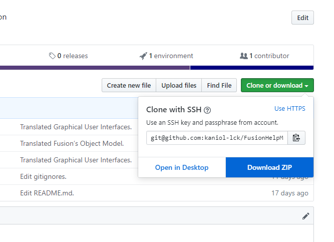

# 帮助

## 新如白纸

### GitHub下载ZIP

点击右边最显眼的绿绿的按钮，然后下载为ZIP保存到本地，解压后即可得到翻译文件夹。

或者[点此下载](https://github.com/kaniol-lck/FusionHelpManual-zh_CN/archive/master.zip)。

### Typora下载

进入[Typora官网](https://typora.io)，找到[Download界面](https://typora.io/#download)，选择自己的系统版本下载。

[Windows64位](https://typora.io/windows/typora-setup-x64.exe) [Windows32位](https://typora.io/windows/typora-setup-ia32.exe)

下载后安装后即可自动使用Typora打开.md后缀的文件。

## 实用工具

### Lua For Windows下载

本帮助手册翻译中的部分工作由Lua脚本完成：

- 同步Typora的主题
- 将小章节的文档内容自动拼接为大章节，包括书签及链接的自动调整
- 自动构建html及pdf文档（正在实现）

在此处找到最新的安装包下载：[Lua for Windows Releases](https://github.com/rjpcomputing/luaforwindows/releases/download/v5.1.5-52/LuaForWindows_v5.1.5-52.exe)

目前最新版：[LuaForWindows_v5.1.5-52.exe](https://github.com/rjpcomputing/luaforwindows/releases/download/v5.1.5-52/LuaForWindows_v5.1.5-52.exe)

**除了作用于本帮助手册外，你可以用于FusionScript，Fusion同样实用Lua作为脚本。**

## Typora配置

### 安装主题

- **若已配置Lua For Windows：**

  则只需双击运行本项目themes文件夹中的copyToTypora.lua即可安装主题。

- **若未安装Lua For Windows：**

  将本项目themes文件夹中的.css文件复制到Typora安装目录下的themes文件夹。

**注意重启Typora后才会加载新主题。**