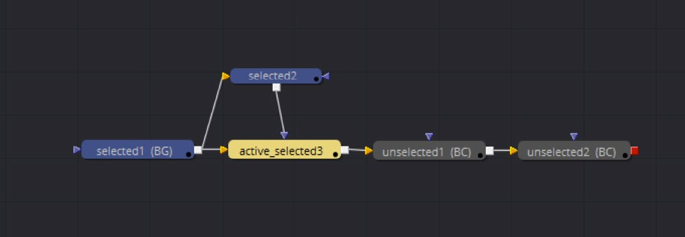
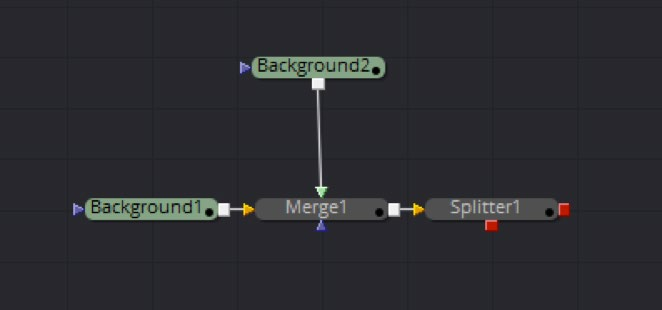
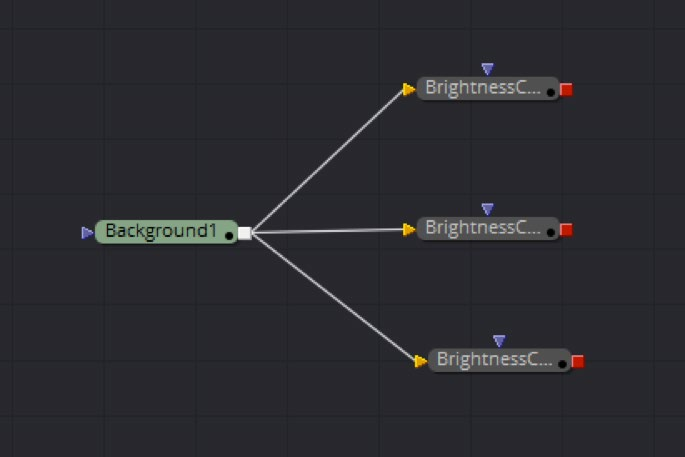

### Fusion's Object Model Fusion的对象模型

为了更好地理解FusionScript，值得去揭开Fusion对象模型的面纱看一看。尽管FusionScript及其概览是真实应用的极大简化，它还是会帮助我们用脚本API在应用中漫游。

#### Overview 概览

Fusion由独立类型的不同对象组成的。一种可能的对象类型是运算器（Operator），又称工具（Tool）。每个运算器也许会有多个链接（Link）作为输入（Inputs）或输出（Outputs）对象，它可能在属性视图中的GUI中显示。对合成（Composition）的应用也是一种特殊的对象类型，就像Fusion自身。即使通过导入器（Loader）创建的用来表示文件格式的文件类型（FileType）也是对象。

大多数对象拥有一组属性（Attribute）用来表示对象的状态及功能。另外它们也可能包含数据（Data），即一种特殊的元数据形式。

每个对象都必须在内部注册表中注册其特定类型及功能。这样的话就就可以在实例创建前在注册表中读取每个对象或工具的信息。

虽然我们可以从注册表访问大部分信息，但FusionScript大多数时间都在处理应用（Application）、合成（Composition）、工具（Tool）、输入（Inputs）等中的实例。

#### Common Object Dependencies 通用对象依赖

这一章描绘了Fusion中的通用对象依赖。这意味着用户所体验的对象关系会类似于这些依赖关系，而底层实现和公开的对象层次结构可能看起来不同。

这只是对最常见的对象的节选，它们是用户有倾向于使用的并可能会对从用户视角描绘与Fusion的交互有帮助。

<b>Fusion</b>

- Composition 合成（集合）

- Tool 工具（集合）

- Inputs 输入（集合）

  一些是在流程视图中的MainInputs（主输入）=Input（输入）

  - 类型：设置（sets）和获取（gets）类型

    Text 文本

    Number 数值

    Image 图像

    Data3D 三维数据

- Output 输出（集合）

  一些是在流程视图中的MainOnputs（主输出）=Onput（输出）

  - 类型：设置（sets）和获取（gets）类型

    Text 文本

    Number 数值

    Image 图像

    Data3D 三维数据

    其他

虽然这个视角是高度简化并忽略了很多接口上的方面和特性——像LUT、Viewers等——它是用户在大多数时间处理的数据的核心。

##### Fusion Instance Fusion接口

所有访问的起始点都是Fusion对象。一个Fusion对象代表一个运行中的Fusion实例。它可以创建、打开和关闭合成，存储应用范围设置和偏好设置或持久元数据。Fusion能从一个实例中打开并管理多个合成。图形用户界面中用标签页布局（Tab-Layout）来表示这些。在脚本中，所有当前载入的合成都可以通过`fu.CurrentComp`或`fu:GetCurrentComp()`访问。使用`fu:LoadComp(path, locked)`载入合成或使用`fu:NewComp(locked, auto-close, hidden)`创建空合成。你也可以通过使用`fu:Quit()`退出Fusion实例。如果你从Fusion内运行该脚本，它仍会被执行。实际上，脚本并不与Fusion实例绑定。而生成一个FuScript应用程序，以核算脚本并与运行中的Fusion实例通信。如果你的脚本退出了，最终FuScript实例也会停止。这在外部脚本环境中运行脚本（如前些章节所述）显然也使用。

##### Composition Instance 合成实例

一个合成（Composition）可能也存储设置、属性和持久元数据。虽然Fusion实例保存了全局设置，但每个合成可能有一组单独的设置。偏好设置对话框中模仿了这一行为，可以更改每个新合成的全局设置或当前打开的合成的独立设置。大多数时间应该访问合成设置来包含对当前合成的覆盖。这包含了PathMapping（路径映射），用于在Fusion的相对路径系统中识别路径。

合成可以被保存（Saved）和关闭（Closed），创建撤销（Undo），撤销操作，和重做（Redo）它们及清除撤销（Clear Undos）。同样，回放与渲染也可以从合成调用。

请注意你可以`comp:Lock()`一个合成，这防止了在通过`comp:Unlock()`解锁前由于更改产生的重渲染和弹出框。操作合成时总是尽可能锁定它。你可以通过`comp:IsLocked()`查询一个合成的锁定状态。

可以查询合成中的工具。一个合成可以通过`comp.ActiveTool`和`comp:SetActiveTool(tool)`获取（get）或设置（set）当前活动工具。所有合成内的工具都可以用`comp:GetToolList()`查询而只限选中的工具则使用`comp:GetToolList(true)`查询。

> **注意**
>
> Fusion工具可以有三种选中状态：未选中、选中和活动&选中。
>
> 选中的工具是通过拖动选中的（以蓝色指示），活动的工具是最后点击的工具（以黄色指示）。活动的工具也自动是选中的。
>
> 这一行为允许了更好的选中，如当你想拷贝一个工具的设置到另一工具，你可以拖动选择所有目标工具然后通过点击激活源工具。
>
> 

工具的选中是流程视图的一部分，并可以像这样触发：

```lua
flow = comp.CurrentFrame.FlowView
flow:Select(Blur1, true)    -- 将blur1添加到选中
flow:Select(Blur2, false)   -- 将blur2从选中中移除
flow:Select()               -- 取消选中所有
```

`composition`和`fusion`都拥有`GetPrefs()`和`SetPrefs()`，用于存储Fusion和合成的本地拷贝的偏好设置。如果你不能在那里找到特定的设置，如后所述看一下属性（Attributes）内部。

##### Tool Instances 工具实例

工具（Tool）是特定类型的唯一命名运算器。在内部，工具是运算器（Operator）在流程上可见的子集。它可以是创建器（Creator）或滤镜（Filter）、三维工具（3D Tool）等等。另一个运算器的例子是修改器（Modifier）。它与工具相像但处理数值或文本数据而不是图像数据。你也可以将它连接到输入（Inputs）和其他修改器。

简单起见，我们将在大多数时间谈论工具，而这些技术也可能适用于不同的运算器类型。

对它名称和其类型的读取访问由`tool.Name`和`tool.ID`提供。对于名称的读写访问，使用`TOOLS_Name`属性。注意属性`TOOLB_NameSet`指示了名称是否已被手动修改。若没有，一些工具会在工具块的名称旁显示额外信息。比如，载入器（Loader）会显示片段的文件名。

其他重要的属性有`TOOLB_PassThrough`指示它的穿过状态（PassThrough-State）和`TOOLB_Locked`指示它的锁定状态（Lock-State）。

与选中状态相似，工具在流程视图上的位置不是工具实例而是流程的一部分。

```lua
flow = comp.CurrentFrame.FlowView
==flow:GetPos(Blur1)         -- 输出Blur1的位置
==flow:SetPos(Blur1, 5, 1)   -- 将Blur1的位置设置为x = 5 y = 1
```

如果很多工具重新移位则所示方法会很慢。您可以排队多个工具的重新移位并在一个批处理中应用，如下所示：

```lua
-- 重新移位一列的所有工具
flow = comp.CurrentFrame.FlowView
flow:QueueSetPos()
for i, tool in ipairs(comp:GetToolList()) do
    flow:QueueSetPos(tool, 0, i)
end
flow:FlushSetPosQueue()
```

拥有输入（Inputs）和输出（Outputs）的工具会在接下来详细讨论。

##### MainInputs and MainOutputs 主输入与主输出

总得来说，工具都有输入和输出。属性输入（Property Inputs）——由属性视图中的控件表示（如ColorCorrector中的Gain滑块）——或在流程视图上连接另一工具的输入，被叫做主输入（MainInputs）。即使大多数时候工具在流程视图上只有一个主输入，但输出仍非常相似。一个例外的Stereo Splitter（Fusion Studio）如下图所示。



输入或输出在流程上的区别是通过在Plugin或Fuse的开发中将它们定义为主输入和主输出来实现的。

可见的主输入可以通过`tool:FindMainInput(i)`查询，而主输出通过`tool:FindMainOutput(i)`。因为拥有至少一个主输入或主输出，这些方法的参数`i`需要至少从`1`开始。

如果没有结果对应所给的索引，该方法返回`nil`。接下来的代码段展示了如何查询活跃工具的所有主输入与主输出：

```lua
tool = comp.ActiveTool

if(tool ~= nil) then
    print (tool.Name)
    
    local i = 1
    while(true) do
        out = (tool:FindMainInput(i))
        if out == nil then break end
        print(string.format("\tMainInput %d: %s", i, out.Name))
        i = i + 1
    end
    
    i = 1
    while(true) do
        out = (tool:FindMainOutput(i))
        if out == nil then break end
        print(string.format("\tMainOutput %d: %s", i, out.Name))
        i = i + 1
    end
end     
```

##### Inputs and Outputs 输入与输出

与主输入和主输出相邻的是其他输入与输出。如果输入没有被隐藏的话，它们会在属性视图中以输入控件显示。而底层数据类型（DataType）也许仍是相同的。比如，数值数据类型可以通过滑块控件、复选框、下拉列表、多按钮等等访问。

要查询输入的数据类型，使用`inp:GetAttrs("INPS_DataType")`。

要查询输出的数据类型，使用`outp:GetAttrs("OUTS_DataType")`。

一个控件允许用户在属性视图修改底层数据类型对应的值。一个可选的预览控件允许直接在监视器中修改值。

在写脚本时，输入的值可以用赋值直接修改，通过代表特定时间的索引或通过使用`tool:SetInput("InputName", value, [time])`。

如后所示，指定时间只对输入动画有意义。只支持简单的数据类型，如整数、浮点数和字符串。

考虑下面这个例子：

```lua
Merge1.Angle = 10                 -- 将Angle设置为10
Merge1.Angle[5] = 20              -- 在第5帧将Angle设置为20
Merge1:SetInput("Angle", 20, 5)   -- 同上
```

像这样得到给定输入的值：

```lua
print(Merge1.Angle)                   -- 获取Angle输入句柄
print(Merge1.Angle[TIME_UNDEFINED])   -- 获取Angle值
print(Merge1.Angle[5])                -- 获取Angle第五帧时的值
Merge1:GetInput("Angle", 5)           -- 同上
```

请注意你不能使用`Merge1.Angle`来检索值，因为这将返回输入句柄。

##### Querying Inputs 查询输入

与流程上的主输入类似，输入可以连接到别的输出，如已Publish输入，已Animate输入或修改器。虽然没有用流程表示，类似的连接流程对于所有输入来说都是可能的。主要区别在于主输入处理图像数据、遮罩、三维数据、粒子流而常规输入处理数值、点和文本等。

无论是否是主输入，所有输入都可以通过`tool:GetInputList()`列出。所有输出都可以通过`tool:GetOutpuList()`列出。在这两种情况下，都可以指定数据类型的可选滤镜。此外，如果已知名称则输入和输出可以作为工具的属性被直接访问。如果将鼠标悬停在输入上，状态栏将显示其名称。例如， 要访问BrightnessContrast工具的Gain输入，使用：`BrightnessContrast1.Gain`。

##### Connections 连接

可以通过`inp:ConnectTo(output)`方法将输入连接到输出。通过`inp:ConnectTo()`取消连接。通过`inp:GetConnectedOutput()`获取一个输入所连接的输出。相类似地，你可以通过`outp:GetConnectedOutputs()`获取一个输出所连接的所有输入。请留意后面那个命令的复数形式。

> **注意**
>
> 依照设计，一个输出也许会连接到多个输入，但一个输入只能有一个输出连接。
>
> 

请注意输出和输入共享一个叫做`Link`的父类，它允许了它们访问`GetTool()`来引用包含输入或输出的工具。

输入可以直接连接到它们的基础数据类型，但它们也可以连接到相同数据类型、修改器或动画的其他输入。由于所有这些的内部都是作为连接实现的，因此一旦需要核算上游的输入，就会查询所有相连接的下游输出。这允许了具有许多交叉依赖的复杂连接方案。

##### Animation 动画

要通过脚本animate一个输入，第一步是添加一个`BezierSpline`。贝塞尔样条（Bezier Spline）是一种可以在样条编辑器中显示的曲线。它是工具已animate属性的信息仓库。要对Merge的blend属性执行此操作，使用如下代码：

```lua
Merge1.Blend = BezierSpline({})
```

在特定时间设置输入的值将创建关键帧。

如果属性为点数据类型，改用`Path{}`函数来添加基于贝塞尔的路径。

如果希望在100帧的时间段内将blend从1设置为0，则可以使用以下代码：

```lua
Merge1.Blend[1] = 1
Merge1.Blend[100] = 0
```

您可以请求所有在`BezierSpline`上的关键帧集合：

```lua
local spline, splineout, splinedata

-- 获取连接到Blend输入上的样条输出，
splineout = Merge1.Blend:GetConnectedOutput()

-- 然后使用GetTool()获取BezierSpline修改器自身，
if splineout then
    spline = splineout:GetTool()
    
    -- 然后使用GetKeyFrames()样条数据的表，
    splinedata = spline:GetKeyFrames()
    
    -- 该数据接着被转储。
    dump(splinedata)
end
```

返回的数据包含一个嵌套表，每个关键帧一个，以关键帧时间为键值。子表包含一个关键帧值的条目，以及左边和/或右边句柄的子表，称为`“LH”`和`“RH”`。句柄子表包含两个条目，用于句柄的X&Y位置。

将值设置为`nil`来从已animate样条中移除关键帧。

```lua
Merge1.Blend[composition.CurrentTime] = nil
```

在上例中，关键帧从comp的当前帧中删除。但是如果该关键帧是动画样条曲线上的唯一的点，则不会删除该点，因为样条必须始终至少有一个点。

可以将Input恢复为静态值来完全删除动画。

不指定时间而将整个输入设置为零。

```lua
Merge1.Blend = nil
```

#### Attributes 属性

属性（Attributes）存储了特定类型相关的信息，以及一些作用于对象状态的常见标志。

比如，在工具（Tool）的情况下，属性可以包括对象的类型名、合成名、工具栏中显示的缩写、PassThrough和选择状态等。

属性拥有读取访问，但是这并不担保你可以更改所有属性。所以当你可以更改工具的穿过状态（PassThrough-State）时，更改它的类型毫无意义。

每一个运算器类型都会由一组依赖其类型的属性。你不能添加你自己的属性。而是使用像图像流元数据或对象数据这样的机制。

使用`GetAttrs()`方法来访问属性。由`Object`父类提供了属性，几乎所有对象都拥有属性。所以`GetAttrs()`是一个在对象内查找功能或数据的绝妙去处。

如果不提供参数，将返回所有属性。它也可以通过提供单个标签字符串来缩小查找。

```lua
==Merge1:GetAttrs()                 -- 转储所有工具属性
==Merge1.Blend:GetAttrs()           -- 输入也拥有属性
==Merge1:GetAttrs("TOOLB_Locked")   -- 只显示锁定状态
```

标签由类型前缀、类型字符、下划线与属性名组成。比如说多数工具内的属性都有`TOOL`前缀，输入`INP`，合成`COMP`等等。

类型字符分别代表：

<table class = "guide-table">
  <thead>
    <tr>
      <th>
        类型字符</th>
      <th>
        类型</th>
    </tr>
  </thead>
  <tbody>
    <tr>
      <td>
        S</td>
      <td>
        String 字符串</td>
    </tr>
    <tr>
      <td>
        B</td>
      <td>
        Boolean 布尔</td>
    </tr>
    <tr>
      <td>
        N</td>
      <td>
        Number (float) 数值（浮点）</td>
    </tr>
    <tr>
      <td>
        I</td>
      <td>
        Integer 整型</td>
    </tr>
    <tr>
      <td>
        H</td>
      <td>
        Handle 句柄</td>
    </tr>
    <tr>
      <td>
        NT</td>
      <td>
        Number Table 数值表</td>
    </tr>
    <tr>
      <td>
        IT</td>
      <td>
        Integer Table 整型表</td>
    </tr>
    <tr>
      <td>
        ST</td>
      <td>
        String Table 字符串表</td>
    </tr>
    <tr>
      <td>
        BT</td>
      <td>
        Boolean Table 布尔表</td>
    </tr>
  </tbody>
</table>

在我们的例子中，`TOOLB_Locked`代表了类型为布尔且名称为`"Locked"`的工具属性。

属性可以通过`SetAttrs({})`设置。所提供的表必须以标签为键而以新值为值。多个属性可以同时修改，但不是所有属性都可以更改。下例在一次调用中重命名`"Merge1"`为`"MyMerge"`并锁定了工具：

```lua
Merge1:SetAttrs({TOOLS_Name = "MyMerge", TOOLB_Locked = true})
```

#### Object Data 对象数据

数据（Data）是一种特殊的存储在应用偏好设置或合成中的元数据（Metadata）类型。

与从图像数据流（如OpenEXR）中读取并从工具传递到工具的元数据相反，对象数据不随数据流传递。相反，它对应用、合成或工具的当前状态是一致的。

这使它成为可靠存储自定义脚本状态的完美人选。

比如，假设一个具有GUI的自定义脚本，它需要存储其上次使用的路径以便用户不必在每次使用脚本时更改路径。

一种选择是创建一个全局变量并在每次运行时检查它是否被设置：

```lua
if globals.mytool_lastpath then
    path = mytool_lastpath
else
    path = "default/path"
end

-- ... 带路径的对话框

globals.mytool_lastpath = path
```

然而，一旦Fusion关闭，全局变量也随之而去。此策略仅适用于不太可能在会话之间更改的数据，如当前加载工具的缓存列表。

但对于我们的场景来说，使用Fusion偏好设置存储每个最新路径可能会更明智一些，即使Fusion被关闭并重新打开。

```lua
local last_path = fusion:GetData("mytool.lastpath")
if last_path then
   path = last_path
else
   path = "default/path"
end

-- ... 带路径的对话框

fusion:SetData("mytool.lastpath", path)
```

然而，另一种策略也许用合成来存储数据，因此每个合成都可以有自己的路径。简单地用合成或任何其他相应的上下文替换Fusion。

请注意点符号不是随机的。点代表子表。因此，您可以在`"mytool"`中放置多个变量甚至其他嵌套表。利用此优势，如定义代表工作室的域宽根名称、带有工具及其各自的设置的子表：

```lua
fusion:SetData("MyStudioInc.MyCompTool.DoMagic", true)
fusion:SetData("MyStudioInc.MyRenderSettings.RemoteNames", "clients")
...
```

##### Where is the actual ObjectData stored? 真实的对象数据被存储在哪儿了？

在Fusion的情况下，你将在`Global.Script.GlobalData`的Fusion8.prefs中找到数据。

与合成、工具等一起，对象数据与合成文件中的相应对象一起存储。由于所有这些都是Lua表，直接使用文本处理器打开.comp文件。您应该会找到您指定的对象数据。

> **注意**
>
> 工具对象数据的一大好处是它直接存储在工具中。如果将工具复制并粘贴到另一个合成中，它将被传递。然而，新创建的工具将不具有任何对象数据，因此请确保通过事件套件（EventSuite）或类似方法捕获此默认情况。

#### Metadata 元数据

对象数据很容易与常规的图像元数据混淆。然而，图像元数据只能用脚本读取而不能被更改，因为它与图像流本身相关联。您将需要Fuses或插件（Plugins）来直接更改图像流及其元数据。你需要核算输出到元数据被查询的位置来访问它。

在对象数据的情况下不需要这样做，因为它依赖于`Object`实例而不依赖于其底层数据流。

在具有有效输入访问的Loader中，元数据如下所示：

```lua
==Loader1.Output[comp.CurrentTime].Metadata.Filename
```

在简单表达式（SimpleExpression）中不需要核算，因为它在当前时间被自动核算。比如将它放在文本字段的表达式（Expression）字段中：

```lua
Loader1.Output.Metadata.Filename
```

