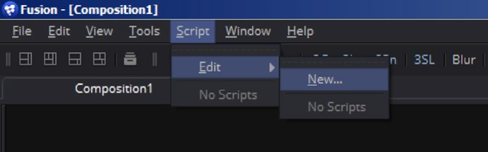
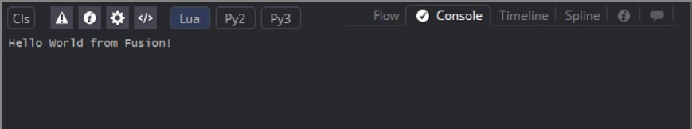

### Introduction 引言

脚本（Scripting）是什么？脚本解释执行特定编程语言——理论上讲——逐行或以编译字节码的形式（与之相对应的是直接执行预编译的机器码）。若不深究实现细节，可以总结出：由于其特性， 像Fusion这样复杂的程序可以通过脚本API作为宿主（host）提供功能访问。脚本环境封装了底层API，而且即使第三方代码有缺陷，也不那么容易使整个程序崩溃。代码也可以不重启宿主程序而热更新。另外，垃圾收集器（garbage collector）提供了常见脚本环境中大部分内存管理。即使与本地编译代码相比，这会比较慢，但性能仍优于常规图形用户界面所能及。Fusion中使用的LuaJIT风格因在多种情况下与机器码几乎一样快而闻名。

最终，脚本允许程序员将语言特性及库与宿主程序的功能结合。这也允许了第三方数据或应用的集成。

让我们通过示例来介绍Fusion内脚本的实际应用。作品中的脚本也许会有助于：

- **自动化：** 比如，读取给定文件夹中的所有媒体，加载进合成中，添加水印，缩放，并渲染到特定位置。
- **重复工作：** 比如， 找到合成中的所有Saver并将它们的状态设置为pass-through。
- **维护约定：** 比如，确保Saver中的路径总是指向服务器的特定位置，并有着特定命名约定。
- **易犯错的任务：** 比如，验证某个设置在渲染合成前被设置。
- **扩展应用的核心特性：** 比如，从第三方应用中导出动画数据。
- **需要为特定“管道”自定义的行为：** 比如，重载某事件发生后的事。这也许会强制某工具在创建特定工具时显示。
- **与第三方应用通信：** 比如，不仅交换数据还共享事件。当特定“管道工具”触发了创建镜头时创建对应的合成。

这些只是常见中的一些例子，有些脚本也许会需要一个接口来将行为适配到特定需求上。这也许是一个配置文件或派生自应用状态的信息（也许是合成中当前选中的工具）。但很多情况下会需要一个图形用户界面，有一个自定义对话框显示所有行为的可能选项。后者会在 “Graphical User Interfaces 图形用户界面”章节详细介绍。

在Fusion中，被叫做FusionScript的脚本API提供了对应用最必需的功能的访问。为了好好利用FusionScript，就需要对Fusion如何工作有一个基本的理解。理解了模型之后，通过浏览脚本参考（Scripting Reference）来找所需要的功能会更简单。

在FusionScript的加持下，Fusion的方方面面都是可访问、可控的，无论是合成还是它的工具、渲染、元数据、设置、属性、或是接口。

因为FusionScript只是一个抽象API，所以它允许通过不同的脚本语言访问——最值得注意的是内嵌于Fusion中的Lua语言，或是独立安装的Python语言。尽管这些语言自己的特性相去甚远，但它们对FusionScript的访问非常相似，毕竟是相同的API。差异及局限将于下章解释。

#### Quick Start Tutorial 快速入门教程

废话不多说，我们直接来看一个示例。

正如先前提到的，我们将创建一个Lua脚本来使除选中之外的所有Saver都pass through。如果没有选中Saver，那么所有Saver都pass through。当你有一个巨大的合成但只需要预渲染某个特定的Saver，这就会非常有用。

##### 第一步

首先，我们需要通过菜单的*Script->Edit->New…*创建一个脚本。



在文件对话框中，存储脚本到Script文件夹并命名为“Disable Unselected Savers.lua”。

在合成的脚本中，文件名被用于菜单中执行脚本的标签。所以选择了一个有意义的名称。

默认情况下，如果没有在偏好设置（Preferences）中设置别的，Fusion会打开默认应用。你可以手动通过调用*Script->Edit->Disable Unselected Savers*来编辑脚本。

在文本处理器中输入以下行：

```Lua
print("Hello World from Fusion!")
```

保存脚本并通过Script->Disable Unselected Savers执行。

> **注意** 
>
> 请留意是通过*Script->Edit->子菜单*来编辑脚本，而*Script->脚本名*来直接执行。
>
> 所有合成文件夹中的脚本都会在这里列出，包括子文件夹。

在界面上切换到控制台（Console）选项卡。如果一切无误，控制台会输出以下文字：



所有如`print`的标准输出都将传输到控制台。

##### 真正的脚本

按步骤分解我们打算写的脚本，需要实现以下功能：

1. 如果当前选中的工具是Saver，获取并保存它。
2. 迭代遍历该合成中的所有Saver。
3. 如果它们与我们的初始选择不匹配，将他们设置为PassThrough。

在Fusion中直接执行的脚本中，默认有两个变量是可见的：

`fusion`和`composition`。为减少打字，你也可以用缩写形式`fu`和`comp`。

正如它们的名字所指示的那样：使用`fusion`，你可以获取应用的属性和方法；而`compostion`表示合成中的一切。

因为这个特定脚本的所有任务都与合成（Composition）息息相关，所有必需的方法都可以在这个对象或其成员中找到。首先：

```Lua
comp:GetToolList(bool selected, string type = nil)
```

返回该合成中的所有工具，而如果参数设置为`true`则只返回选中的。类型参数是可选的，它可以用于筛选特定类型的工具。

该工具本身是类型`Tool`或`Operator`的一个对象。如你所见，Fusion的对象模型遵循面向对象（OOP）的概念，这将在下章深究。

一个工具有多种属性与方法，而我们要找的是Attribute（特征）。

> **注意**
>
> 大多数脚本API中的对象都有一个叫做`Object`的基类。`Object`有共同属性，其中一个存储Attribute。Attribute表示了一个工具在输出之外的序列化状态。

用于读写PassThrough状态的Attribute是叫做`TOOLB_PassThrough`的布尔量。

因为此时我们只设置它，我们只需：

```Lua
tools:SetAttrs( { TOOLB_PassThrough = True } )
```

注意我们传入了一个元组，所以使用了花括号，这样我们就能一次传入并设置多个Attribute。

使用这两个命令，我们就能完成该脚本所需的所有任务了。

```Lua
--源文件: 01 禁用未选中的保存器（Saver）
comp:Lock()
local selectedSavers = comp:GetToolList(true, "Saver")
local allSavers = comp:GetToolList(false, "Saver")
for i, currentSaver in pairs(allSavers) do
    local isSelected = false
    
    for j, currentSelectedSaver in pairs(selectedSavers) do
        if(currentSaver == currentSelectedSaver) then 
            isSelected = true
        end
    end
    if isSelected == false then
        currentSaver:SetAttrs( { TOOLB_PassThrough = true } )
    end
end
comp:Unlock()
```

我们还没有介绍第一和最后一条语句呢。

```Lua
comp:Lock()
comp:Unlock()
```

无论何时要更改一个合成的对象或数据，你都应该先锁定该合成，并在最后解锁它。这一担保不仅防止了竞态条件（race conditions）和不必要的重绘，还抑制了对话框弹出，如Loader和Saver添加进流程（Flow）中时。

以下两行简单地返回一个元组包含所有选中的Saver及所有独立的Saver。

```Lua
selectedSavers = comp:GetToolList(true, "Saver")
allSavers = comp:GetToolList(false, "Saver")
```

第一个循环迭代所有的的Saver。

接下来对每个选中的Saver的迭代比较所有`selectedSavers`与迭代中的 `currentSaver`。因为所有选中的Saver都在`allSavers`的集合中，我们可以确信`currentSaver`有没有被选中。

如果它没有被选中，我们将`currentSaver`设置为PassThrough，这与在流程视图（FlowView）中设置是一样的。

最后，我们像之前提到的那样解锁该合成。

保存该脚本，切换到Fusion，创建一摞Saver。选中其中的部分并运行这个脚本。现在，所有除了选中之外的Saver都应被设置成了PassThrough.