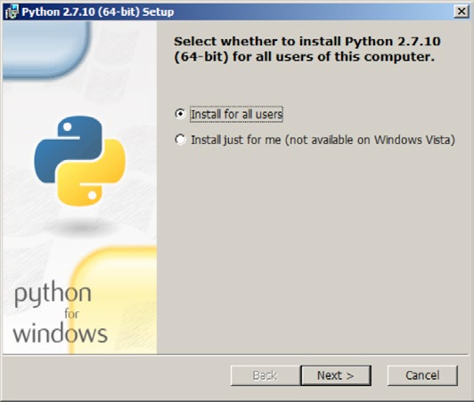
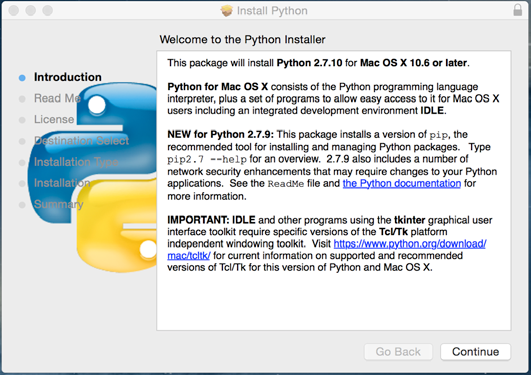
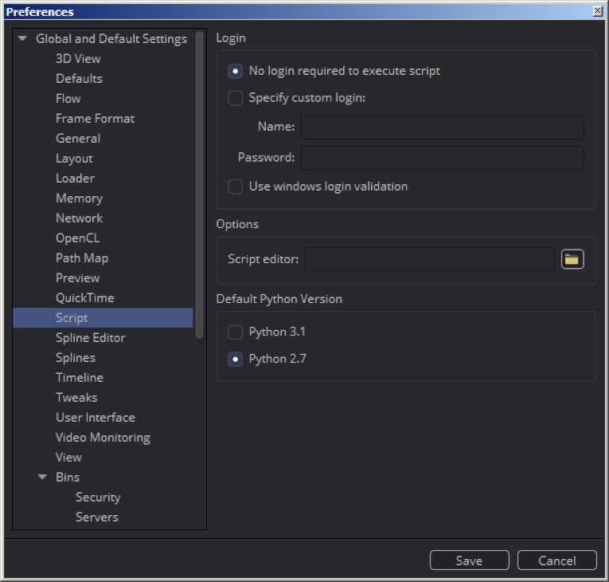

### Scripting Languages 脚本语言

Fusion有两种语言可供选择：Lua和Python。你可以自由选择使用哪一个语言来通过FusionScript访问API。

脚本不同于Fusion中别的API。也就是说Fuses，Lua脚本插件也可以包含基于GPU运算的OpenCL内核。Fuses允许创建工具及滤镜，而这特性原先只可能通过C++ SDK实现。

通过FusionScript编写脚本有两种选择：

#### Lua

Lua语言以其效率、速度、低内存占用而闻名，所以被广泛应用于科学和电子游戏中。

Fusion搭载了Lua5.1并额外内建了一些库：

- IUP - 用于图形用户界面（与“Graphical User Interfaces 图形用户界面”比较）
- bmd.scriptlib - 一个包含共有Fusion相关的帮助函数库

Lua是Fusion中的一等公民，所以在安装时就搭载了。所有的偏好设置和合成都被存储在Lua表中。Fuses使用Lua编写而简单表达式（Simple Expressions）也是由Lua的子集组成。此外，Fusion使用Lua的LuaJIT（JustInTime）风格，这比Cpython快得多了。虽然在普通脚本中这不算什么，但这也是Fuses只能用Lua编写的其中一个原因。

若需完整的语言参考，于此查看Lua文档：http://www.lua.org/manual/5.1/

以下是Lua和Python在封装上的区别：

- 成员属性由点访问。方法由冒号访问：

  例如

  ``` Lua
  print(comp.ActiveTool)
  print(comp:GetToolList(true))
  ```

- Lua中的布尔值是小写的（`true, false`）

- 函数、循环和条件等由`end`语句结尾

- Lua只知道一个叫做元组的集合类型，它可以像Python中的元组、列表或字典一样使用。

- Fusion有一个内建函数叫做`dump()`，它可以看作是`print()`的一个扩展。它将表的输出格式化成更易于阅读的形式。在控制台中，你可以以`==`开始来简写`dump`，例如，`==comp:GetAttrs()`。

##### 库

Lua的一个优点就是轻量；它没有庞大的标准库。取而代之的，可以添加库和Lua文件。因为FusionScript的Lua解释器是一个自定义的Lua版本，所以不能保证所有原生的Lua库都能在Fusion中工作。

#### Python

##### Python介绍

Python因其高效语法和语言特性被快速接纳。尤其是在视效（Visual Effects）工业中，Python代表了脚本的一种标准。多数后期制作应用现在会使用Python，这对于你通过脚本来流水线化制作由很大的帮助。除VFX外，还有数千的库提供Python绑定，这使得使用公共语言访问各种工具成为可能。

为了使用FusionScript，你需要在系统上安装官方基于C的Python实现，或称之为CPython，操作如下。

##### 选择版本

Python有Python2或Python3。后者是为了解决Python的核心问题而引入的，其代价是语法和特性的向后兼容性。比较：

https://wiki.python.org/moin/Python2orPython3

在Fusion中，您可以选择使用Python 2.7或3.3。根据您的任务做选择：或使用2.7（最广范围的应用程序支持）或3.3（如果你的“管道”依赖它的话）。

在撰写本文时，推荐的VFX参考平台建议使用最新的Python 2.7版本，因此许多工具可能依赖于这个版本。

##### 文档

官方文档可以在这里找到：

https://docs.python.org/2.7/

https://docs.python.org/3.3/

##### 安装

###### Windows

您需要在您的系统上安装最新的Python 2.7或Python 3.3，以便能够在Fusion中使用。为了匹配Fusion，需要64位编译。

https://www.python.org/downloads/windows/

安装期间，将安装选项设置为`“Install for all users”`，如下图：



这样，Python库安装完成，Fusion就可以在启动时就能获取它。继续以下的安装。

###### Mac OS X

您需要在您的系统上安装最新的Python 2.7或Python 3.3，以便能够在Fusion中使用。为了匹配Fusion，需要64位编译。

https://www.python.org/downloads/release/python-2710/



这样，Python库安装完成，Fusion就可以在启动时就能获取它。继续以下的安装。

##### 安装

安装完Python后，需要重启Fusion。

因为两个Python版本可以都安装，所以你需要在偏好设置（Preferences）中说明首选的版本。

为.py文件和默认控制台设置默认版本：

- *File Preferences...->Global and Default Settings->Script->Default Python Version*



> **注意**
>
> 如果你需要确保你的脚本在Python2或Python3下运行，你可以将脚本的文件扩展名单独设置成.py2或.py3。
>
> 注意这是非标准的行为，只能在Fusion中使用。

##### 库

与Lua相对的，Python拥有一个完整的标准库。这里由一个重要模块的列表来快速概览。

- os（操作系统&文件系统访问）
- shutil（文件系统访问）
- glob（文件系统匹配&监听）
- os.path（操作系统无关的路径操作）
- sys（系统访问）

完整的列表请参考：

https://docs.python.org/2/library/

https://docs.python.org/3.3/library/

另外，你也可以手动或由eco系统通过pip或easyinstall安装外部库。一些库对Fusion很有用：

- **slpp**（Lua数据解析for python）

  https://github.com/SirAnthony/slpp

  这个库使解析Lua表变得简单，而表恰是Fusion中数据的主要组成。

- **Pillow**（Python图像库Fork）

  图像处理框架

- **Numpy**

  数学框架

##### 与FusionScript的不同

如前所述，Fuses不能用Python编写。

同时还有EventScript、某些事件的回调脚本也只可能用Lua编写。

因为历史上FusionScript就只有Lua，一些返回多语句的方法有一个特殊的`Table()`后缀变体来使Python使用时返回合适的表。

因为Lua集合是元组，你很多情况下需要向API中传递字典，即使它看起来被当成了列表。

所以每个值都需要有一个条目顺序的键。

比如像这样的列表：

```Python
l = [“a”, “b”, “c”] 
```

需要这样的字典

```Python
d = {1: “a”, 2: “b”, 3:”c” }
```

请注意Lua使用1而不是0作为元组的第一个索引值。Python字典没有特定的顺序。因此，只有键指示它们的顺序。

类似地，所有由Python字典产生的Lua元组都需要解析成列表。如果顺序无所谓的话，就这样：

```Python
l = d.values()
```

如果顺序是重要的，它们的值需要在转换成列表前以它们的键排序。这可以由列表推导（List Comprehension）完成。

```Python
l = [item[1] for item in sorted(d.items())]
```

##### 脚本语言的选择

下面的列表汇总了使用其中一门或另一门语言的原因。

使用Lua：

- 内置二进制 - 免安装
- 从此共享脚本可以确保在Fusion中工作而无需安装
- 更多Fusion中的特性
- 更简单地解析Fusion的表
- 更轻量，更快
- Fusion搭载了很多Lua脚本而可以作为示例

使用Python：

- 在“管道”中使用其他Python脚本/应用。
- 大多数VFX应用使用Python
- 允许外部脚进行跨应用通信（仅限Studio）
- 强大的标准库
- 更多的使用&更多的第三方库、脚本和绑定
- Liunx&OSX中预装

总是推荐坚持使用你熟知的那一门。如果你已经熟悉了Lua或Python，那么在大多数情况下再去学习一门全新的语言是毫无意义的，尤其是当存在你可依赖的脚本或库时。

如果你仅对脚本语言初来咋到，而且只需要在乎Fusion，你应该坚持Lua，这也别的艺术家使用你的代码而无需预先设置。

如果您正在使用别的VFX应用最终也支持Python，这也许对于Fusion来说也是更好的选择。选择还可以取决于标准库或特定的第三方库。选择前研究一下你所需要的环境在长远来看会节省你的时间。

无论如何，Fusion及其FusionScript API都会尊重你的选择。

##### 跨语言评估

有时从一门语言调用另一门来访问某些特性是必要的或有用的，例如，您可能希望在Python中访问Lua函数转储。

控制台设置成Py2并执行：

```Python
composition.Execute(“dump(comp:GetAttrs())”)
```

而在Lua中以字符串执行Python：

```Lua
composition:Execute(“!Py: print(comp.GetAttrs())”)
```

要指定特定的Python版本，使用`!Py2:`或`!Py3:`。

你也可能会想运行完整的Lua或Python脚本。使用：

```Lua
composition:RunScript(filePath)
```

使用.lua、.py、.py2或.py3作为文件扩展名来指定对应的解释器。脚本菜单也与此相似，.py将执行已安装并在偏好设置中设置的Python解释器。因为`RunScript`在Python中也可用，你也可以在Python中运行.lua脚本。

> **注意**
>
> 所示脚本执行于当前打开合成的上下文中。
> 因此，所有的评估方法都是`composition`对象的成员。
>
> ```Lua
> composition:Execute(command)
> composition:RunScript(filePath)
> ```
>
> 如果你想让脚本执行于应用的上下文中，使用`fusion`来替代。
>
> ```Lua
> fusion:Execute(command)
> fusion:RunScript(filePath)
> ```

请注意没有可能向另一个语言传递返回对象。