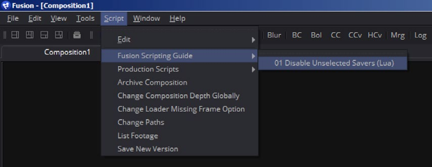
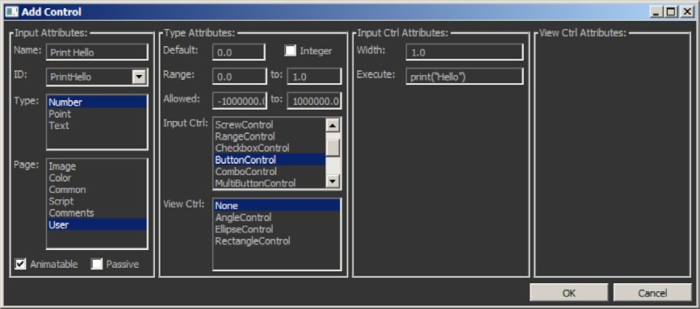
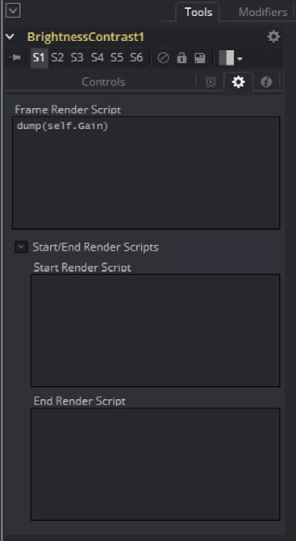

### Types of Scripts 脚本类型

Fusion根据上下文支持不同类型的脚本，例如，你也许有一个修改合成的的脚本，而另一个脚本也许只作用于某种工具。

这些上下文中的一些提供了不同的预定义对象集。就像Tool脚本会显示已被用作变量的工具。

为帮助理解，让我们来探究一些重要的脚本上下文。

#### Interactive Scripts 交互式脚本

交互式脚本（Interactive Scripts）是Fusion所有脚本中需要用户交互来运行的。这些脚本中大多数都由用户从菜单调用。

可用于这些上下文：

##### Composition Script 合成脚本

合成脚本（Composition Script）是最常见的脚本类型。它们被存储于*Scripts:/Comp*文件夹内并从脚本菜单（Scripts Menu）中运行。正如其名字所指，它们用于合成（Composition）的上下文。如果使用合成脚本来实现作用在单个选中工具上的话也没什么不妥，但你应该使用工具脚本（Tool Script）来替代才对。该菜单可以理解子文件夹，所以当脚本被放在子文件夹内时，会为其创建一个子菜单。



##### Tool Script 工具脚本

工具脚本（Tool Script）作用于单个工具。它们被存储于*Scripts:/Tool*文件夹内并可以从工具属性的右键上下文菜单中访问或编辑。当被调用是，Fusion、合成和特定工具对象将作为变量可用。

##### Bin Script 工具箱脚本

工具箱脚本（Bin Script）比较特殊，作用于工具箱内容。它们被存储在*Scripts:/Bin*文件夹内并通过工具箱的上下文菜单调用。

对于工具箱的更多信息，参考Fusion User Manual。

##### Utility Script 效用脚本

效用脚本（Utility Script）是这些脚本中作用于Fusion本身而不是特定合成的。它们被存储在*Scripts:/Utility*文件夹内并可通过*File > Script*菜单访问。Fusion变量默认是可见的。

##### Script Libraries 脚本库

scriptlib是一个包含可用于多个脚本的函数库的文件。包含在Fusion默认安装中的是bmd.scriptlib，它含有常见的实用函数。scriptlib中可以附加一些额外的东西，如变量声明（例如添加到全局表）。脚本库被安装到脚本路径（默认为*Scripts:*）的根目录下。在这个路径中，任何有`.scriptlib`扩展名的文件都会在Fusion启动时运行。为了在一个合成创建或打开时执行一个scriptlib，将scriptlib放在*Scripts:/Comp*来代替。scriptlib所添加的好处是你可以指示Fusion在每次合成创建或打开时运行一些代码。这个的缺点是Fusion将以任意顺序执行脚本目录中的文件。这意味着任何你写的依赖于其他库的脚本库中的代码都有可能无法工作。为了解决这个问题，尝试在scriptlib的顶部插入所需要的函数。

除了将函数传递到合成的全局环境外，scriptlib还可以设置来对合成完成默认操作。

#### External Scripts 外部脚本

外部脚本（External Scripts）可以在Fusion外部运行且也能访问Fusion实例。

##### Commandline Scripts 命令行脚本

在Fusion的安装目录下有一个叫作FuScript的应用，它允许从命令行直接运行脚本。

Mac版本可以*Fusion.app/Contents/MacOS/fuscript*的应用包中找到。

FuScript可以直接执行`.lua`脚本：

```sh
FuScript <script> [args]
```

传入的参数可以在脚本中通过`arg[1]`、`arg[2]`...`arg[n]`访问，而`arg[0]`留作指示执行脚本的路径。

FuScript也有一个交互式shell，以此启动：

```sh
FuScript -i
```

对于FuScript的其他用途，无需任何参数即可运行它。一个可能参数的列表会被打印到控制台。

使用以下代码段连接FuScript到一个正在运行的Fusion实例：

```lua
fusion = Fusion()
fu = fusion
composition = fu.CurrentComp
comp = composition
SetActiveComp(comp)
```

此后，交互式shell会像内建在Fusion中的shell一样运作。通过调用`SetActiveComp(comp)`，全局域会接受对该合成的调用。比如，像这样创建工具：

```lua
blur = Blur()
```

该命令会创建一个模糊（Blur）工具在当前合成的流程图（FlowView）中。

为运行python2或3，你可以像这样指定语言：

```sh
FuScript <script> [args] -l python2
FuScript <script> [args] -l python3
```

#### Events & Callbacks 事件&回调

事件与回调会在某些事件发生时触发。预先定义的回调会被调用。

##### Event Suites 事件套件

事件套件（Event Suites）在Fusion中被安装为某些事件的回调。像普通的scriptlib一样安装它们。在scriptlib中，添加以下变量：

```lua
ev = AddEventSuite("Composition")
```

这个变量现在可以在某些事件触发时访问该事件。

有这些可能的事件;

- `OnOpen()` -- 每次文件打开时触发
- `OnSave()` -- 每次合成保存时触发
- `OnSaveAs()` -- “另存为”调用时
- `OnStartRender()` -- 渲染开始时
- `OnEndRender()` -- 渲染结束时
- `OnFrameRendered()` -- 帧渲染时
- `OnTimeChange()` -- 时间改变时
- `OnActivateTool()` -- 工具激活时

**比如：**在*Scripts:/Comp*文件夹中创建叫作`PrintSaverPathsOnRender.scriptlib`的文件。输入以下内容：

```Lua
globals.ev = AddEventSuite("Composition")
function ev:OnStartRender(event)
    local toollist=comp:GetToolList("Saver")
    for i, tool in pairs(toollist) do
        print(tool:GetInput("Clip"))
    end
    self:Default(event)
end
```

现在开始渲染一个含有至少一个合法路径保存器（Saver）的合成。控制台会打印出保存器的路径。虽然这个例子没有加入太多的值，但它可以轻易地被修改成检查并操作路径。

> **注意**
>
> 总是使用`self:Default(event)`来调用事件的底层实现。
>
> 这将允许你在不同的scriptlib中创建多个事件。

移除事件套件可以通过运行`RemoveEventSuite(suite)`函数完成。在本例场景中，语法应为：

```lua
RemoveEventSuite(ev)
```

##### Button Callbacks 按钮回调

按钮回调（Button Callback）会在工具中的自定义按钮控件（Button Control）点击时被调用。

在内部，叫做`BTNCS_Execute`的属性（Attribute）需要被设置。最简单的方法是使用用户控件工具脚本（UserControls ToolScript）。当添加按钮控件时，标记为Execute的字段即可在Lua命令中使用。



生成的按钮控件会在合成中这样结束：

```lua
UserControls = ordered() {
    PrintHello = {
        LINKID_DataType = "Number",
        INP_Default = 0,
        BTNCS_Execute = "print(\"Hello\")", --译注：这里换成单引号或[[]]显然更好
        LINKS_Name = "Print Hello",
        INPID_InputControl = "ButtonControl",
    },
},
```

点击时，会输出`"Hello"`到控制台。

##### Hotkey Script 热键脚本

热键脚本（Hotkey Script）是一种在特定上下文中可以添加在键盘快捷键的脚本。

它们被默认存储在*Profile:*文件夹下的Fusion.hotkeys文件中。

#### InTool Scripts 工具内脚本

工具内脚本（InTool Scripts）是一种特殊的可以在每帧核算期间（渲染开始或结束时）运行在工具上的脚本。它们直接定义于工具内并拥有有限的读取访问，通过输入的名称——`self`、`composition`或`comp`，以及`fusion`和`fu`。该限制是为了防止死循环、竞态条件以及性能问题。

比如，你不能调用或改变输入。如果你想在逻辑上改变输入，使用修改器（Modifiers）、表达式（Expression）或简单表达式。同时注意改变工具内大多数输入会触发重渲染且工具内帧渲染脚本（InTool Frame Render Script）会被重新核算。



#### Simple Expressions 简单表达式

简单表达式（Simple Expressions）是工具内输入的直接的有限脚本环境的子集。它们可以被用作取代表达式（Expression）修改器，来直接连接并基于运算改变输入。

#### Fuses

Fuses是以Lua为脚本的插件，可以像普通的工具一样运作。它们可能是多线程的并包含OpenCL内核以在GPU上处理。参考专用的Fuses文档和参考。