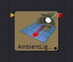
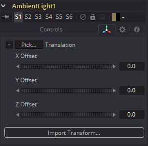

### Ambient Light [3Am]

Ambient Light是一种无方向的光照，它在全局范围内照亮一个场景。它没有实际的位置或旋转，尽管屏幕上的小部件将出现在视图中，以表明场景中有光照。提供了小部件的位置控件，以便在必要时将小部件移出其他几何图形。

#### 外部输入

 

*AmbientLight.SceneInput* 

[橙色，可选的]这个输入需要一个3D场景。如果提供了场景，此工具中的Transform控件将应用于提供的整个场景。

#### Controls选项卡

##### Enabled

当选中Enabled复选框时，环境光会影响场景。清除复选框以关闭光照。

##### Color

使用此标准Color控件设置灯光的颜色。

##### Intensity

使用此滑块设置环境光的强度。值为.2表示光的20%。一个完美的白色纹理只有在0.2环境光下才会渲染为20%的灰色`（.2, .2, .2）`。

#### Transform选项卡

此选项卡中出现的选项将确定此工具创建的几何物体的位置。由于这些控件在生成几何物体的所有工具上都是相同的，因此在本文档的Common 3D控件部分中对这些控件进行了全面描述。

