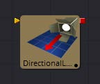
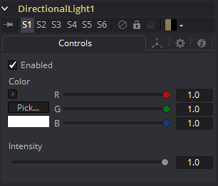
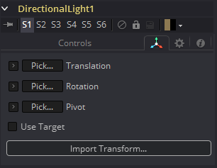

### Directional Light [3DL] 方向性光照

Directional Light是一种有明确方向但没有明确光源的光。此光照显示屏幕上的小部件，但小部件的位置没有任何意义。

#### External Inputs 外部输入

 

**DirectionalLight.SceneInput 场景输入** 

[橙色，可选的]这个输入需要一个3D场景。如果提供了场景，此工具中的Transform控件将应用于提供的整个场景。

#### Controls 控件

此选项卡包含该工具的所有参数。

##### Enabled 启用

当选中Enabled复选框时，定向光会影响场景。清除复选框以关闭光照。

##### Color 颜色

使用此标准Color控件设置灯光的颜色。

##### Intensity 强度

使用此滑块设置定向光的强度。值为.2表示光的20%。

#### Transform Tab 变换选项卡

此选项卡中出现的选项将确定此工具创建的几何物体的位置。由于这些控件在生成几何物体的所有工具上都是相同的，因此在本文档的Common 3D控件部分中对这些控件进行了全面描述。

