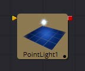
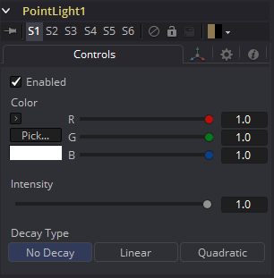
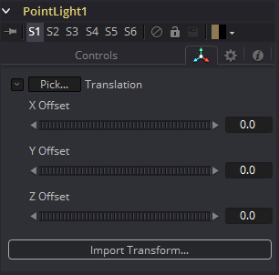

### Point Light [3PL]

Point Light是一种在空间中位置清晰的光源，它向四面八方发光。灯泡是一种点光源，就像太阳一样，尽管来自太阳的光可能由于从大气散射而显得是环境光。

此灯显示屏幕上的小部件，但只影响小部件的位置。由于光线是360度光源，所以小部件的旋转没有任何意义。与环境光和方向光不同，点光源可能会随着距离而衰减。

#### External Inputs 外部输入

 

**PointLight.SceneInput** 

[橙色，可选的]这个输入需要一个3D场景。如果提供了场景，此工具中的Transform控件将应用于提供的整个场景。

Controls 控件

##### Enabled 启用

当选中Enabled复选框时，点光源会影响场景。清除复选框以关闭光照。

##### Color 颜色

使用此标准Color控件设置灯光的颜色。

##### Intensity 强度

使用此滑块设置定向光的强度。值为.2表示光的20%。

##### Decay Type 衰减类型

点光源默认No Decay，这意味着它的光在场景中的所有点都具有相同的强度。若要使强度随距离衰减，可将Decay Type设置为Linear或Quadratic模式。

#### Transform Tab 变换选项卡

此选项卡中出现的选项将确定此工具创建的几何物体的位置。由于这些控件在生成几何物体的所有工具上都是相同的，因此在本文档的Common 3D控件部分中对这些控件进行了全面描述。

