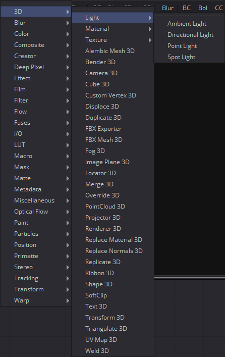
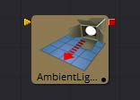
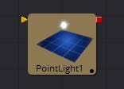
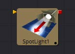

## 第二章 3D Light Tools 三维灯光工具

- [Ambient Light [3Am]](./Ambient%20Light%20[3Am].md) 
- [Directional Light [3DL]](./Directional%20Light%20[3DL].md) 
- [Point Light [3PL]](./Point%20Light%20[3PL].md) 
- [Spot Light [3SL]](./Spot%20Light%20[3SL].md) 

<table id="img">
  <tr>
    <td rowspan="4"></td>
    <td></td>
  </tr>
  <tr>
    <td></td>
  </tr>
  <tr>
    <td></td>
  </tr>
  <tr>
    <td></td>
  </tr>
</table>