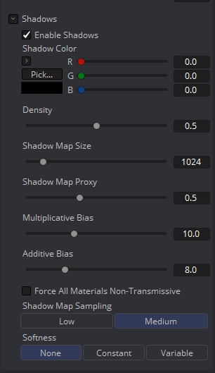
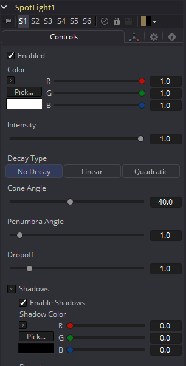
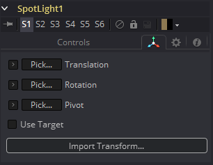

### Spot Light [3SL]

Spot Light 是从一个特定的点发出的光，它有一个清晰的锥形，光线会向边缘衰减。经验丰富的舞台和剧院灯光技术人员将把聚光灯当作是非常类似用于现场制作的标准灯具。这是唯一一种能够投射阴影的光。

#### 外部输入

 

*SpotLight.SceneInput* 

 [橙色，可选的]这个输入需要一个3D场景。如果提供了场景，此工具中的Transform控件将应用于提供的整个场景。

#### Controls选项卡

此选项卡包含该工具的所有参数。

##### Enabled

当选中Enabled复选框时，点光源会影响场景。清除复选框以关闭光照。

##### Color

使用此标准Color控件设置灯光的颜色。

##### Intensity

使用此滑块设置定向光的强度。值为.2表示光的20%。

##### Decay Type

聚光灯默认No Decay，这意味着它的光在几何物体上具有相同的强度，而与从光到几何图形的距离无关。若要使强度随距离衰减，可将Decay Type设置为Linear或Quadratic模式。

##### Cone Angle

光的锥角是指光发出其全部强度的锥的宽度。角越大，锥角越宽，达到90度的极限。

##### Penumbra Angle

Penumbra Angle决定了光强下降到0的锥角以外的面积。较大的半影角定义较大的衰减，而值0生成硬边光。

##### Dropoff

Dropoff控制半影角从全强度到0的下降速度。

#### Shadows

本节提供几个用于定义聚光灯创建阴影时使用的阴影映射控件。详情请参阅Lights and Shadows章节。

##### Enable Shadows

如果要生成阴影，应选中Enable Shadows复选框。默认为选中。

##### Shadow Color

使用此标准Color控件设置阴影的颜色。默认为黑色`(0, 0, 0)`。

##### Density

阴影的Density决定了阴影的不透明程度。密度1.0将产生一个完全（译注：不）透明的阴影，而较低的值使阴影透明。

##### Shadow Map Size

Shadow Map Size控件确定用于创建阴影映射的位图的大小。较大的值将生成更详细的阴影映射，这将牺牲内存和性能。

##### Shadow Map Proxy

Shadow Map Proxy确定启用Proxy或Auto Proxy模式时使用的阴影映射的大小。值0.5将生成分辨率为阴影映射大小中定义的一半的阴影映射。

##### Multiplicative/Additive Bias

阴影本质上是应用于场景中的物体的纹理，所以偶尔会有Z轴冲突，也就是物体的一部分应该接收阴影的部分在阴影之上渲染。Bias的工作原理是添加一个小的深度偏移量，将阴影从阴影表面移开，消除Z轴冲突。Bias过小，物体就会自我遮蔽。过多的Bias会使阴影与表面分离。首先对Multiplicative Bias进行调整，然后利用Additive Bias控件对结果进行微调。

有关示例和更多信息，请参见3D章节的Multiplicative and Additive Bias部分。

##### Force All Materials Non-Transmissive

通常，渲染阴影时使用RGBAZ阴影映射。通过启用此选项，你将强制渲染器使用只包含Z的阴影映射。这可以显著加快阴影渲染，同时使用五分之一的内存。缺点是你不能再像投射阴影一样投射“彩色玻璃”。

##### Shadow Map Sampling

设置阴影贴图采样的质量。

##### Softness

阴影中的软边是通过对采样后的阴影图进行滤镜而产生的。在渲染产生不同效果的阴影时，Fusion有三种不同的滤镜方法。

- *None:* 阴影会有一个硬边。完全不做阴影映射的滤镜。这种方法的优点是只需要在阴影映射中采样一个像素，因此速度很快。
- *Constant:* 阴影边缘将有一个恒定的柔和度。当对阴影贴图采样时，使用一个宽度恒定的滤镜。调整Constant Softness滑块控制过滤器的大小。注意滤镜做得越大，渲染阴影的时间就越长。
- *Variable:* 阴影边缘的柔和度会随着阴影接收器离阴影投射者变远而增加。
  通过改变滤滤镜的尺寸，根据接收者和投射者之间的距离来实现可变的柔和度。选择此选项后，会出现Softness Falloff、Min Softness和Max Softness滑块。

##### Constant Softness

如果Softness设置为Constant时，则会出现此滑块。它可以用来设置阴影的整体柔和度。

##### Softness Falloff

当Softness设置为Variable时，会出现Softness Falloff滑块。这个滑块控制阴影边缘的柔软度随距离增长的速度。更精确地说，它根据阴影投射者和接收者之间的距离控制阴影映射滤镜的大小增长的速度。它的效果是由Min和Max Softness滑块的值调节的。

##### Min Softness

当Softness设置为Variable时，会出现Min Softness滑块。这个滑块控制阴影的最小柔和度。阴影离投射阴影的物体越近，它就会越尖锐，直至这个滑块设置的极限。

##### Max Softness

当Softness设置为Variable时，会出现Max Softness滑块。这个滑块控制阴影的最大柔和度。阴影离投射阴影的物体越远，它就会越柔和，直至这个滑块设置的极限。

#### Transform选项卡

此选项卡中出现的选项将确定此工具创建的几何物体的位置。由于这些控件在生成几何物体的所有工具上都是相同的，因此在本文档的Common 3D控件部分中对这些控件进行了全面描述。

