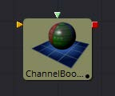
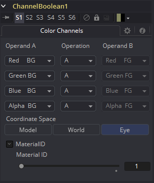

### Channel Boolean Material [3Bol]

Channel Boolean Material可用于通过数学运算重新映射和修改3D材质的通道。 例如，如果要使用材质的红色通道来控制使用alpha通道的照明模型的标量输入（例如，Blinn.SpecularExponent），则可以在此处重新映射通道。 此外，它允许使用几何物体特定的信息，如纹理空间坐标和法线。

#### 外部输入

 

**ChannelBooleanMaterial.BackgroundMaterial** 

[橙色，可选的]此输入将接受2D图像或3D材质。

**ChannelBooleanMaterial.ForegroundMaterial** 

[绿色，可选的]此输入将接受2D图像或3D材质。

#### Controls

##### Operand A/B

每个输出RGBA通道一个的Operand菜单允许用户为相应的通道设置所需的输入信息。

- **Red/Green/Blue/Alpha FG** 

  读取前景材质的颜色信息。

- **Red/Green/Blue/Alpha BG** 

  读取背景材质的颜色信息。

- **Black/White/Mid Gray** 

  将通道的值设置为0.1或0.5。

- **Hue/Lightness/Saturation FG** 

  读取前景材质的颜色信息，将其转换为HLS色彩空间，并将所选信息放入相应的通道中。

- **Hue/Lightness/Saturation BG** 

  读取背景材质的颜色信息，将其转换为HLS色彩空间，并将所选信息放入相应的通道中。

- **Luminance FG** 

  读取前景材质的颜色信息，并计算通道的亮度值。

- **Luminance BG** 

  读取背景材质的颜色信息，并计算通道的亮度值。

- **X/Y/Z Position FG**

  将通道的值设置为三维空间中像素的位置。向量信息在眼空间中返回。

- **U/V/W Texture FG** 

  将前景材质的纹理空间坐标应用于通道。

- **U/V/W EnvCoords FG** 

  将环境纹理空间坐标应用于通道。在修改环境纹理坐标的工具上游使用它，如Reflect 3D工具。

- **X/Y/Z Normal** 

  将通道的值设置为法向量的选定轴。向量在眼空间中返回。

##### Operation

确定如何组合操作数的Operation。

- **A:** 仅对输出通道使用Operand A。
- **B:** 仅对输出通道使用Operand B。
- **1-A:** 从1中减去Operand A的值。
- **1-B:** 从1中减去Operand B的值。
- **A+B:** 相加Operand A和B的值。
- **A-B:** 从Operand A中减去B的值。
- **A\*B:** 将两个Operand的值相乘。
- **A/B:** 将Operand B的值除以A。
- **min(A,B):** 比较Operand A和B的值并返回较小的值。
- **max(A,B):** 比较Operand A和B的值并返回较大的值。
- **avg(A,B):** 返回两个Operand的平均值。

##### Material ID

此滑块设置分配给此材质的数字标识符。如果渲染器中启用了相应选项，这个值将被渲染到MatID辅助通道中。