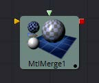
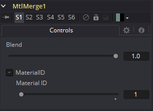

### Material Merge 3D [3MM]

Material Merge工具可用于将两个单独的材质组合在一起。  此工具可用于复合材质工具，将多个照明材质（Blinn，Cook Torrance）与纹理工具（Bumpmap，Reflection）组合在一起，以创建复杂的着色器网络。

该工具还提供了一种为组合材质指定新材质标识符的机制。

#### 外部输入

 

*MtlMerge3D.BackgroundMaterial* 

[橙色，必需的]此输入将接受2D图像或3D材质以用作背景材质。在基本着色模型中，2D图像将被视为漫反射纹理贴图。

*MtlMerge3D.ForegroundMaterial* 

[绿色，可选的]此输入将接受2D图像或3D材质以用作前景材质。

在基本着色模型中，2D图像将被视为漫反射纹理贴图。

#### Controls

##### Blend

Material Merge的Blend行为类似于图像的Dissolve(DX)工具。使用滑块的值将两种材质/纹理混合在一起，以确定每个输入所贡献的百分比。虽然背景和前景输入可以是2D图像而不是材质，但此工具的输出始终是材质。

##### Material ID

此滑块设置分配给此材质的数字标识符。如果渲染器中启用了相应选项，这个值将被渲染到MatID辅助通道中。