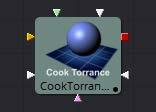

## 3D Material Tools 三维材质工具

- **[Blinn [3Bi]](./Blinn%20[3Bi].md)** ✔
- **[Channel Boolean Material [3Bol]](./Channel%20Boolean%20Material%20[3Bol].md)** ✔
- **[Cook Torrance [3CT]](./Cook%20Torrance%20[3CT].md)** ✔
- **[Material Merge 3D [3MM]](./Material%20Merge%203D%20[3MM].md)** ✔
- **[Phong [3Ph]](./Phong%20[3Ph].md)** ✔
- **[Reflect [3Rr]](./Reflect%20[3Rr].md)** 📌
- **[Stereo Mix [3SMM]](./Stereo%20Mix%20[3SMM].md)** 
- **[Ward [3Wd]](./Ward%20[3Wd].md)** 

