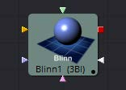

## 第三章 3D Material Tools 三维材质工具

- [Blinn [3Bi]](./Blinn%20[3Bi].md) 
- [Channel Boolean Material [3Bol]](./Channel%20Boolean%20Material%20[3Bol].md) 
- [Cook Torrance [3CT]](./Cook%20Torrance%20[3CT].md) 
- [Material Merge 3D [3MM]](./Material%20Merge%203D%20[3MM].md) 
- [Phong [3Ph]](./Phong%20[3Ph].md) 
- [Reflect [3RR]](./Reflect%20[3RR].md) 
- [Stereo Mix [3SMM]](./Stereo%20Mix%20[3SMM].md) 
- [Ward [3Wd]](./Ward%20[3Wd].md) 

<table id="img">
  <tr>
    <td rowspan="4"></td>
    <td></td>
    <td></td>
  </tr>
  <tr>
    <td></td>
    <td></td>
  </tr>
  <tr>
    <td></td>
    <td></td>
  </tr>
  <tr>
    <td></td>
    <td></td>
  </tr>
</table>