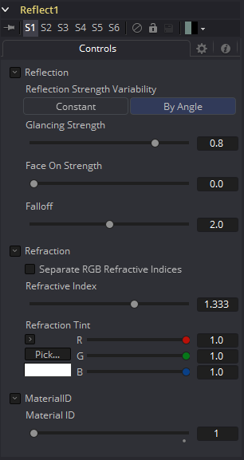

### Reflect [3RR] 反射

Reflect工具用于向材质添加环境贴图反射和折射。提供反射和掠射强度、衰减、各通道折射率和染色。多个纹理贴图输入可以修改每个参数的行为。

反射工具通常与标准照明材质（如Blinn、Cook Torrance、Phong或Ward）组合，将该工具的输出连接到反射工具的背景材质输入。然后将反射纹理连接到反射纹理输入。这可以是2D图像，但更常见的是由Sphere Map或Cube Map工具创建的环境贴图。

环境贴图是一种假定对象的环境与对象无限远的近似。最好将其描绘为以物体为中心的立方体或球体。特别地，这种无限距离假定意味着物体不能与它们自身相互作用（例如，茶壶手柄上的反射不会显示茶壶的主体而是显示无限的环境贴图）。这也意味着如果在场景中的多个对象上使用相同的立方体贴图，那些对象将不会相互反射（例如，两个相邻对象不会彼此反射）。如果希望对象相互反射，则需要为每个对象渲染立方体贴图。

有关详细信息，请参阅本手册中的Reflections and Refractions。

#### External Inputs 外部输入

 

**Reflect.BackgroundMaterial 背景材质** 

[橙色，可选的]此输入需要2D图像或3D材质。
  如果提供了2D图像，该工具会将其视为应用于基本材质的漫反射纹理贴图。

**Reflect.Reflection.ReflectionTex 反射纹理** 

[绿色，可选的]此输入需要2D图像或3D材质。RGB通道用作反射纹理，并忽略alpha。

**Reflect.Reflection.ReflectionIntensityTex 反射强度纹理** 

[洋红色，可选的]此输入需要2D图像或3D材质。纹理的alpha通道乘以反射的强度。

**Reflect.Refraction.RefractionTex 折射纹理** 

[淡蓝色，可选的]此输入需要2D图像或3D材质。RGB通道用作折射纹理。

**Reflect.BumpmapTex 凹凸纹理** 

[白色，可选的]此输入将接受2D图像或3D材质，然后将RGB信息用作纹理空间法线。

#### Controls 控件

#### Reflection 反射

##### Reflection Strength Variability 反射强度变化量

这个多按钮控件可以设置为Constant或By Angle来改变反射强度，根据相对于观察者的表面方向。以下三个控件只有在此控件设置为By Angle时才可见。

##### Glancing Strength 

[By Angle]Glancing Strength控制着反射面远离相机的几何物体区域的反射强度。

##### Face On Strength

[By Angle]Face On Strength控制反射的强度，为那些部分的几何形状直接反射回相机。

##### Falloff

[By Angle]Falloff在强度区域上的扫瞄和脸部之间转换的锐度。它可以被认为是类似于将伽玛校正应用于Face On和Glancing值之间的梯度。

##### Constant Strength

[Constant Angle]这种控制只有在Reflection Strength Variability设置为Constant时才可见。在这种情况下，反射的强度是恒定的，与反射的入射角无关。

#### Refraction

如果进入的背景材质的不透明度低于1，则可以使用环境贴图作为折射纹理，也可以在透明物体中模拟折射效果。

##### Separate RGB Refraction Indices

启用此复选框后，将隐藏Refraction Index滑块，并在其位置出现三个调节红、绿、蓝通道折射率的滑块。例如，这允许模拟在厚而不完美的玻璃中常见的光谱折射效应。

##### Refraction Index

这个滑块控制了通过一个表面查看环境贴图的变形程度。整体变形是基于入射角。由于这是一个近似，而不是模拟，结果并不打算准确地模拟真实折射。

##### Refraction Tint

折射纹理与色调颜色相乘，用于模拟滤过颜色的折射。它可以用来模拟在有色玻璃中的着色类型，例如在许多品牌的啤酒瓶中可以看到。