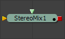

### Stereo Mix [3SMM] 立体混合

#### External Inputs 外部输入

 

**StereoMix.LeftMaterial** 

[橙色，必需的]此输入将接受2D图像或3D材质，以用作左眼渲染的材质。如果使用2D图像，则使用基本材质类型将其转换为漫反射纹理贴图。

**StereoMix.RightMaterial** 

[橙色，必需的]此输入将接受2D图像或3D材质，以用作右眼渲染的材质。如果使用2D图像，则使用基本材质类型将其转换为漫反射纹理贴图。

虽然输入可以是2D图像或3D材质，但输出总是材质。

#### Controls

##### Swap

这个选项将交换工具的两个输入。

##### Material ID

此滑块设置分配给此材质的数字标识符。如果渲染器中启用了相应选项，这个值将被渲染到MatID辅助通道中。