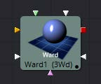
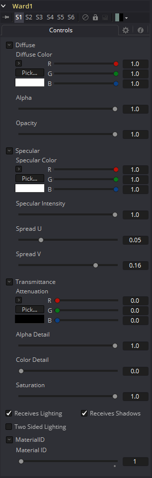

### Ward [3Wd]

Ward工具是一种基本的照明材质，可以应用于3D场景的几何物体。它描述了物体对光线的反应，并提供了大量的纹理贴图输入，允许对材质的漫反射、高光和凹凸贴图组件进行精细控制。

特别是，Ward工具是模拟拉丝金属表面的理想工具，因为高光可以沿着映射坐标的U或V方向拉长。这就是所谓的各向异性（Anisotrophic）亮点。

Ward工具输出一个三维材质，可以连接到任何三维几何工具上的材质输入。

#### External Inputs 外部输入

 

**Ward.DiffuseTex** 

[橙色，可选的]此输入将接受2D图像或3D材质作为漫反射纹理贴图。

**Ward.SpecularColorTex** 

[绿色，可选的]此输入将接受2D图像或3D材质作为高光彩色纹理贴图。

**Ward.SpecularIntensityTex** 

[洋红色，可选的]此输入将接受2D图像或3D材质作为材质高光高光的强度贴图。当输入为2D图像时，alpha通道用于创建贴图，而颜色通道则被丢弃。

**Ward.SpreadUTexture** 

[淡蓝色，可选的]该输入将接受2D图像或3D材质。此工具控件中的Spread U选项的值将与材质的alpha通道中的像素值相乘。

**Ward.SpreadVTexture** 

[淡蓝色，可选的]该输入将接受2D图像或3D材质。此工具控件中的Spread V选项的值将与材质的alpha通道中的像素值相乘。

**Ward.BumpmapTex** 

[白色，可选的]此输入将接受2D图像或3D材质，然后使用RGB信息作为纹理空间法线。

这些输入中的每一个都将纹理贴图中的像素乘以工具本身中等效命名的参数。这提供了用于缩放部分材质的有效方法。

当工具有像这个一样多的输入时，通常很难精确地进行连接。按住Option(Mac OS X)或Alt(Windows)键，同时将另一个工具的输出拖动到工具块上，并在释放鼠标左键时按住Option或Alt键。将出现一个小菜单，其中列出该工具提供的所有输入。单击所需的输入完成连接。

#### Controls

#### Diffuse

Diffuse描述基本表面特征，没有任何额外的效果，如反射或高光。除了定义对象的基本颜色外，漫反射颜色还定义对象的透明度。漫反射纹理贴图中的alpha可以用来使任何物体表面的部分透明。

##### Diffuse Color

材质的Diffuse Color描述了材质在间接或环境光照射下呈现的基色。如果提供了漫反射纹理贴图，那么这里提供的颜色值将乘以纹理中的颜色值。

##### Alpha

这个滑块设置材质的Alpha通道值。这同样影响漫反射和高光颜色，并影响渲染输出中材质的alpha值。如果提供了漫反射纹理贴图，那么这里的alpha值集将乘以纹理贴图中的alpha值。

##### Opacity

降低材质的不透明度会同样降低高光和漫反射颜色的颜色和alpha值，使材质透明。

#### Specular

Specular部分的参数描述了表面高光的外观。对于每个光照模型，这些值的计算方法不同。

##### Specular Color

Specular Color决定了从光亮表面反射的光的颜色。一种材料的高光越高，它看起来就越有光泽。像塑料和玻璃这样的表面往往有白色高光，而金属表面则有像黄金这样的高光，这些高光从材质的颜色中继承了它们的颜色。如果提供了高光纹理映射，那么这里提供的值将乘以纹理中的颜色值。

##### Specular Intensity

Specular Intensity控制高光的强度。如果提供高光强度纹理，则此值乘以纹理的alpha值。

##### Spread U

Spread U控制物体UV-Map中高光高光沿U轴的衰减。值越小，衰减越明显，在这个方向上材质出现的越光滑和光泽。如果提供了Spread U纹理，那么这个值乘以纹理的alpha值。

##### Spread V

Spread V控制物体UV-Map中高光高光沿V轴的衰减。值越小，衰减越明显，在这个方向上材质出现的越光滑和光泽。如果提供了Spread U纹理，那么这个值乘以纹理的alpha值。

#### Transmittance

Transmittance控制着光通过材质的方式。例如，一个实心的蓝色球体会投射出一个黑色的阴影，但是一个半透明的蓝色塑料球体会投射出一个密度低得多的蓝色阴影。

还有一个单独的Opacity选项。不透明度决定了渲染时实际表面的透明度。Fusion允许分别调整不透明度和透射率。对于那些刚开始不熟悉3D软件的人来说，这可能有点违反直觉。有可能存在一个表面是完全不透明的，但会100%地透射到达它的光，有效地使它成为一个发光/发射表面。

##### Attenuation

Attenuation决定了有多少颜色通过物体。对于具有透射阴影的对象，将衰减设置为`(1,1,1)`，这意味着100%的绿色、蓝色和红色光线通过该对象。将此颜色设置为`RGB(1,0,0)`意味着材质将传输100%到达表面的红色，但没有绿色或蓝色的光。这允许了“彩色玻璃”阴影。

##### Alpha Detail

当Alpha Detail滑块设置为0时，对象的Alpha通道将被忽略，整个对象将投射阴影。如果将其设置为1，alpha通道将确定对象投射阴影的部分。

##### Color Detail

Color Detail滑块通过漫反射颜色+纹理颜色调节通过表面的光线。使用此方法可以投射阴影，其中包含应用于对象的纹理的颜色细节。将滑块从0增加到1会给阴影带来更多的漫反射颜色和纹理颜色。注意，当传输颜色时忽略了对象的alpha值和不透明度，允许具有实alpha值的对象仍然将其颜色透射到阴影。

##### Saturation

Saturation滑块控制透射到阴影的颜色部分的饱和度。将此设置为`0.0`将导致单色阴影。

##### Receives Lighting/Shadows

这些复选框控制材质是否受到场景中光照和阴影的影响。如果关闭，该对象将始终是完全点亮和/或无阴影。

##### Two Sided Lighting

通过在表面的背面添加一组面向相反方向的法线，从而使曲面实际上是双面的。这通常是关闭的，以提高渲染速度，但可以为2D表面或不完全封闭的对象打开，以允许反向或内部表面也可见。

通常，在3D应用程序中，只有一个表面的正面是可见的，而背面是经过筛选的，因此，如果相机在3D应用程序中围绕一个平面旋转，当它到达背面时，这个平面将变得不可见。在3D应用程序中，让一个平面双面化相当于在第一个平面上添加另一个平面，但旋转180度，因此法线在背面朝相反的方向。因此，当你绕着背面旋转时，你会看到第二个像平面，它的法线朝相反的方向。

当你制作一个双面的曲面时，Fusion和3D应用做的是一样的事情。由于Fusion在缺省情况下不会剔除背面的多边形，所以出现了关于双面的混淆。如果你在Fusion中绕着一个单面旋转，你仍然会从背面看到它（但你看到的是正面复制到背面，就像它是透明的一样）。让平面两面化实际上增加了第二套法线到平面的背面。

> 注意：一旦您使表面透明，这将变得相当混乱，因为同样的规则仍然适用并产生结果，这是违反直觉的。如果你从正面看一个从背面照亮的透明双面表面，它看起来就不亮。

#### Material ID

此滑块设置分配给此材质的数字标识符。如果渲染器中启用了相应选项，这个值将被渲染到MatID辅助通道中。

