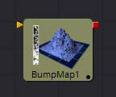
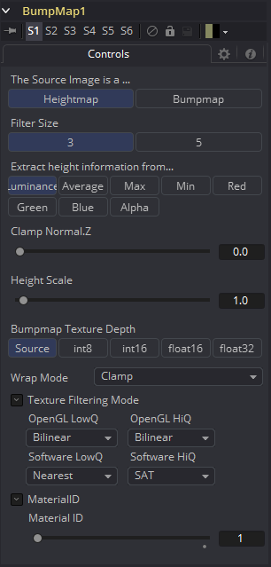
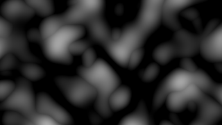
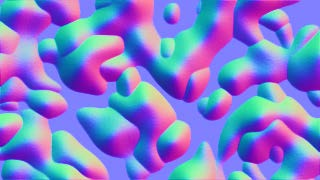
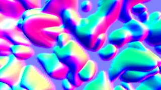

### BumpMap [3Bu] 凹凸贴图

Bumpmap工具可以将灰阶（高度贴图）图像转换成凹凸贴图，也可以直接使用Create Bumpmap工具创建的凹凸贴图。本工具输出一种材质。

#### External Inputs 外部输入

 

**Bumpmap.ImageInput (white)**

从图像中接收RGBA通道，用于凹凸计算或现有凹凸贴图。

#### Controls

此选项卡包含该工具的所有参数。

##### The Source Image is a...

在Heightmap和Bumpmap之间切换，前者将创建一个类似于CreateBumpmap工具的凹凸贴图，后者期望由CreateBumpmap工具创建一个凹凸贴图。

##### Filter Size

生成凹凸信息的过程基本上是一个自定义滤镜。这个多按钮控件设置过滤器的大小。

##### Extract height information from...

设置从何处提取灰阶信息的通道。

##### Clamp Normal.Z

在生成的凹凸纹理中剪切蓝色通道的较低值。

##### Filter Wrap Mode

基本上将图像“包裹”在边框处，因此在使用无缝可平铺纹理时，滤镜会产生正确的结果。

##### Height Scale

更改凹凸贴图中结果值的对比度。增加此值会产生更明显的凹凸贴图。

##### Bumpmap Texture Depth

可选地将产生的凹凸纹理转换为所需的位深。

#### 关于Bumpmap的注释

Bumpmap在术语上有一些混乱，这取决于你正在阅读的论文/书籍/和你交谈的人。以下是Fusion的约定:

##### Heightmap

包含每个像素高度值的灰度图像

##### Bumpmap

包含存储在RGB通道中的法线的图像，用于修改现有法线（通常在切线空间中给出）

##### Normalmap

包含存储在RGB通道中的法线的图像，用于替换现有法线（通常在切线或对象空间中给出）