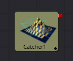
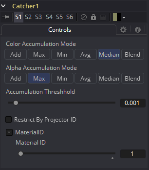

### Catcher [3Ca]

Catcher材质是用来“捕捉”从Projector 3D和Camera 3D工具投射的纹理模式投影。截取的投影被转换成纹理贴图，并由Catcher材质应用于其连接的几何物体。

理解基于光的投影和基于纹理的投影之间的区别有助于了解Catcher工具的用途。基于光的投影简单地将投影图像中的RGB通道的值添加到位于投影锥内的任何几何的漫反射纹理。这使得在使用光模式投影时无法基于图像的alpha通道剪切几何体。

想象一下，您希望将建筑物的图像投影到图像平面上作为设置扩展镜头的一部分。您首先roto图像以matte窗口。这样就可以在最终合成中看到墙后面房间的几何物体。当此图像投影为光时，将忽略Alpha通道，因此被matte的窗口保持不透明。

通过将Catcher连接到应用于图像平面的材质的漫反射纹理贴图，然后将投影从Light or Ambient Light模式切换到Texture模式，Fusion知道将投影图像应用为纹理贴图。使用此技术时，窗口将变为透明，并且可以看到窗口后面的几何物体。

这种方法相对于光投影的主要优点是可以使用Catcher将alpha通道投影到对象上，并且不需要启用照明。另一个优点是Catcher不仅限于材质的漫反射输入，因此可以投射高光强度贴图，甚至是反射和折射贴图。

> **注意：**Catcher材质需要场景中的 Projector 3D或Camera 3D工具，设置为在Catcher所连接的对象上以Texture模式投影图像。如果没有投影，或者投影未设置为Texture模式，Catcher将简单地使对象透明且不可见。

#### 外部输入

 

此材质工具没有任何外部输入。

#### Controls

##### Enable

使用此复选框可启用或禁用该工具。

##### Color Accumulation Mode

Color Accumulation Mode用于控制Catcher如何组合来自多台投影机的灯光。当场景中只有一台投影机时，它对结果没有影响。此控件旨在与Software渲染器一起使用，并且在使用OpenGL渲染器时不会产生任何影响。

##### Alpha Accumulation Mode

Alpha Accumulation Mode用于控制Catcher如何组合来自多台投影机的Alpha通道。当场景中只有一台投影机时，它对结果没有影响。此控件旨在与Software渲染器一起使用，并且在使用OpenGL渲染器时不会产生任何影响。

##### Accumulation Threshold

Accumulation Threshold可用于从累积计算中排除某些低值。例如，当使用Median Accumulation累积模式时，阈值0.01将从中值计算中排除任何值小于0.01的像素。

##### Restrict by Projector ID

激活时，Catcher只会从具有匹配ID的Projector接收光线。具有不同ID的Projector将被忽略。

##### Material ID

此滑块设置分配给此材质的数字标识符。如果渲染器中启用了相应选项，这个值将被渲染到MatID辅助通道中。