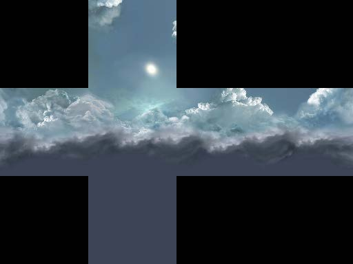
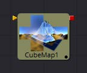
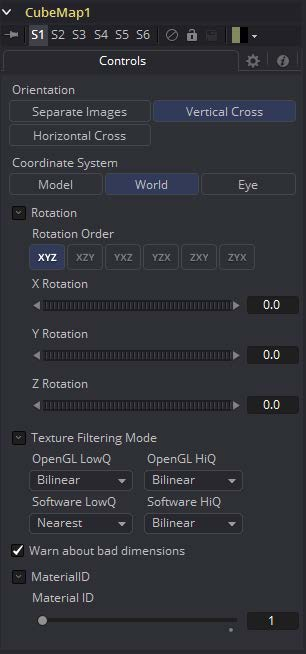

### CubeMap [3Cu] 立方体贴图

CubeMap工具使用单独的图像为立方体的每个面创建纹理贴图。它还可以从包含垂直或水平十字布局中的展开立方体的单个图像中提取立方体的各个面。

通过以90度视角安装6个摄像机以指向上，下，左，右，前和后来产生立方体贴图。

该工具提供了为生成的纹理贴图设置参考坐标系和旋转的选项。CubeMap工具通常用于为远距离区域（如天空或视野）或反射和折射贴图生成环境贴图。

#### External Inputs 外部输入

 

**CubeMap.CrossImage**

[白色，必需的]此输入仅在工具设置为Vertical Cross或Horizontal Cross方向时可见。它需要一个2D图像。

**CubeMap.[DIRECTION]**

[白色，必需的]仅当工具设置为Separate Images方向模式时，才会显示这六个输入。每个输入都需要对齐图像以匹配左，右，上，下，前和后面。

#### Controls

##### Orientation

这个多按钮控件告诉工具对立方体贴图纹理要求哪种输入。有效选项包括：

- **Separate Images:** 此选项在工具图块上显示六个输入，一个用于立方体的每个面。如果单独的图像不是正方形或不是相同大小，它们将被重新缩放为可包含所有图像的最大1:1图像。
- **Vertical Cross:** 此选项显示工具磁贴上的单个输入。图像应该是立方体的展开纹理，其中包含组织成垂直交叉形式的所有面，其中高度大于宽度。如果交叉图像的图像方面不是3:4，则Cubemap工具会将其裁剪下来，以匹配适当的宽高比。
- **Horizontal Cross:** 此选项显示工具磁贴上的单个输入。图像应该是立方体的展开纹理，其中包含组织成水平交叉形式的所有面，其中宽度大于高度。如果交叉图像的图像方面不是3:4，则Cubemap工具会将其裁剪下来，以匹配适当的宽高比。

##### Coordinate System

此多按钮控件设置将图像转换为纹理时使用的坐标系。

- **Model:** 此选项沿着对象局部坐标系定向纹理。
- **World:** 此选项使用全局或世界坐标系定向生成的纹理。
- **Eye:** 此选项将纹理贴图与相机或查看器的坐标系对齐。

##### Warn about bad dimensions

如果提供的图像尺寸不符合所选方向模式的要求，则选中此复选框将在控制台中显示警告消息。

##### Material ID

此滑块设置分配给此材质的数字标识符。如果渲染器中启用了相应选项，这个值将被渲染到MatID辅助通道中。