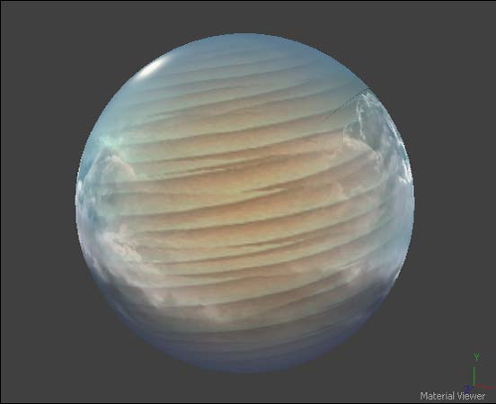
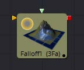
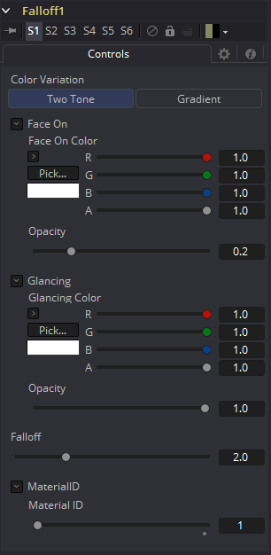
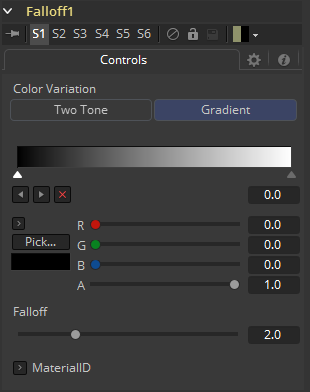

### Falloff [3Fa]

Falloff工具根据材质所应用的物体与相机之间的入射角将两种材质混合在一起。
当您希望将一种材质用于将光直接反射回相机的几何物体部分而另一种不同的材质用于将光反射回场景的部件时，这非常有用。

#### External Inputs 外部输入

 

**Falloff.FaceOnMaterial**

[橙色，可选的]此输入需要2D图像或3D材质。如果提供了2D图像，则将使用基本材质着色器将其转换为漫反射纹理贴图。

**Falloff.GlancingMaterial**

[绿色，可选的]此输入需要2D图像或3D材质。如果提供了2D图像，则将使用基本材质着色器将其转换为漫反射纹理贴图。

虽然此工具的输入可以是图像，但输出始终是一种材质。

#### Controls

#### Color Variation

##### Two Tone

两个常规颜色控件定义了Glancing和Face On的颜色。

##### Gradient

渐变控件定义了Glancing和Face On的颜色。这可以用于多种效果，例如创建Toon着色器。

#### Face On Color

##### Face On Color

Face On Color定义了面向相机的表面部件的颜色。如果提供了Face On纹理贴图，则此处提供的颜色值将乘以纹理中的颜色值。

##### Face On Opacity

降低材质的不透明度将降低面部材质的颜色和Alpha值，使材质透明。

#### Glancing Color

##### Glancing Color

Glancing Color定义了更垂直于相机的表面部分的颜色。如果Glancing材质端口具有有效输入，则此输入将乘以此颜色。

##### Glancing Opacity

降低材质的不透明度将降低Glancing材质的颜色和alpha值，使材质透明。

##### Falloff

此值控制Glancing和Face On强度之间的过渡。它非常类似于应用于将一个值混合到另一个值的渐变的伽玛操作。

##### Material ID

此滑块设置分配给此材质的数字标识符。如果渲染器中启用了相应选项，这个值将被渲染到MatID辅助通道中。