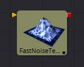
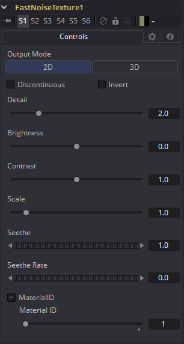

### Fast Noise Texture [3FN] 快速噪声纹理

Fast Noise Texture工具是2DFast Noise工具的与程序分辨率无关的版本。它直接创建噪声纹理作为3D工具使用的材质。它提供了一个3D体积模式，可以与提供UVW纹理坐标的工具（如设置为XYZtoUVW或相机的UV Map工具）一起创建无缝纹理。

#### External Inputs 外部输入

 

**FastNoiseTexture.SourceMaterial**

[橙色，必需的]此输入将接受2D图像或3D材质。这由噪声模式调制。

#### Controls

##### Output Mode

- **2D:** 根据2D纹理坐标（UV）计算噪声纹理。该模式允许平滑地改变噪声模式。
- **3D:** 根据3D纹理坐标（UVW）计算噪声纹理。像Shape 3D这样的工具会自动提供第三个纹理坐标，否则可以使用UV Map工具创建3D纹理空间。不支持噪声模式的动画。

##### Discontinuous

或者，噪声函数在值之间进行插值以创建平滑连续的结果梯度。勾选此复选框可沿某些噪声等值线创建硬间断线。结果将产生截然不同的效果。

##### Invert

勾选此复选框以反转噪声，创建原始图案的负像。当启用Discontinuous时，这是最有效的。

##### Detail

增加此滑块的值可在噪声结果中生成更高级别的细节。较大的值会增加更多层次的增进详细的噪音，而不会影响整体模式。较高的值会使渲染需要更长时间，但可以产生更自然的结果（并非所有图形卡都支持更高的硬件细节级别）。

##### Brightness

此控件可调整噪声贴图的整体亮度。

##### Contrast

此控件增加或减少噪声图的整体对比度。它可以加大噪声的影响。

##### Scale

可以使用Scale滑块调整噪声贴图的特征比例，将其从整个图像的温和变化更改为更紧密的整体纹理效果。该值表示沿UV轴的刻度。

##### Scale Z

（仅限3D）Scale Z的值在纹理空间中沿W轴缩放噪声纹理。

##### Seethe

（仅限2D）Seethe控件可平滑地改变2D噪声模式。

##### Seethe Rate

（仅限2D）与上面的Seethe控件一样，Seethe Rate也会使噪声贴图发生变化。Seethe Rate定义噪声每帧改变的速率，自动引起噪声的动画漂移，而不需要样条动画。

##### Material ID

此滑块设置分配给此材质的数字标识符。如果渲染器中启用了相应选项，这个值将被渲染到MatID辅助通道中。