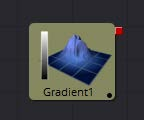
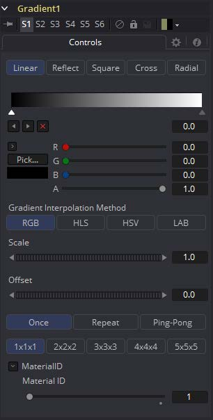
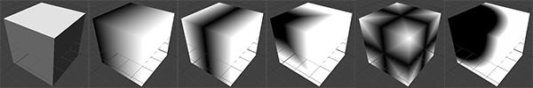

### Gradient 3D [3Gd] 渐变3D

使用渐变3D工具，可以使用各种渐变类型对对象进行纹理化。它提供了Background工具的许多控件。

虽然无法直接在3D空间中变换渐变，但可以使用以下工具进行定向：

- **Texture Transform工具**

  Texture Transform工具可用于调整每个像素的映射。

- **UVMap工具**

  UV Map工具可用于调整每个顶点的映射（使用XYZtoUVW模式）。这有屏幕控制，因此您可以看到渐变正在做什么。建议使用此工具，因为评估速度更快。

 

Controls

##### Gradient Type

确定用于渐变的类型或模式。

- **Linear:** 简单的线性渐变。
- **Reflect:** 基于线性模式，此渐变将在纹理范围的中间进行镜像。
- **Square:** 使用方形模式应用渐变。
- **Cross:** 与Reflect模式类似，但它将使用两个轴来应用渐变。
- **Radial:** Radial模式使用圆形模式来应用渐变。

##### Gradient

Gradient控件由一个条形图组成，可以在其中添加，修改和删除渐变的点。每个点都有自己的颜色。可以设置颜色的动画以及点的位置。此外，可以将From Image修改器应用于渐变以从图像中评估它。

##### Gradient Interpolation Method

默认情况下，梯度在RGB颜色空间中从一点到另一点进行线性插值。这有时会导致不需要的颜色。选择另一个颜色空间可以提供更好的结果。

##### Offset

允许平移渐变。

##### Repeat

定义如何处理渐变的左右边框。

将渐变设置为Once，Repeat和Ping Pong从顶部到底部分别向左移动渐变。

- **Once:** 使用Gradient Offset控件移动渐变时，边框颜色将保持其值。将默认渐变向左移动将导致左侧出现白色边框，向右移动将导致右侧出现黑色边框。
- **Repeat:** 使用Gradient Offset控件移动渐变时，边框颜色将被包围。将默认渐变向左移动将导致从白色到黑色的急剧跳跃，向右移动将导致从黑色到白色的急剧跳跃。
- **Ping Pong:** 使用Gradient Offset控件移动渐变时，边框颜色来回“打乒乓”。将默认渐变向左移动将导致边缘从白色变回黑色，向右移动将导致边缘从黑色渐变回白色。

##### Sub Pixel

确定创建渐变的精度。

##### Material ID

此滑块设置分配给此材质的数字标识符。如果渲染器中启用了相应选项，这个值将被渲染到MatID辅助通道中。