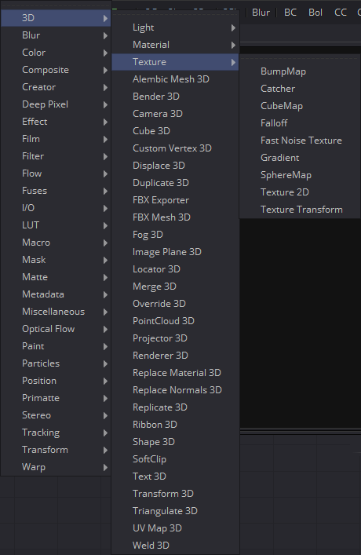
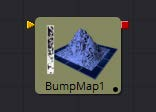
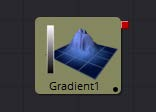
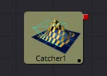
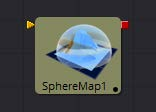
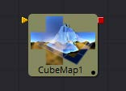
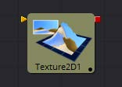
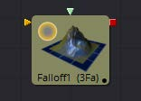
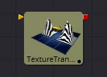
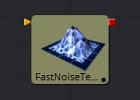

## 第四章 3D Texture Tools 三维纹理工具

- [BumpMap [3Bu]](./BumpMap%20[3Bu].md) 
- [Catcher [3Ca]](./Catcher%20[3Ca].md) 
- [CubeMap [3Cu]](./CubeMap%20[3Cu].md) 
- [Falloff [3Fa]](./Falloff%20[3Fa].md) 
- [Fast Noise Texture [3FN]](./Fast%20Noise%20Texture%20[3FN].md) 
- [Gradient 3D [3Gd]](./Gradient%203D%20[3Gd].md) 
- [Sphere Map [3SpM]](./Sphere%20Map%20[3SpM].md) 
- [Texture [Txr]](./Texture%20[Txr].md) 
- [Texture Transform [3Tx]](./Texture%20Transform%20[3Tx].md) 

<table id="img">
  <tr>
    <td></td>
    <td>
      <table id="img">
        <tr>
          <td></td>
          <td></td>
        </tr>
        <tr>
          <td></td>
          <td></td>
        </tr>
        <tr>
          <td></td>
          <td></td>
        </tr>
        <tr>
          <td></td>
          <td></td>
        </tr>
        <tr>
          <td></td>
        </tr>
      </table>
    </td>
  </tr>
</table>

