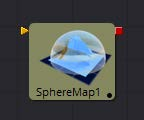
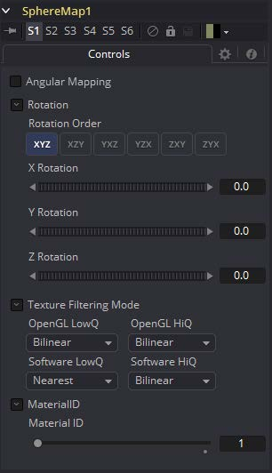
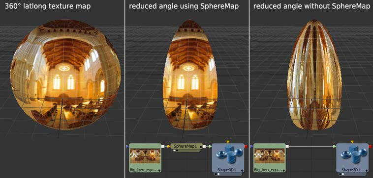

### Sphere Map [3SpM]

Sphere Map工具允许从图像创建球形纹理贴图。输入图像应表示经度/纬度格式的纹理信息，其中X轴表示经度0-360度，Y轴表示纬度-90到+90度。

#### 外部输入

 

**SphereMap.ImageImage**

[白色，必需的]从图像输出接收RGBA通道。

#### Controls

##### Angular Mapping

调整纹理坐标映射，使极点较少被压扁，纹理中的区域映射到球体上的相等区域。换句话说，它将纬度线的映射从半球形鱼眼转变为角鱼眼。此映射尝试保留区域并使绘制或修改球体贴图更容易，因为图像不是在极点处压缩。

##### Rotation

提供旋转纹理贴图的控件。

##### Material ID

此滑块设置分配给此材质的数字标识符。如果渲染器中启用了相应选项，这个值将被渲染到MatID辅助通道中。

该工具需要宽高比为2:1的图像。否则，将根据以下规则钳制图像：

- **2 * width > height**

  宽度适合球体，杆将显示夹紧边缘。

- **2 * width < height**

  高度适合球体，并且将围绕0度经度线进行夹紧。

#### Sphere Map与直接将纹理连接到Sphere

您可以直接将经纬(球面投影)纹理映射连接到一个球体，而不是首先通过连线将其连接到Sphere Map工具。如果您将起始/结束角和纬度设置为小于360°/180°，则会导致不同的渲染。在第一种情况下，纹理将被压扁。当使用Sphere Map工具时，纹理将被裁剪。
比较：

> **注意：**如果你直接将纹理导入球体，它也会被水平镜像。您可以首先使用Transform工具来“修复”这个问题。

