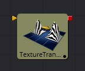
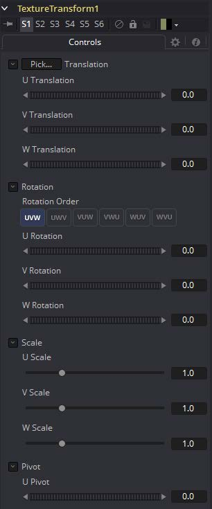
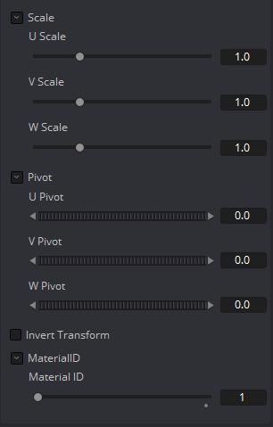

### Texture Transform [3Tx]

Texture Transform工具可用于平移，旋转和缩放输入材质上的图像纹理。虽然输入也可以是图像，但始终输出材质。

#### 外部输入

 

**TextureTransform.MaterialInput**

[橙色，可选的]此输入需要2D图像或3D材质。

#### Controls

> **注意：**并非所有图形卡都支持所有Wrap模式。

#### Translation

##### U, V, W Translation

这些滑块将沿U，V和W轴移动纹理。

#### Rotation

##### Rotation Order

使用这些按钮设置应用旋转的顺序。

##### U, V, W Rotation

与旋转顺序一起，这些设置定义围绕UVW轴的旋转。

#### Scale

##### U, V, W Scale

沿相应的UVW轴缩放纹理。

#### Pivot

##### U, V, W Pivot

设置旋转和缩放的参考点。

##### Material ID

此滑块设置分配给此材质的数字标识符。如果渲染器中启用了相应选项，这个值将被渲染到MatID辅助通道中。