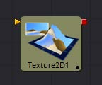
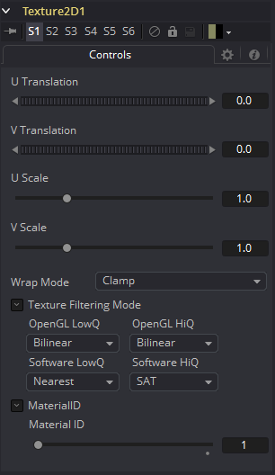

### Texture [Txr]

Texture工具可以控制渲染图像中元素的纹理映射。纹理贴图图像（连接到绿色输入）可以包裹在对象周围以替换当前纹理。Texture工具依赖于3D渲染图像中U和V贴图通道的存在。如果这些通道不存在，则此工具无效。

> **注意：**背景像素的U和V值可能为0.0，这会将这些像素设置为纹理角点像素的颜色。要将纹理限制为特定对象，请使用基于物体的alpha或基于Object或Material ID通道效果遮罩。

有关更多信息，请参阅“辅助通道Auxiliary Channels”章节。

#### External Inputs 外部输入

 

**CreateTexture.ImageInput**

[橙色，必需的]此输入需要一个2D图像。

#### Controls

##### Wrap Mode

如果在纹理空间中转换纹理（使用下面的控件或UV Map工具），则可能会在图像边框之外的区域映射到对象上。Wrap Mode确定图像在这些区域中的应用方式。

- **Wrap:** 这会围绕图像的边框包裹图像的边缘。
- **Clamp:** 图像边缘的颜色用于纹理化。此模式类似于“变换”工具中的“复制”模式。
- **Black:** 图像沿其边缘被剪裁。使用alpha=0的黑色代替。
- **Mirror:** 图像在X和Y中都被镜像。

##### U/V Offset

这些滑块可用于沿U和V坐标偏移纹理。

##### U/V Scale

这些滑块可用于沿U和V坐标缩放纹理。

