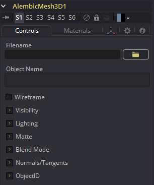
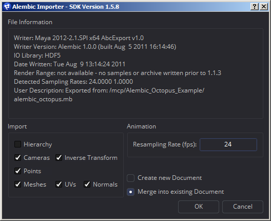

### Alembic Mesh 3D [ABc]

**有两种方法导入Alembic文件：**

- 使用 File > Import > Alembic 菜单选项
- 手动将AlembicMesh3D 工具添加到流程

*推荐使用第一种方法*

Alembic格式允许在文件中存储任意的用户数据。由于各种原因，Fusion忽略了大多数元数据。对于如何命名元数据以及元数据在不同的ABC出口商之间可能发生的更改，还没有定义任何约定。当通过菜单选项导入Alembic文件时，转换将被读入样条并传入到工具的Input中，并将与comp一起保存。

这意味着当重新加载comp时，转换是从comp而不是Alembic文件中加载的。mesh的处理方式不同；它们总是从Alembic文件中重新加载。

 

#### Controls

##### Filename

导入的Alembic文件的名称。

##### Object Name

此输入显示正在导入的Alembic文件中的mesh名称。如果此字段为空，则FBX模型的全部内容将作为单个mesh导入。此输入不能被用户编辑;而通过 File > Import > Alembic工具导入Alembic文件时由Fusion设置。

##### Sampling Rate

在导入文件时设置帧率。它可以通过使用这个滑块来改变效果，比如慢动作。

##### Dump File

在首选文本编辑器中打开产生的ASCII码。

##### Alembic import dialog

- *Writer:* 创建或写出Alembic文件的插件或应用程序的名称
- *Writer Version:* 写出Alembic文件的Alembic sdk的版本
- *RenderRange:* 这将使您了解动画在Alembic文件中的持续时间(以秒为单位)
- *DetectedSamplingRates:* Fusion检查文件中的帧率并在这里报告它们。这对于确定设置重采样率的值是有用的。

##### Hierarchy

如果禁用，Alembic文件中的转换将被压缩到摄像机和mesh中。这导致许多mesh/摄像机连接到Fusion中的一个Merge节点。启用后，您将获得完整的父子层次结构。

##### Orphaned transforms

如果不选中此选项，则不会导入不父化mesh或相机。例如，如果您有一个框架和关联的mesh模型，模型将被导入为一个Alembic mesh，而骨架将作为Merge3D的树型结构导入。禁用此选项将导致无法导入Merge3D。

##### Cameras

Near/Far/Apertures/Angles of View/Plane of Focus都是导入的。适配分辨率可以被导入;这取决于作者是否正确地标记了与适配分辨率的元数据。如果您的相机没有正确导入，您应该检查Camera3D.ResolutionGateFit是否被正确地设置。立体(stereo)信息不会被导入。

##### InverseTransform

导入相机的逆变换(World to Model)。

##### Points

Alembic支持点类型。这是一组没有方向的3D点。一些3D应用将粒子导出为点，但要记住粒子的方向和方向会丢失；而你只得到了位置。很可能，exocortex Alembic插件可以写出包含方向的额外用户数据。

##### Meshes

可选地导入UVs和法线。

##### ResamplingRate

当导出动画时，它以秒为单位存储在磁盘上，而不是以帧为单位。当将Alembic数据融合到Fusion中时，您需要提供一个帧率来重新采样动画。理想情况下，您应该选择它所导出的相同的帧，以便您的采样与原始的采样匹配。检测到的采样率可以在不确定的情况下告诉我们选择什么。

##### Lights

目前不支持导入。目前还没有关于Alembic光照的通用约定。

##### Materials

目前不支持导入。目前还没有关于Alembic材质的通用约定模式。

##### Curves

目前不支持导入。

##### Multiple UVs

目前不支持导入。目前仍还没有通用约定模式。

##### Velocities

目前不支持导入。

##### Cyclic/Acyclic sampling

目前没有实现。均匀抽样是最常见的抽样方式，它工作得很好。我们建议使用FBX用于照明/摄像机/材质，而Alembic仅用于mesh。如果你的相机和Alembic为你工作，那就去做吧。原因是我们的Alembic插件不支持光照/材质，但是对FBX有很好的支持。相机的Alembic导入存在适配分辨率的问题，并且不导入立体(stereo)选项。