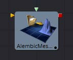

### Alembic Mesh 3D [ABc]

<b>有两种方法导入Alembic文件：</b>

- 使用 File > Import > Alembic 菜单选项
- 手动将AlembicMesh3D 工具添加到流程

**推荐使用第一种方法。**

Alembic格式允许将任意用户数据存储在文件中。由于各种原因，Fusion忽略了大多数元数据。而且对于如何命名元数据以及元数据在不同的ABC出口商之间可能发生的更改也还没有定义任何约定。当通过菜单选项导入Alembic文件时，转换将被读入样条并传入到工具的Input中，并将与comp一起保存。

这意味着当重新加载comp文件时，转换是从comp文件而不是Alembic文件中加载的。mesh的处理方式不同：它们总是从Alembic文件中重新加载。

 

#### Controls 控件

##### Filename 文件名

导入的Alembic文件的名称。

##### Object Name 物体名称

此输入显示正在导入的Alembic文件中的mesh名称。如果此字段为空，则整个FBX模型的内容将作为单个mesh导入。此输入不能被用户编辑；在通过 File > Import > Alembic工具导入Alembic文件时由Fusion设置。

##### Sampling Rate 采样率

帧率会在导入文件时设置。它可以通过使用这个滑块来改变效果，比如慢动作。

##### Dump File 转储文件

在首选的文本编辑器中打开产生的ASCII码。

##### Alembic import dialog Alembic导入对话框

- **Writer:** 创建或写出Alembic文件的插件或应用程序的名称
- **Writer Version:** 写出Alembic文件的Alembic sdk的版本
- **RenderRange:** 这将使您了解动画在Alembic文件中的持续时间（以秒为单位）
- **DetectedSamplingRates:** Fusion检查文件中的帧率并在这里报告它们。这对于确定设置Resampling Rate的值有用。

##### Hierarchy 层次关系

如果禁用，Alembic文件中的变换将被压缩到摄像机和mesh中。这导致许多mesh/摄像机连接到Fusion中的一个Merge节点。启用后，您将获得完整的父子层次结构。

##### Orphaned transforms 孤立变换

如果不选中此选项，则不会导入不父化mesh或摄像机。例如，如果您有一个框架和关联的mesh模型，模型将被导入为一个Alembic mesh，而骨架将作为Merge3D的树型结构导入。禁用此选项将导致无法导入Merge3D。

##### Cameras 摄像机

Near/Far/Apertures/Angles of View/Plane of Focus都被导入。分辨率门适配（resolution Gate Fit）可以被导入；这取决于作者是否正确地标记了与适配分辨率的元数据。如果您的摄像机没有正确导入，您应该检查Camera3D.ResolutionGateFit是否被正确地设置。立体(stereo)信息不会被导入。

##### InverseTransform 逆变换

导入摄像机的Inverse Transform(World to Model)。

##### Points 点

Alembic支持点类型。这是一组没有方向的3D点。一些3D应用将粒子导出为点，但要记住粒子的方向和方向会丢失；而你只得到了位置。exocortex Alembic插件很可能会写出包含方向的额外用户数据。

##### Meshes Meshes

可选地导入UVs和法线。

##### ResamplingRate 重采样率

当导出动画时，它以秒为单位存储在磁盘上，而不是以帧为单位。当将Alembic数据融合到Fusion中时，您需要提供一个帧率来重新采样动画。理想情况下，您应该选择它所导出的相同的帧，以便您的采样与原始的采样匹配。检测到的采样率可以在不确定的情况下告诉我们选择什么。

##### Lights 光照

目前不支持导入。目前还没有关于Alembic光照的通用约定模式。

##### Materials 材质

目前不支持导入。目前还没有关于Alembic材质的通用约定模式。

##### Curves 曲线

目前不支持导入。

##### Multiple UVs 多UV

目前不支持导入。目前仍还没有通用约定。

##### Velocities 速度

目前不支持导入。

##### Cyclic/Acyclic sampling Cyclic/Acyclic采样

目前没有实现。均匀（Uniform）采样是最常见的抽样方式，它工作得很好。我们建议FBX仅用于照明/摄像机/材质，而Alembic仅用于mesh。如果摄像机和Alembic适合你，那就去做吧。原因是我们的Alembic插件不支持光照/材质，但是对FBX有很好的支持。摄像机的Alembic导入存在适配分辨率的问题，并且不导入立体(stereo)选项。