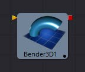
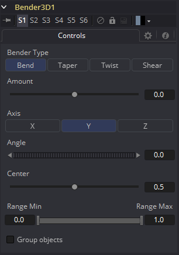

### Bender 3D [3Bn] 弯曲器3D

Bender 3D工具是用来基于它的包围盒弯曲(bend)，变尖 (taper)，扭曲(twist)或剪切(shear)三维场景中的几何物体。以3D场景作为输入并输出修改后的3D场景。只有场景中的几何物体被修改。任何灯、摄像机或材质都不会受到影响。

Bender工具在几何物体中不产生新的顶点；只有存在于几何物体中的顶点才会被改变。因此，当将Bender 3D工具应用于在Fusion中创建的基本形状时，提高原始基本形状中细分（Subdivision）控件的值是一个很好的方法，以提供更高的质量结果。

#### External Inputs 外部输入

以下输入出现在流程编辑器（Flow Editor）中的工具块上。

 

**Bender3D.SceneInput 场景输入**

[金色，必需的]这个输入需要一个3D场景。

#### Controls 控件

##### Bender Type 弯曲类型

使用Bender Type选择变形类型来应用到几何物体上。有四种模式可供选择：弯曲(Bend)、变尖 (Taper)、扭转(Twist)和剪切(Shear)。

##### Amount 量

调整Amount滑块以改变变形的强度。

##### Axis 轴

Axis控制决定了施加变形的轴，并且根据变形的类型有不同的含义。当弯曲时，它与角度控制一起决定弯曲的轴。在其他情况下，变形应用于指定的轴。

##### Angle 角度

Angle拇指滚轮控制决定了轴的方向是什么弯曲或剪切。对于变尖 (Taper)或扭转(Twist)变形不可见。

##### Range 范围

Range控制可用于将变形的影响限制在几何物体的一小部分。当Bender Type设置为剪切(Shear)时，范围控制不可见。

##### Group Objects 打组对象

当被选中时，输入场景中的所有对象被分组到一个对象中，该对象在公共中心周围变形，而不是单个地变形每个组件对象。