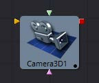
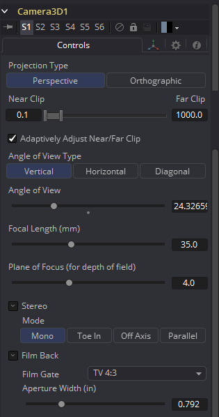
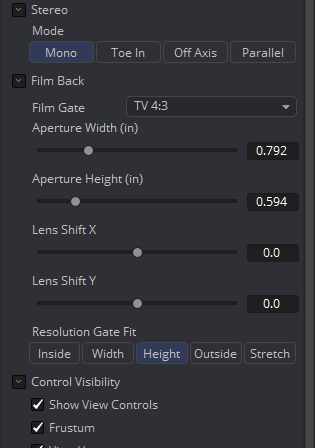
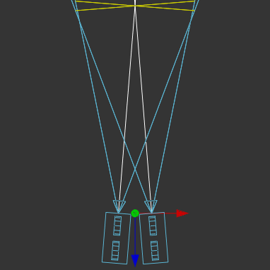
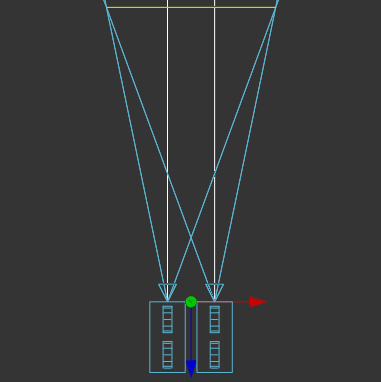
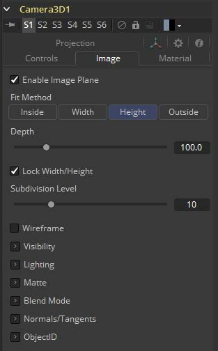
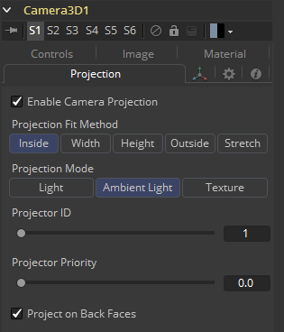

### Camera 3D [3Cm]

Camera 3D工具生成一个虚拟相机，通过它可以观看3D环境。它紧密地模拟了现实和虚拟相机中使用的设置，以尽可能无缝地匹配其他场景元素中使用的相机。

使用Merge 3D工具将摄像机添加到场景中。在监视器中直接显示相机工具只显示一个空场景；照相机什么也看不见。要通过摄像机查看场景，请从引入摄像机的Merge 3D工具中查看场景，或在该Merge 3D的任何下游工具中查看场景。然后在视图中右键单击并从上下文菜单中选择Camera > Cameraname。在右下角找到的轴标上右键单击，将直接显示Camera子菜单。

监视器的视角可能与相机的视角不同，因此通过相机交互得到的视图可能不匹配由Renderer 3D工具实际渲染的图像的真实边界。为了帮助你拍摄照片，向导(Guide)可以被启用，它代表了相机实际看到的部分。在监视器中右键单击并从Guides > Frame Format子菜单中选择一个选项。默认选项将使用Composition > Frame Format首选项中启用的格式。要打开或关闭向导(Guide)，请从监视器上下文菜单中选择Guides > Show Guides，或者在视图处于活动状态时使用Command-G (Mac OS X)或Ctrl-G (Windows)键盘快捷键。

摄像头3D工具还可以用来进行摄像头投影，将2D图像通过摄像头投射到3D空间。这可以作为一个简单的与摄像机对齐的图像平面，也可以作为一个真实的投影，类似于投影仪3D工具的行为，附加的好处是与摄像机对齐。Image Plane、Projection和Materials标签将直到二维图像连接到流编辑器中的Camera 3D工具时才会出现。

相机工具拥有内建的立体(stereo)功能。它们可以控制眼睛的分离和收敛距离。右眼的摄像头可以通过与绿色输入连接的独立摄像头工具进行更换。此外，这里还提供了用于景深渲染的焦点控制平面。

如果你通过将工具栏上的3Cm图标拖拽到3D视图上添加一个摄像头，它会自动将它与你正在观看的场景合并。此外，它将自动设置为当前视角，并将视图设置为通过新相机查看。或者，通过在Camera子菜单下的监视器上下文菜单中的Copy PoV To选项，可以将当前的视角复制到相机(或聚光灯或任何其他对象)中。

#### 外部输入

以下输入出现在流程编辑器中的工具块上。

 

*Camera3D.SceneInput*

[金色，必需的]这个输入需要一个3D场景。

*Camera3D.RightStereoCamera*

[绿色，可选]这个输入应该连接到另一个Camera 3D工具。它被用来覆盖在立体视觉渲染和监视器中用于右眼的内部摄像机。

*Camera3D.ImageInput*

这个输入需要一个2D图像。在启用相机投影时，以及在使用相机的图像平面控件来生成与相机的视场相连的平面几何物体时，图像被用作纹理。

#### Controls

该选项卡中的选项用于设置相机的剪切、视场、焦距和立体属性。

##### Projection Type

使用投影类型按钮选择透视(Perspective)和正投影(Orthographic)相机。一般来说，现实世界中的照相机都是透视照相机。正射影相机采用平行正射影技术，在这种技术中，视场垂直于观看方向。这就产生了一个平行的相机输出，不会因透视而扭曲。

##### Near/Far Clip

剪切面用来限制场景中的几何物体，它是根据物体与相机的焦点距离来渲染的。这对于确保不渲染非常靠近摄像机的对象以及优化渲染以排除在最终渲染中太过遥远而无用的对象非常有用。

默认视角摄像机忽略此设置，除非Adaptively Adjust Near/Far Clip的复选框控制是禁用的。

这些值以单位表示，因此，一个距离相机20个单位以上的剪切平面对相机来说是不可见的。一个0.1的剪切面意味着任何接近0.1单位的物体都是不可见的。

> 注意：在近距和远距剪切面之间的较小范围允许在所有深度计算中更精确。如果一个场景开始在远处的物体上渲染奇怪的工件，试着增加Near Clip平面的距离。

##### Adaptively Adjust Near/Far Clip

当被选中时，渲染器会自动调整相机的近/远剪辑平面，以匹配场景的区段。此设置覆盖上面描述的近剪辑范围控件和远剪辑范围控件的值。此选项不适用于正投影(Orthographic)相机。

##### Viewing Volume Size

只有当Projection Type设置为Orthographic时，才会出现Viewing Volume Size控件。它决定了构成摄像机视场的框的大小。

正投影相机与它看到的物体的Z距离不会影响这些物体的比例，只有观看的尺寸会影响。

##### Angle of View Type

使用Angle of View Type按钮阵列来选择如何度量相机的视角。有些应用程序使用垂直测量，有些使用水平测量，而有些使用对角线测量。改变Angle of View Type将导致下面的Angle of View控制重新计算。

##### Angle of View

Angle of View定义了可以通过摄像机观看的场景区域。一般来说，人眼比摄像机能看到更多的场景，不同的镜头记录下不同程度的图像。一个大的值产生一个更宽的视角，一个小的值产生一个更窄的，或更紧密聚焦的视角。

视角和焦距控制是直接相关的。较小的焦距产生更宽的视角，因此改变一个控件会自动改变另一个控件以匹配。

##### Focal Length

在现实世界中，透镜的焦距是指从透镜中心到电影平面的距离。焦距越短，焦平面就越接近透镜的背面。焦距以毫米计。视角和焦距控制是直接相关的。较小的焦距产生更宽的视角，因此改变一个控件会自动改变另一个控件以匹配。

焦距与视角的关系为`angle = 2 * arctan[aperture / 2 / focal_length]`

利用垂直孔径大小得到垂直视角，利用水平孔径大小得到水平视角。

##### Plane of Focus (for Depth of Field)

OpenGL渲染器使用这个值来计算景深。它定义了摄像机前一个虚拟目标的距离。

#### Stereo Method

允许你调整你的立体方法到你喜欢的工作模式。

##### Toe in

两个相机都指向一个焦点。虽然结果是立体的，但是这种方法引入的垂直视差会引起观众的不适。

##### Off Axis

通常被认为是创建立体相机对的正确方法，这是Fusiom的默认方法。离轴不引入垂直视差，从而产生压力较小的立体图像。

##### Parallel

摄像机是平行移动的。因为这是一个纯粹的平行位移，所以没有收敛距离控制。并行不引入垂直视差，从而创建压力较小的立体图像。

##### Eye Separation

定义两个立体声摄像机之间的距离。如果将Eye Separation设置为大于0的值，那么当选择此工具时，每个摄像头的控件将显示在监视器中。Parallel模式下不存在Convergence Distance控制。

##### Convergence Distance

这个控制设置了立体的收敛距离，定义为沿着相机z轴的点，它决定了左右眼相机在哪里交汇。

#### Film Back

##### Film Gate

 Film Gate菜单显示了预设相机类型的列表。选择其中一个选项将自动设置光圈宽度和光圈高度以匹配所选的相机类型。

##### Aperture Width/Height

光圈宽度和高度滑块控制着摄像机的光圈大小，或者说摄像机的一部分，它可以让真实世界的摄像机接收光线。在视频和胶片相机中，光圈是用来定义每一帧曝光面积的掩模开口。孔径通常用英寸来测量，这是用来控制的单位。

##### Resolution Gate Fit

确定快门在分辨率中的位置。只有当电影门的相位与输出图像的相位不同时，才会产生效果。此设置对应于Maya Fit Resolution Gate。超扫描模式(Overscan)、水平模式(Horizontal)、垂直模式(Vertical)和填充模式(Fill)分别对应于内部模式(Inside)、宽度模式(Width)、高度模式(Height)和外部模式(Outside)。

- *Inside:* 图像源将被均匀地缩放，直到它的一个维度(X或Y)与Mask的内部维度相匹配。根据图像源和Mask背景的相对尺寸，可以裁剪图像源的宽度或高度以适应Mask的相应尺寸。
- *Width:* 图像源将被均匀地缩放，直到它的宽度(X)与Mask的宽度相匹配。根据图像源和Mask的相对尺寸，图像源的Y维可能不符合Mask的Y维，导致图像源在Y中裁剪，或者图像源完全不覆盖Mask的高度。
- *Height:* 图像源将被均匀地缩放，直到它的高度(Y)与Mask的高度相匹配。根据图像源和Mask的相对尺寸，图像源的X维可能不符合Mask的X维，导致在X中裁剪图像源，或者图像源不完全覆盖Mask的宽度。
- *Outside:* 图像源将被均匀地缩放，直到它的一个维度(X或Y)与Mask的外部维度相匹配。根据图像源和Mask的相对尺寸，图像源的宽度或高度可裁剪或不符合Mask的相应尺寸。
- *Stretch:* 图像源将被拉伸成X和Y，以容纳生成的Mask的完整尺寸。这可能导致图像源的可见失真。

##### Control Visibility

允许您有选择地激活与相机一起显示的屏幕控件。

- *Frustrum:* 显示相机的实际视锥。
- *View Vector:* 在观察圆锥内显示一条白线，可用于在并行模式下确定位移。
- *Near Clip:* 近剪切面。这个平面可以细分以提高可见度。
- *Far Clip:* 远剪切面。这个平面可以细分以提高可见度。
- *Plane of Focus:* Plane of Focus根据上面解释的相应滑块。这个平面可以细分以提高可见度。
- *Convergence Distance:* 使用Stereo模式时的收敛点。这个平面可以细分以提高能见度。

##### Import Camera

导入相机按钮显示一个对话框，用于从另一个应用程序导入相机。

它支持以下文件类型：

| 文件类型        | 后缀 |
| --------------- | ---- |
| *LightWave场景  | .lws |
| *Max场景        | .ase |
| *Maya Ascii场景 | .ma  |
| *dotXSI         | .xsi |

#### Image

当一个二维图像连接到相机时，会创建一个始终定向的图像平面，以便图像填充相机的视场。图像平面选项卡被隐藏，直到一个二维图像连接到流程上Camera 3D的输入。

除了下面列出的控件之外，这个选项卡中显示的选项与Image Plane工具的控制选项卡中显示的选项相同。请参阅工具文档以获得详细的描述。

##### Enable Image Plane

使用此复选框来启用或禁用映像平面的创建。

##### Fill Method

描述当相机有不同的长宽比时如何处理输入图像。

- *Inside:* 图像源将被均匀地缩放，直到它的一个维度(X或Y)符合Mask的内部尺寸。根据图像源和Mask背景的相对尺寸，可以裁剪图像源的宽度或高度以适应Mask的相应尺寸。
- *Width:* 图像源将被均匀地缩放，直到它的宽度(X)与Mask的宽度相匹配。根据图像源和Mask的相对维数，图像源的Y维数可能不符合Mask的Y维数，导致要么在Y中裁剪图像源，要么不完全覆盖Mask高度。
- *Height:* 图像源将被均匀地缩放，直到它的高度(Y)与Mask的高度相匹配。根据图像源和Mask的相对尺寸，图像源的X维可能不符合Mask的X维，导致在X中裁剪图像源，或者图像源不完全覆盖Mask的宽度。
- *Outside:* 图像源将被均匀地缩放，直到它的一个维度(X或Y)与Mask的外部维度相匹配。根据图像源和Mask的相对尺寸，可以裁剪图像源的宽度或高度，也可以不匹配Mask的相应尺寸。
- *Depth:* Depth滑块控制图像平面与摄像机的距离。

#### Projection

如果一个二维图像连接到摄像机，就可以将图像投射到场景中。投影不同于像平面，投影会落在场景的几何物体上，就像在场景中有一个物理投影仪一样。图像以光的形式投射，这意味着渲染器必须被设置为使投射的光照可见。

有关更多信息，请参阅Projector 3D工具。

##### Enable Camera Projection

选择此复选框以启用连接到摄像机工具的2D图像的投影。

##### Projection Fit Method

该按钮阵列可用于选择用于将投影图像的相位与摄像机的Field of View相匹配的方法。

##### Projection Mode

- *Light:* 将投影定义为聚光灯。
- *Ambient Light:* 将投影定义为环境光。
- *Texture:* 允许投射，可以使用其他的灯光。需要一个连接到特定材料的合适输入端口的Catcher工具。

#### Camera 3D的小提示

当从3D应用程序中导入一个同时用作投影仪的摄像头时，请确保主控件选项卡和投影选项卡上的适配分辨率选项是同步的。只有第一个将自动设置为3D应用程序使用的内容。后者可能需要手动调整。

##### 要实现真正的Parallel Stereo模式，你可以：

- 将一个额外的外部(右)摄像头连接到你的相机的“Right Stereo Camera”输入。
- 创建独立的左右摄像头
- 将转换距离滑块设置为非常大的值99999999999。

##### 从Fusion的3D空间渲染Overscan

如果你想渲染一个超扫描的图像，你也必须修改你的场景的Camera3D。由于超扫描设置不会与来自3D应用程序的相机数据一起导出，所以对于通过.fbx或.ma文件导入的相机来说，这也是必要的。解决的办法是增加胶片背面的宽度和高度，因为每一面都需要额外的像素。
