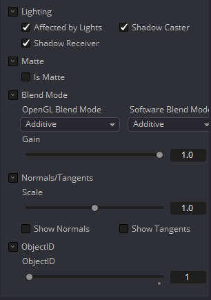

### Cube 3D [3Cb]

Cube 3D工具是一种基本的原始几何类型，能够生成简单的cube。该工具还提供了6个额外的图像输入，可用于将纹理映射到立方体的6个面。立方体通常被用作阴影投射对象和环境映射。有关其他基本物体，请参阅Shape 3D工具。

#### External Inputs 外部输入

 

**Cube3D.SceneInput 场景输入**

[橙色，可选的]这个输入需要一个3D工具输出的场景。

**Cube3D.NameMaterialInput 材质输入**

这6个输入用于定义应用于立方体的6个面的材质。他们将接受有效的二维图像或三维材质。

#### Controls 控件

##### Lock Width/Height/Depth 锁定宽度/高度/深度

这个复选框将立方体的Width、Height和Depth尺寸锁在一起，因此它们总是相同的大小。当选中时，只显示一个Size控件，否则将显示单独的Width、Height和Depth滑块。

##### Size or Width/Height/Depth 大小或宽度/高度/深度

如果选择了Lock Width/Height/Depth，则只显示Size，否则将显示单独的Width、Height和Depth滑块。Size和Width滑块重命名为相同的控件，因此，在解锁控件时，应用于Size的任何动画也将应用于Width。

##### Subdivision Level 细分程度

使用Subdivision Level滑块设置创建图像平面时使用的细分数量。

如果将OpenGL查看器和渲染器设置为Vertex照明，mesh中的细分越多，表示照明的顶点就越多。由于这个原因，当与灯光交互时，高的细分会很有用。

##### Cube Mapping 立方映射

启用Cube Mapping复选框将使多维数据集使用标准的立方映射技术将其第一个纹理覆盖到所有六个面。这种方法要求纹理以十字的形状排列。

##### Wireframe 线框

启用此复选框将导致Mesh在使用OpenGL渲染时只渲染对象的线框。

##### Visibility 可见性

- **Visible 可见：**如果Visibility复选框没有被选中，那么该对象在查看器中将不可见，也不会被Renderer 3D工具渲染到输出图像中。不可见的物体不会投射阴影。
- **Unseen by Cameras 摄像机不可视：**如果选择了Unseen by Cameras复选框，则对象将在查看器中可见(除非Visible复选框被关闭)，而通过摄像机查看时不可见。对象不会被Renderer 3D工具渲染到输出图像中。当Software渲染器渲染时，未被看到的物体所投射的阴影仍然是可见的，而OpenGL渲染器不能。
- **Cull Front Face/Back Face 剔除前/后面：**使用这些选项在几何物体中剔除(消除)某些多边形的渲染和显示。如果选中了Cull Back Face，那么所有远离摄像机的多边形将不会被渲染，也不会投射阴影。如果选中了Cull Front Face，所有朝向摄像机的多边形都将同样被删除。选中两个复选框与取消选中Visible复选框具有相同的效果。
- **Ignore Transparent Pixels in Aux Channels 忽略辅助通道的透明像素：**在以前的Fusion版本中，透明像素被Software/GL渲染器拒绝。更具体地说，软件渲染器拒绝了带有R=G=B=A=0的像素，而GL渲染器拒绝了带有=0的像素。这是可选的。您可能希望这样做的原因是为透明区域获取aux通道(例如，Normals, Z, UVs)。例如，假设在后期，您想要替换一个3D元素上的纹理，该元素在某些区域是透明的，纹理在不同的区域是透明的，那么有透明区域设置辅助通道(特别是UVs)是很有用的。作为另一个例子，假设您正在做后期的DoF。您可能不希望Z通道设置在透明区域上，因为这会给您一个错误的深度。此外，请记住，这种拒绝是基于最终的像素颜色，包括灯光，如果它是开着的。如果你在透明的玻璃材料上有高光，这个复选框不会影响到它。

##### Lighting 光照

- **Affected by Lights 受光照影响：**如果这个复选框没有被选中，场景中的灯光将不会影响到对象，它将不会接收或投射阴影，它将显示在其颜色、纹理或材质的全亮度。
- **Shadow Caster 阴影投射者：**如果这个复选框未被启用，该对象将不会在场景中的其他对象上投射阴影。
- **Shadow Receiver 阴影接受者：**如果此复选框未启用，则该对象将不会接收场景中其他对象投射的阴影。

##### Matte Matte

启用Is Matte选项将对该对象应用一个特殊的纹理，使该对象不仅对摄像机不可见，而且还使直接出现在摄像机后面的所有东西也不可见。此选项将覆盖所有纹理。有关更多信息，请参见3D章节的Matte Objects部分。

- **Is Matte 作为Matte：**当被激活时，像素在Z中的后于matte对象像素的对象不会被渲染。
- **Opaque Alpha 不透明alpha：**将matte对象的alpha值设置为1。此复选框仅在启用is Matte选项时可见。
- **Infinite Z 无限Z：**将Z通道中的值设置为无穷大。此复选框仅在启用is Matte选项时可见。

##### Blend Mode 混合模式

Blend Mode指定Renderer在将该对象与场景的其余部分组合时将使用哪种方法。混合模式与2D Merge工具中列出的模式基本相同。有关每种模式的详细解释，请参阅那个工具的部分。

混合模式最初设计用于2D图像。在光照的3D环境中使用它们会产生不希望的结果。为了获得最佳效果，请在软件中渲染的无光照3D场景中使用Apply模式。

- **OpenGL Blend Mode OpenGL混合模式：**使用此菜单来选择将在OpenGL渲染器处理几何物体时使用的混合模式。这也是在查看器中查看对象时使用的模式。目前OpenGL渲染器支持三种混合模式。
- **Software Blend Mode Software 混合模式：**使用此菜单选择在Software渲染器处理几何物体时使用的混合模式。目前，Software渲染器支持Merge工具文档中描述的所有模式，除了Dissolve模式。

#### Material Tab 材质选项卡

出现在此选项卡中的选项决定此工具创建的几何物体的外观。由于这些控件在生成几何物体的所有工具上都是相同的，因此在本文档的Common 3D控件一节中对这些控件进行了充分的描述。

如果外部3D材质连接到工具块的材质输入，那么这个选项卡中的控件将被Using External Material（使用外部材质）标签所取代。

#### 变换选项卡

出现在此选项卡中的选项决定此工具创建的几何物体的位置。由于这些控件在生成几何物体的所有工具上都是相同的，因此在本文档的Common 3D控件一节中对这些控件进行了充分的描述。

