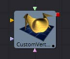
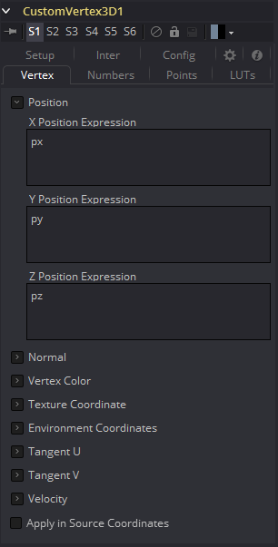

### Custom Vertex 3D [3Cv]

这是3D几何物体的一个自定义工具,可以用来对顶点操作,例如在一个图像平面上：`(px, py, sin(10 *(px ^ 2 + py ^ 2)+ n1))`。其他顶点属性如法线、顶点颜色、纹理坐标、切线和速度也可以修改。

 

> 注意：修改3D对象的X、Y和Z位置不会修改法线/切线。你可以在之后用一个ReplaceNormals工具来重新计算法线/切线。

> 提示：并非所有的几何物体都有顶点属性。例如，除了粒子和一些导入的FBX/Alembic mesh外，大多数Fusion几何物体都没有顶点颜色。

目前没有任何几何物体有环境坐标。只有粒子的速度。如果一个流不存在于输入几何物体中，则假定它具有一个默认值。

##### 这些默认值为：

| 顶点属性                         | 默认值    |
| -------------------------------- | --------- |
| Tangentu (tux, tuy, tuz)         | (1,0,0)   |
| Tangentv (tvx, tvy, tvz)         | (0,1,0)   |
| Normals (nx, ny, nz)             | (0,0,1)   |
| Vertexcolor (vcr, vcg, vcb, vca) | (1,1,1,1) |
| Velocity (vx, vy, vz)            | (0,0,0)   |
| Envcoord (eu, ev, ew)            | (0,0,0)   |
| Texcoord (tu, tv, tw)            | (0,0,0)   |

> 注意：如果流的表达式不是无关紧要的，那么就会创建输入几何上缺少的流。流的值将如上面所示。例如，如果输入的几何物体没有法线，那么(nx, ny, nz)的值总是(0,0,1)。要改变它，您可以使用ReplaceNormals工具预先生成它们。

#### Controls

