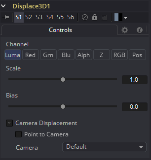

### Displace 3D [3Di]

Displace 3D工具用于根据所参考的图像沿物体的法线置换物体的顶点。几何学上的纹理坐标用来决定图像的采样点。

当使用Displace 3D时，请记住它只会置换现有的顶点，而不会对物体进行细化。为了获得更精细的置换，增加正在被置换的几何物体的细分量。注意，置换图像中的像素可能包含负值。

通过Displace 3D工具传递粒子系统将禁用pEmitter中设置的Always Face Camera选项。粒子不被视为点状物体；这四个粒子顶点中的每一个都是单独置换的，这可能是首选的结果，也可能不是。

#### 外部输入

 

*Displace3D.SceneInput*

[橙色，必需的]这个输入需要一个3D场景。

*Displace3D.Input*

[绿色，可选的] 这个输入需要一个2D图像被用作置换贴图。如果没有提供图像，这个工具其实会将场景直接传递到它的输出。

#### Controls

##### Channel 

确定图像的哪个通道连接到Displace3D。输入被用来置换几何物体。

##### Scale and Bias

使用这些滑块来scale(放大)和bias(偏移)位移。先应用scale，再应用bias。

#### Camera Displacement

##### Point to Camera 

当Point to Camera复选框被启用时，每个顶点都被置换向相机而不是沿着它的法线。这个选项的一个可能用途是移动相机的图像平面。通过相机观看时被置换的相机图像平面没有变化，但会在3D空间中变形，这使得可以与其他3D层在Z通道中正确交互。

##### Camera

当Point to Camera被选中时时，这个下拉框用于选择场景中的哪个摄像机监视器被用于摄像机的置换。

