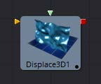
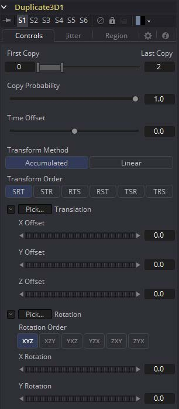
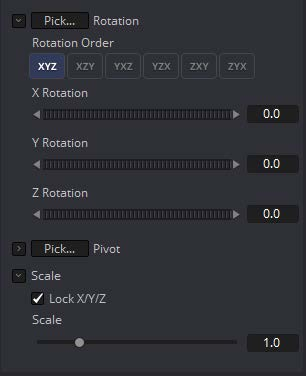
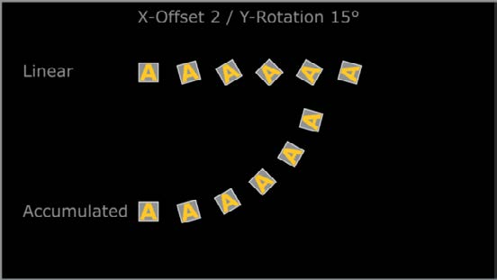
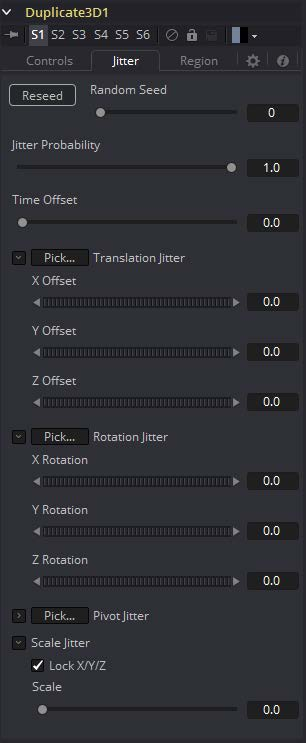

### Duplicate 3D [3Dp]

Duplicate 3D工具可以用来快速复制场景中的任何几何物体，对每个图形进行连续的转换，并创建重复的模式和复杂的对象数组。Jitter选项卡中的选项允许非均匀的转换，如随机定位或大小。

#### 外部输入

 

**Duplicate3D.SceneInput**

[橙色，必需的]这个输入需要一个3D场景。

#### Controls

##### First/Last Copy

使用此范围控件来设置要制作多少个几何物体副本。每个副本是最后一个副本的副本，因此，如果该控件设置为[0,3]，则拷贝父副本，然后副本被拷贝，然后拷贝副本的副本，以此类推。当使用下面的控件对每个副本应用转换时，这将允许你做一些有趣的效果。

对于First Copy和Last Copy使用同一个值将只显示原始输入。将First Copy设置为大于0的值将排除原始输入，只显示副本。

##### Time Offset

使用Time Offset滑块按每个拷贝的设置数量来偏移任何应用于源几何物体的动画。例如，将值设置为-1.0并使用一个立方体在Y轴上旋转作为源。第一个副本将显示前一帧的动画。第二个副本会显示前一帧的动画，等等。这在纹理的平面上使用会非常有用，例如，可以显示一个片段的连续帧。

#### Transform Method

##### Accumulated

当设置为Accumulated时，每个对象复制从前一个对象的位置开始，并从那里进行变换。结果将再次为下一个副本变换。

##### Linear

当设置为Linear时，变换将乘以复制的数量，然后依次应用总的缩放、旋转和平移，独立于其他副本。

##### Transform Order

使用这些按钮，可以设置计算转换的顺序，默认为Scale-Rotation-Transform (SRT)。

使用不同的顺序将导致最终对象的不同位置。

##### XYZ Offset

这三个滑块告诉工具在每个副本上应用多少偏移量。X偏移量为1将会使每一个副本1与上一个副本沿着X轴偏移。

##### Rotation Order

这些按钮可以用来设置旋转应用于几何物体的顺序。将旋转顺序设置为XYZ将首先在X轴上应用旋转，然后是Y轴旋转，然后是Z轴旋转。

##### XYZ Rotation

这三个旋转滑块告诉工具要对每个副本应用多少旋转。

##### XYZ Pivot

Pivot控件确定旋转每次拷贝时使用的中心点的位置。

##### Lock XYZ

当选择Lock XYZ复选框时，对复制缩放的任何调整将同时应用于所有三个轴。如果这个复选框被禁用，那么缩放滑块将被替换为X、Y和Z缩放的单个滑块。

##### Scale

缩放控件告诉Duplicate对每个副本应用多少缩放。

#### Jitter

##### Random Seed/Randomize

Random Seed用于“seed”于复制对象的抖动(jitter)量。两个具有相同设置但不同随机种子的Duplicate工具将产生两个完全不同的结果。单击Randomize按钮来分配一个随机的种子值。

##### Time Offset

使用Time Offset滑块按每个拷贝的设置数量来偏移任何应用于源几何物体的动画。例如，将值设置为-1.0并使用一个立方体在Y轴上旋转作为源。第一个副本将显示前一帧的动画。第二个副本会显示前一帧的动画，等等。这在纹理的平面上使用会非常有用，例如，可以显示一个片段的连续帧。

##### Translation XYZ Jitter

使用这三个控件来调整复制对象的位移的变化量。

##### Rotation XYZ Jitter

使用这三个控件来调整复制对象的旋转的变化量。

##### Pivot XYZ Jitter

使用这三个控件来调整复制对象的旋转中心的变化量。这只影响附加的抖动旋转，而不影响Controls选项卡中的旋转设置所产生的旋转。

##### Scale XYZ Jitter

使用此控件调整复制对象的缩放变化量。取消勾选Lock XYZ复选框，以在所有三个轴上独立地调整比例变化。

