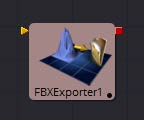
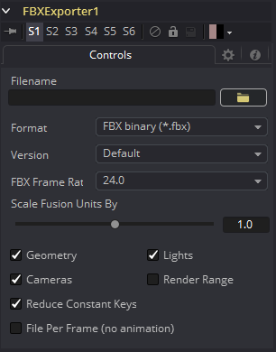

### FBX Exporter 3D [FBX]

FBX Exporter提供了一种方法，可以将Fusion的3D场景导出到FBX场景交换格式。Fusion中的每个节点都是导出文件中的单个对象。对象、灯光和摄像机将使用创建它们的节点的名称。可以将该工具设置为为整个场景一个文件，或每帧一个文件。

除了FBX格式之外，该工具还可以导出到3D Studio的.3ds、Collada的.dae、Autocad的.dxf和Alias的.obj格式。

#### External Inputs 外部输入

 

**FBXExporter.Input 输入**

[橙色，必需的]这个输入需要一个3D场景。

#### Controls 控件

##### Filename 文件名

此文件浏览器控件可用于设置工具输出的文件。单击黄色文件夹图标打开文件浏览器对话框。

##### Format 格式

此控件用于设置输出文件的格式。可以导出以下文件格式：

| 文件类型       | 后缀    |
| -------------- | ------- |
| FBX ascii      | (*.fbx) |
| FBX 5.0 binary | (*.fbx) |
| Autocad DXF    | (*.dxf) |
| 3D Studio 3Ds  | (*.3ds) |
| Alias OBJ      | (*.obj) |
| Collada DAE    | (*.dae) |

并非所有格式都支持此工具的所有特性。例如，obj格式不支持处理动画。

##### Version 版本

版本下拉菜单显示了上面控件选择的格式的可用版本。菜单的内容将动态变化，以反映该格式的可用版本。如果所选格式仅提供一个选项，则此菜单将被隐藏。

FBX格式的默认（Default）选择使用FBX200611。

##### Geometry/Lights/Cameras 几何物体/光照/摄像机

这三个复选框控件决定该工具是否尝试导出指定的场景元素。例如，取消几何物体和灯光但保留选择的摄像机，现在将只输出场景中的摄像机。

##### Reduce Constant Keys 减少常关键帧

如果相邻的关键帧具有相同的值，启用此选项将自动删除关键帧。

##### File Per Frame (No Animation) 文件每帧（无动画）

启用此选项将强制工具在每帧导出文件，导致一串序列文件。这将禁用动画的导出。

##### Set Sequence Start 设置序列起始

通常，Fusion会使用工程文件的渲染范围来确定将文件序列渲染到磁盘时使用的数字序列。启用此复选框以显示Sequence Start Frame控件，以将序列中的第一个帧的数量设置为自定义值。

##### Sequence Start Frame 序列起始帧

此转轮控件可用于为渲染文件名的数字序列设置显式的开始帧。例如，如果Global Start设置为1，并渲染1 - 30帧，文件通常编号为0001 - 0030。如果Sequence Start Frame设置为100，渲染输出将从100-131被编号。