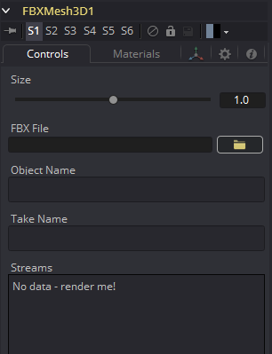
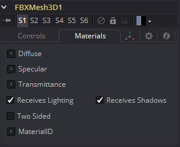

### FBX Mesh 3D [FBX] FBX网格3D

FBXMesh3D工具用于以FilmBox（FBX）格式保存的场景文件中导入多边形几何物体。它还可以从OBJ、3DS、DAE和DXF场景文件中导入几何物体。这提供了一种使用比Fusion内建物体更复杂几何体的方法。

当使用此工具导入几何物体时，FBX文件中包含的所有物体将被组合成一个具有单个中心点和变换的mesh。FBXMesh工具将忽略任何应用于物体的动画。

File > Import > FBX工具可用于导入FBX并为文件中包含的每个摄像机、灯光和mesh创建单独的工具。这个工具还可以保留物体的动画。

如果启用了Global > General > Auto Clip Browse选项(默认)，则将此工具添加到工具栏或菜单的composition中，将自动显示文件浏览器。

#### External Inputs 外部输入

 

**FBXMesh3D.SceneInput 场景输入**

[橙色，必需的]这个输入需要一个3D场景作为输入。

**FBXMesh.MaterialInput 材质输入**

[绿色，可选的]该输入将接受二维图像或三维材质。如果提供了2D图像，则它将作为构建在工具中的基本材质的diffuse纹理映射。如果一个3D材质被连接，那么基本材质将被禁用。

#### Controls 控件

##### Size 大小

Size滑块控制导入的FBX几何物体的大小。FBX mesh倾向于比Fusion的默认单位尺度大得多，因此该控制对于扩展导入的几何物体以匹配Fusion环境是有用的。

##### FBX File FBX文件

此控件显示当前加载的FBX的文件名。单击黄色文件夹的图标，打开一个文件浏览器，可用于定位FBX文件。尽管该工具的名称不同，但该工具还可以加载各种其他格式。

| 文件类型       | 后缀    |
| -------------- | ------- |
| FBX ascii      | (*.fbx) |
| FBX 5.0 binary | (*.fbx) |
| Autocad DXF    | (*.dxf) |
| 3D Studio 3Ds  | (*.3ds) |
| Alias OBJ      | (*.obj) |
| Collada DAE    | (*.dae) |

##### Object Name 物体名称

此输入显示正在导入的FBX文件中的mesh名称。如果该字段为空，那么FBX物体的全部内容将作为一个mesh导入。此输入不能被用户编辑；当通过File > Import > FBX工具导入FBX文件时，由Fusion设置。

##### Take Name 使用名称

此输入显示从FBX文件中使用的动画的名称。如果该字段为空，则不会导入动画。此输入不能被用户编辑；当通过File > Import > FBX工具导入FBX文件时，由fusion设置。

##### Wireframe 线框

启用此复选框将导致mesh只渲染对象的线框。目前，只有OpenGL渲染器支持线框渲染。

##### Visibility 可见性

- **Visible 可见：**如果Visibility复选框没有被选中，那么该对象在查看器中将不可见，也不会被Renderer 3D工具渲染到输出图像中。不可见的物体不会投射阴影。
- **Unseen by Cameras 摄像机不可视：**如果选择了Unseen by Cameras复选框，则对象将在查看器中可见(除非Visible复选框被关闭)，而通过摄像机查看时不可见。对象不会被Renderer 3D工具渲染到输出图像中。当Software渲染器渲染时，未被看到的物体所投射的阴影仍然是可见的，而OpenGL渲染器不能。
- **Cull Front Face/Back Face 剔除前/后面：**使用这些选项在几何物体中剔除(消除)某些多边形的渲染和显示。如果选中了Cull Back Face，那么所有远离摄像机的多边形将不会被渲染，也不会投射阴影。如果选中了Cull Front Face，所有朝向摄像机的多边形都将同样被删除。选中两个复选框与取消选中Visible复选框具有相同的效果。
- **Ignore Transparent Pixels in Aux Channels 忽略辅助通道的透明像素：**在以前的Fusion版本中，透明像素被Software/GL渲染器拒绝。更具体地说，软件渲染器拒绝了带有R=G=B=A=0的像素，而GL渲染器拒绝了带有=0的像素。这是可选的。您可能希望这样做的原因是为透明区域获取aux通道(例如，Normals, Z, UVs)。例如，假设在后期，您想要替换一个3D元素上的纹理，该元素在某些区域是透明的，纹理在不同的区域是透明的，那么有透明区域设置辅助通道(特别是UVs)是很有用的。作为另一个例子，假设您正在做后期的DoF。您可能不希望Z通道设置在透明区域上，因为这会给您一个错误的深度。此外，请记住，这种拒绝是基于最终的像素颜色，包括灯光，如果它是开着的。如果你在透明的玻璃材料上有高光，这个复选框不会影响到它。

##### Lighting 光照

- **Affected by Lights 受光照影响：**如果这个复选框没有被选中，场景中的灯光将不会影响到对象，它将不会接收或投射阴影，它将显示在其颜色、纹理或材质的全亮度。
- **Shadow Caster 阴影投射者：**如果这个复选框未被启用，该对象将不会在场景中的其他对象上投射阴影。
- **Shadow Receiver 阴影接受者：**如果此复选框未启用，则该对象将不会接收场景中其他对象投射的阴影。

##### Matte Matte

启用Is Matte选项将对该对象应用一个特殊的纹理，使该对象不仅对摄像机不可见，而且还使直接出现在摄像机后面的所有东西也不可见。此选项将覆盖所有纹理。有关更多信息，请参见3D章节的Matte Objects部分。

- **Is Matte 作为Matte：**当被激活时，像素在Z中的后于matte对象像素的对象不会被渲染。
- **Opaque Alpha 不透明alpha：**将matte对象的alpha值设置为1。此复选框仅在启用is Matte选项时可见。
- **Infinite Z 无限Z：**将Z通道中的值设置为无穷大。此复选框仅在启用is Matte选项时可见。

##### Blend Mode 混合模式

Blend Mode指定Renderer在将该对象与场景的其余部分组合时将使用哪种方法。混合模式与2D Merge工具中列出的模式基本相同。有关每种模式的详细解释，请参阅那个工具的部分。

混合模式最初设计用于2D图像。在光照的3D环境中使用它们会产生不希望的结果。为了获得最佳效果，请在软件中渲染的无光照3D场景中使用Apply模式。

- **OpenGL Blend Mode OpenGL混合模式：**使用此菜单来选择将在OpenGL渲染器处理几何物体时使用的混合模式。这也是在查看器中查看对象时使用的模式。目前OpenGL渲染器支持三种混合模式。
- **Software Blend Mode Software 混合模式：**使用此菜单选择在Software渲染器处理几何物体时使用的混合模式。目前，Software渲染器支持Merge工具文档中描述的所有模式，除了Dissolve模式。

#### Material Tab 材质选项卡

出现在此选项卡中的选项决定此工具创建的几何物体的外观。由于这些控件在生成几何物体的所有工具上都是相同的，因此在本文档的Common 3D控件一节中对这些控件进行了充分的描述。

如果外部3D材质连接到工具块的材质输入，那么这个选项卡中的控件将被Using External Material（使用外部材质）标签所取代。

#### 变换选项卡

出现在此选项卡中的选项决定此工具创建的几何物体的位置。由于这些控件在生成几何物体的所有工具上都是相同的，因此在本文档的Common 3D控件一节中对这些控件进行了充分的描述。

