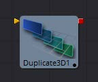
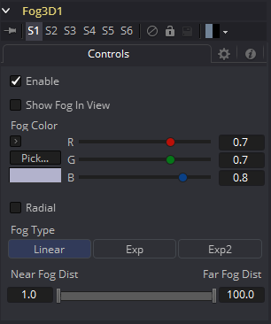

### Fog 3D [3Fo] 雾3D

Fog 3D工具将基于深度提示的雾应用到场景中。它是三维版本的Fog工具，在深度像素范畴。它设计成完全在三维空间中工作，在渲染过程中充分利用了景物的抗锯齿和景深。

Fog 3D工具本质上是通过根据物体与摄像机的距离进行颜色校正来重新绘制场景中的几何物体。一个可选的密度纹理图像可以用来应用变化到校正。

#### External Inputs 外部输入

 

**Fog3D.SceneInput 场景输入**

[橙色，必需的]这个输入需要一个3D场景。

**Fog3D.DensityTexture 密度纹理**

[绿色，可选的]这个输入需要一个2D图像。该工具创建的雾的颜色乘以图像中的像素。在为密度纹理创建图像时，请记住，纹理是通过摄像机有效地投影到场景上的。

#### Controls 控件

##### Enable 启用

使用此复选框启用或禁用该工具。

##### Show Fog in View 在视图中显示雾

默认情况下，该工具创建的雾只有在使用Camera工具查看场景时才可见。当启用这个复选框时，从所有的视角都可以看到场景中的雾。

##### Color 颜色

这个控件可以用来设置雾的颜色。如果已经提供了，颜色也乘以密度纹理图像。

##### Radial 径向

在默认情况下，雾是基于垂直距离到一个平面(与近平面平行)通过眼睛点。当Radial选项选中时，使用到眼点的径向距离而不是垂直距离。垂直距离雾的问题在于，当你移动摄像机的时候，物体移动到中心，即使它们与眼睛保持相同的距离，它们也会变得不那么雾化。Radial 雾修复这个问题。有时Radial雾是不可取的。例如，如果你将一个靠近摄像机的物体雾化，比如像一个图像平面，在边缘完全模糊的情况下，图像平面的中心可以不模糊。

##### Fog Type 雾类型

此控件用于确定应用于雾的衰减类型。

- **Linear:** 定义雾的线性衰减。
- **Exp:** 创建指数级非线性衰减。
- **Exp2:** 创建更强的指数衰减。

##### Near/Far Fog Distance 近/远雾距离

该控件将场景中的雾的范围表示为与摄像机的距离单位。Near Distance决定雾从哪里开始，Far Distance决定雾的最大影响点。雾是累积的，所以物体离摄像机越远，雾就越明显。

