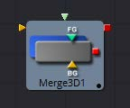
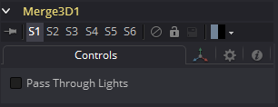
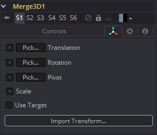

### Merge 3D [3Mg]

Merge 3D工具用于将独立的3D元素组合到相同的3D环境中。

例如，用一个图像平面、一个摄像机和一个光照创建的场景，摄像机将无法看到图像平面而且光照也不会影响图像平面，除非所有三个对象通过Merge 3D工具被引入相同环境。

工具块最初只显示两个输入，但是当每个输入都被连接时，一个新的输入将出现在工具上，确保始终有一个可以向场景中添加新元素的自由输入。

Merge提供了Fusion的3D套件中大多数工具上的标准转换控件。与这些工具不同，对Merge的变换、旋转或缩放所做的更改会影响到连接到Merge的所有对象。这种行为构成了Fusion 3D环境中所有父子关系的基础。

#### External Inputs 外部输入

 

**Merge3D.SceneInput[#] 场景输入[多个]**

[任意，见描述]这些输入需要一个3D场景。当构造工具时，它将显示两个输入。此工具可以接受的输入数量没有限制。该工具根据需要动态添加更多的输入，确保始终至少有一个可用于连接的输入。

#### Controls 控件

##### Pass Through Lights 透过光照

当选中Pass Through Lights复选框时，光照将透过Merge至其输出，从而影响到下游的元素。通常情况下，灯光不会通过下游来影响场景的其他部分。这通常用于确保投影不应用于稍后在场景中引入的几何物体。

#### Transform Tab 变换选项卡

出现在此选项卡中的选项决定此工具创建的几何物体的位置。由于这些控件在生成几何物体的所有工具上都是相同的，因此在本文档的Common 3D控件一节中对这些控件进行了充分的描述。

