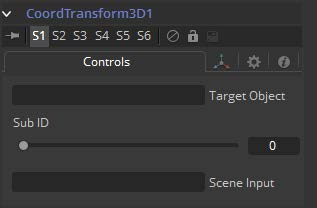

### Modifier

#### **Coordinate Transform 3D** 

由于Fusion 3D流程的层次性，物体在三维场景中的初始位置往往不能反映出物体的当前位置。例如，一个图像平面最初的位置可能是`1, 2, 1`，但随后在3D场景中被进一步下游的其他工具缩放、偏移和旋转，最终的绝对位置可能是`10, 20, 5`。

这可能使将组合中较下游的对象直接连接到上游对象的位置变得复杂。Coordinate Transform修饰器可以添加到任意一组XYZ坐标控件中，并将计算场景层次结构中给定对象的当前位置。

要添加Coordinate Transform修饰符，只需右键单击任何工具上的数字输入，并从Controls上下文菜单中选择Modify With/CoordTransform Position。

#### Controls Tab

##### Target Object

此控件应连接到生成要转换的原始坐标的3D工具。要连接一个工具，可以将一个工具块从流程拖放到文本编辑控件中，或者右键单击该控件并从上下文菜单中选择该工具。还可以直接在控件中键入工具名。

##### Sub-ID

SubID滑块可用于针对特定几何类型的单个子元素，例如Text 3D工具生成的单个字符或复制3D工具创建的特定副本。

##### Scene Input

此控件应连接到包含新位置对象的场景的3D工具。要连接一个工具，可以将一个工具块从流拖放到文本编辑控件中，或者右键单击该控件并从Connect To弹出菜单中选择一个对象。