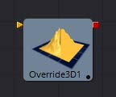
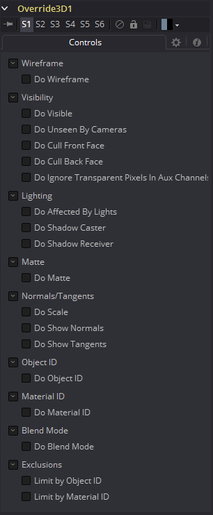

### Override 3D [3Ov]

Override工具允许您同时为3D场景中的每个物体更改物体特定的选项。这很有用，例如，当您希望将输入场景中的每个对象设置为线框时。此外，该工具是为3D粒子系统和Text 3D工具设置wireframe、visibility、lighting、matte和ID选项的唯一方法。

它经常与Replace Material工具一起使用，以产生隔离通道。例如，可以将一个场景分支到一个Override工具，该工具关闭受灯光影响的每个工具的属性，然后连接到一个Replace Material工具，该工具应用一个Falloff着色器来产生通过场景的衰减。

#### External Inputs 外部输入

 

[橙色，必需的]这个输入需要一个3D场景。

#### Controls 控件

在Override工具中找到的控件的哲学非常直白。首先，使用Do[option]复选框选择要覆盖的选项。这将显示可以用来设置选项本身的值的控件。这里没有对单独选项的解释；可以在任何物体创建工具(如Image Plane、Cube或Shape工具)中找到每个工具的完整描述。

##### Do [option] 使用[选项]

启用此选项的覆盖。

##### [Option] [选项]

如果启用了Do[option]复选框，那么属性本身的控件将变得可见。所有上游对象的属性的控件值都被新值覆盖。