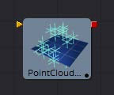
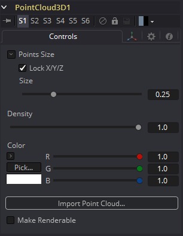
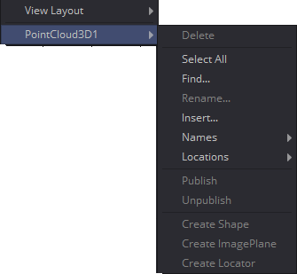
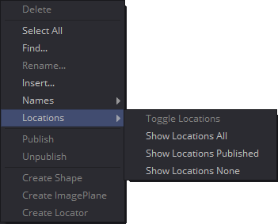

### Point Cloud 3D [3PC]

Point Cloud通常是由3D跟踪或建模软件创建的大量空位置（点）。当由3D跟踪软件制作时，这些点通常代表每个被跟踪的模型 ，以创建3D摄像机路径。这些点云可用于识别地面，并将其他3D元素与跟踪图像定位。Point Cloud 3D工具通过导入3D场景来创建点云。

#### External Inputs 外部输入

 

**Pointcloud3D.SceneInput 场景输入** 

[橙色，必需的]这个输入需要一个3D场景。

#### Controls 控件

##### Lock X/Y/Z 锁定X/Y/Z

取消选中此复选框，以提供对云中各点的X、Y和Z十字准线长度的单独控制。

##### Size 大小

这些滑块可用于增加表示每个点的屏幕上十字准线的大小。

##### Density 密度

这个滑块定义了显示特定点的概率。如果值为1，则显示所有点。0.2的值表示只显示五分之一。

##### Color 颜色

使用标准Color控件来设置屏幕上的横线控件的颜色。

##### Import Point Cloud 导入点云

Import Point Cloud按钮显示一个对话框，用于从另一个应用程序导入点云。支持的文件有：

| 文件类型                    | 后缀 |
| --------------------------- | ---- |
| *Alias's Maya               | .ma  |
| *3DS Max ASCII Scene Export | .ase |
| *NewTek's LightWave         | .lws |
| *Softimage XSI's            | .xsi |

##### Make Renderable 设置为可渲染

确定点云在OpenGL 视窗中是否可见，以及用OpenGL renderer的最终渲染中是否可见。Software renderer目前不支持该工具的可见十字线渲染。

##### Unseen by Camera 摄像机不可视

当选择Make Renderable选项时，将出现这个复选框控件。如果选中了Unseen by Camera复选框，则可以在监视器中看到点云，但不能通过Renderer 3D工具将其渲染到输出图像中。

#### Onscreen Contextual Menu 屏幕上的上下文菜单

通常，导入的的点云中的一个或多个点会被手动分配，以跟踪特定特性的位置。这些点通常有不同于云中的其他点的名称。要查看一个点的当前名称，请将鼠标指针直接悬停在一个点上，过一会儿会出现一个小的弹出窗口，显示该点的名称。

当Point Cloud 3D工具被选中时，一个子菜单将被添加到显示监视器的上下文菜单中，其中有几个选项可以使定位、重命名以及将这些点与点云的其他部分分开变得简单。上下文菜单包含以下选项：

##### Find 查找

从显示的监视器上下文菜单中选择此选项将打开一个对话框，该对话框可用于搜索并选择一个点的名称。将选择与模式匹配的每个点。

##### Rename 重命名

通过从上下文菜单中选择Rename，重命名一个或多个点。在出现的对话框中键入新名称并单击回车。点现在有了这个名称，末尾增加了一个四位数。例如，名称window将是window0000，多个点将是window0000、window0001等。名称必须是有效的Fusion标识符(即，不允许空格，名称不能以数字开头)。

##### Delete 删除

选择此选项将删除当前选中的点。

##### Publish 公开

通常，云中的一个点的确切位置是不公开的。要公开位置，请选择一个或多个点，然后从上下文菜单中选择publish选项。这将向控制面板添加一个坐标控件，用于显示该点的当前位置。

#### Additional toolbar and shortcuts 额外的工具栏和快捷键

| 操作                                    | 快捷键  |
| --------------------------------------- | ------- |
| 删除选中的点                            | Del     |
| 全选                                    | Shift+A |
| 查找点                                  | Shift+F |
| 重命名选中的点                          | F2      |
| 创建新的点                              | Shift+C |
| 切换None/Selected/published/All点的名称 | Shift+N |
| 切换None/Selected/published/All点的位置 | Shift+L |
| 发布选中的点                            | Shift+P |
| 取消发布选中的点                        | Shift+U |
| 在选中的点上创建一个形状                | Shift+S |
| 创建并安装一个ImagePlane到选中的点      | Shift+I |
| 在选定的点上创建一个 Locator            | Shift+O |

