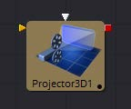
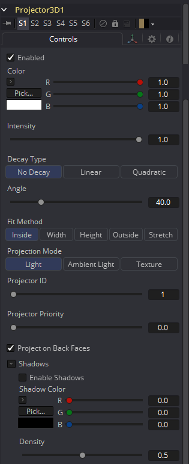
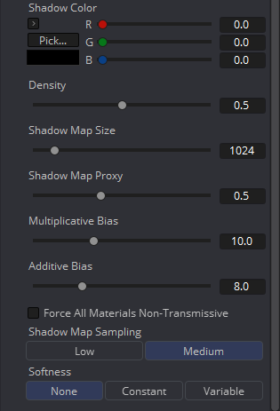
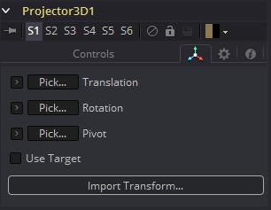

### Projector 3D [3Pj] 

Projector 3D工具用于在三维几何物体上投影图像。这在很多方面都很有用：用多个层来纹理对象，在多个独立的对象上应用纹理，从相机的视角投射背景照片，基于图像的渲染技术等等。Projector工具只是几种能够投射图像和纹理的工具之一。每种方法都有优缺点。有关每种方法的更多信息，请参阅3D章节的投影部分。

如果物体相对于投影仪3D移动，投影纹理可以“滑动”到物体上，或者，通过Merge 3D将两者组合在一起，它们可以作为一个移动，纹理将保持锁定在物体上。

最好理解Projector 3D工具的功能和限制的方法是把Projector当成Spotlight工具的变体。当当在Light或Ambient Light投影模式时，Projector 3D工具本质上是一盏灯的事实导致了一些重要的后果：

- 为了使投影的结果可见，必须打开灯光。
- 投影仪发出的光被视为漫反射/高光。这意味着它将受到表面法线的影响，并可能导致镜面高光。如果不希望这样，设置Projector 3D为Ambient Light通道。
- Enabling Shadows将导致Projector 3D投射阴影。
- 就像其他光线一样，Projector 3D发出的光线只会影响到第一个Merge 3D的对象，该Merge 3D是在Projector 3D工具流的下游。启用Merge 3D的Pass Through Lights复选框将允许投影到更下游的物体。
- Projector 3D发出的光由物体上的照明选项设置和材料上的接收照明选项控制。
- 投影图像中的Alpha值不会在Light或Ambient Light模式下剪切几何物体。使用纹理模式来替代。
- 如果两个投影重叠，它们的光线效果就会相加。

若要为非漫反射颜色通道(如Specular Intensity或Bump)投射可重亮的纹理或纹理，请使用Texture投影模式：

- Texture模式下的投影将只对使用Catcher工具输出的所有或部分材质应用于该对象的对象进行影响。
- Texture模式投影将根据投影图像的alpha通道剪切几何物体。

有关其他详细信息，请参阅Catcher工具一节。

Camera 3D工具还提供了投影功能，当投影与摄像机匹配时应该使用该工具，因为该工具对光圈、胶片背面和剪切平面有更多的控制。Projector 3D被设计用来作为一个定制的光线在3D场景中分层和纹理。投影仪可以更好地控制光线强度、颜色、衰减和阴影。

当在OpenGL view或OpenGL renderer中使用Projectors时，为了查看主视图中投影的结果，照明必须设置为Per-pixel(默认)。Per-pixel照明模式需要从你的显卡上获得一定级别的着色器支持。即使显卡不支持像素着色，在使用Software renderer时投影仍然是可见的。

#### 外部输入

 

**Projector3D.SceneInput**

[橙色，可选的]这个输入需要一个3D场景。如果一个场景连接到这个输入，那么应用到聚光灯上的变换也会影响场景的其余部分。

**Projector3D.ProjectiveImage**

[白色，可选的]这个输入需要一个2D图像用于投影。

#### Controls

##### Enabled

当选中这个复选框时，Projector就会影响场景。清除复选框以关闭它。

##### Color

在投影到场景之前，输入图像乘以这个颜色。

##### Intensity

当使用Light和Ambient Light投影模式时，使用此滑块设置投影的强度。在Texture模式下，这个选项将缩放乘以颜色的纹理Color值。

##### Decay Type

Projector默认No Falloff，这意味着无论投影仪到几何物体的距离有多远，它的光线在几何物体上的强度都是相等的。若要使强度随距离下降，请将Decay Type设置为Linear模式或Quadratic模式。

##### Angle

工具的Cone Angle是指Projector发出其全部强度的锥形的宽度。角度越大，锥角越宽，最高可达90度。

##### Fit Method

Fit Method确定投影在投影锥中如何拟合。

首先要知道的是，虽然这个文档可能称之为“圆锥(cone)”，但Projector3D工具和Camera3D工具并不投射实际的锥；它更像是一个金字塔形的光线，它的顶点在照相机/投影仪上。Projector3D工具总是投射一个正方形金字塔形的光线，即它的X角和Y角是相等的。由Camera3D工具投射的金字塔形的光线可以是非方形的，这取决于在相机中设置的Film Back。与Projector3D/Camera3D相连接的图像的方面不会影响金字塔的X/Y角度，而是根据拟合选项缩放图像来适合金字塔形。

当金字塔的比例`(AovY/AovX)`和图像的比例`(height ** pixelAspectY)/(width ** pixelAspectX)`都相同时，就不需要拟合选项，在这种情况下，所有拟合选项都做同样的事情。然而，当图像和金字塔的比例(由Camera3D中的Film Back设置决定)不同时，拟合选项就变得重要了。

例如，‘Fit by Width’将与Camera3D金字塔的宽度相匹配。在这种情况下，如果图像的长宽比大于金字塔的长宽比，一些投影会垂直地延伸到金字塔之外。

有五个选项：

- **Inside:** 图像是均匀缩放的，以使其最大尺寸适合于锥内。另一种考虑方法是，它将图像缩放到尽可能大的程度，使图像完全被覆盖在金字塔形的光线中。这意味着如金字塔形的光线以外的任何东西都不会接收到任何投射的光。
- **Width:** 图像是均匀缩放的，以便其宽度适合于锥内。注意，图像仍然可以在锥外的高度方向上延伸。
- **Height:** 图像是均匀缩放的，以便其宽度适合于锥内。注意，图像仍然可以在锥外的高度方向上延伸。
- **Outside:** 图像是均匀缩放的，以使其最小尺寸适合于锥内。另一种考虑方法是，它将图像缩放到尽可能小的程度，使图像覆盖整个金字塔形的光线(即金字塔完全被覆盖在图像中)。这意味着光金字塔内任何物体的任何像素都会被照亮。
- **Stretch:** 图像是不均匀缩放的，所以它正好覆盖了投影仪的锥形。

##### Projection Mode

- **Light:** 将纹理投影为漫反射/高光。
- **Ambient Light:** 使用环境光进行投影。

##### Texture

当与Catcher工具一起使用时，这种模式允许可重新照明材质的投影。投影将只作用于使用Catcher材质作为材质着色器的一部分的对象。

一个有用的窍门是将Catcher工具连接到3D Material工具(比如Blinn)上的Specular Texture输入。这将导致使用Blinn材质的任何对象接收作为高光部分的投影。这种技术可以用于任何使用纹理贴图的材质输入，例如Specular贴图和Reflection贴图。

#### Shadows

由于Projector是基于Spotlight的，它也可以使用阴影贴图投射阴影。这个揭示的下面的控件用于定义阴影映射的大小和行为。

##### Enable Shadows

若光线要产生阴影就应该选中Enable Shadows复选框。这个默认被选中。

##### Shadow Color

使用这个标准Color控件来设置阴影的颜色。默认为黑色(0,0,0)。

##### Density

Shadow Density决定了阴影的不透明程度。密度为1.0会产生完全不透明的阴影，而较低的值会使阴影透明。

##### Shadow Map Size

Shadow Map Size控件确定用于创建阴影贴图的位图的大小。较大的值将以牺牲内存和性能为代价生成更精细的阴影贴图。

##### Shadow Map Proxy

Shadow Map Proxy确定用于代理(proxy)和自动代理(auto proxy)计算的阴影贴图的大小。0.5的值将使用50%的阴影映射。

##### Multiplicative/Additive Bias

阴影本质上是应用于场景中的对象的纹理，所以偶尔会有Z-fighting，在这里，应该接收阴影的对象的部分会渲染到阴影的顶部来代替。

偏置通过添加一个小的深度偏移来将阴影从阴影表面移开，从而消除了Z-fighting。如果偏置太少，物体就会自我隐藏。太多的偏置使阴影可能会与表面分离。

首先对乘法偏置(multiplicative bias)进行调整，然后利用加法偏置(additive bias )控件对结果进行微调。

##### Force All Materials Non-Transmissive

通常，渲染阴影时使用RGBAZ阴影贴图。通过启用此选项，您将迫使渲染器使用只有Z通道的阴影贴图。这可能导致显著更快的阴影渲染，同时使用五分之一的内存。缺点是你不能再投射“彩色玻璃”那样的阴影。

##### Shadow Map Sampling

设置阴影贴图的采样质量。

##### Softness

阴影中的柔边是在采样时通过对阴影图进行过滤而产生的。当渲染产生不同效果的阴影时，Fusion有三种单独的过滤方法。

- **None:** 阴影的边缘会很生硬。阴影贴图完全没有过滤。这种方法的优点是你只需要在阴影贴图中采样一个像素，所以速度很快。
- **Constant:** 阴影边缘会有一个恒定的柔软度。当采样阴影贴图时会使用一个恒定宽度的滤镜。调整Constant Softness滑块控制滤镜的大小。注意，滤镜越大，渲染阴影的时间就越长。
- **Variable:** 阴影边缘的柔软度会随着阴影接收器离阴影投射物的远离而增加。根据接收物与投射物之间的距离，改变滤镜的大小，可实现不同的柔软度。当选中此选项时，Softness Falloff、Min Softness和Max Softness滑块出现。

##### Constant Softness

如果Softness设置为Constant，则会出现此滑块。它可以用来设置阴影的整体柔软度。

##### Softness Falloff

当将Softness设置为Variable时，会出现Softness Falloff滑块。这个滑块控制阴影边缘的柔软度随距离增长的速度。更精确地说，它可以根据阴影投射物和接收物之间的距离来控制阴影贴图滤镜尺寸的增长速度。它的影响是由Min和Max Softness滑块的值来调节的。

##### Min Softness

当Softness设置为Variable时，Min Softness滑块就会出现。这个滑块控制阴影的最小柔软度。阴影越接近投射阴影的物体，它就越尖锐，达到这个滑块设定的极限。

##### Max Softness

当Softness设置为Variable时，Max Softness滑块就会出现。这个滑块控制阴影的最大柔软度。阴影离投射阴影的物体越远，它就越柔和，达到这个滑块设定的极限。

#### Transform选项卡

出现在此选项卡中的选项决定此工具创建的几何物体的位置。由于这些控件在生成几何物体的所有工具上都是相同的，因此在本文档的Common 3D控件一节中对这些控件进行了充分的描述。

