## 第一章 3D Tools三维工具

- **[Alembic Mesh 3D [ABc]](./Alembic%20Mesh%203D%20[ABc].md)** ✔
- **[Bender 3D [3Bn]](./Bender%203D%20[3Bn].md)** ✔
- **[Camera 3D [3Cm]](./Camera%203D%20[3Cm].md)** ✔
- **[Cube 3D [3Cb]](./Cube%203D%20[3Cb].md)** ✔
- **[Custom Vertex 3D [3Cv]](./Custom%20Vertex%203D%20[3Cv].md)** ✔
- **[Displace 3D [3Di]](./Displace%203D%20[3Di].md)** ✔
- **[Duplicate 3D [3Dp]](./Duplicate%203D%20[3Dp].md)** ✔
- **[FBX Exporter 3D [FBX]](./FBX%20Exporter%203D%20[FBX].md)** ✔
- **[FBX Mesh 3D [FBX]](./FBX%20Mesh%203D%20[FBX].md)** ✔
- **[Fog 3D [3Fo]](./Fog%203D%20[3Fo].md)** ✔
- **[Image Plane 3D [3Im]](./Image%20Plane%203D%20[3Im].md)** ✔
- **[Locator 3D [3Lo]](./Locator%203D%20[3Lo].md)** ✔
- **[Merge 3D [3Mg]](./Merge%203D%20[3Mg].md)** ✔
- **[Override 3D [3Ov]](./Override%203D%20[3Ov].md)** ✔
- **[Point Cloud 3D [3PC]](./Point%20Cloud%203D%20[3PC].md)** ✔
- **[Projector 3D [3Pj]](./Projector%203D%20[3Pj].md)** ✔
- **[Renderer 3D [3Rn]](./Renderer%203D%20[3Rn].md)** ✔
- **[Replace Material 3D [3Rpl]](./Replace%20Material%203D%20[3Rpl].md)** ✔
- **[Replace Normals 3D [3Rn]](./Replace%20Normals%203D%20[3Rn].md)** ✔
- **[Replicate 3D [3Rep]](./Replicate%203D%20[3Rep].md)** ✔
- **[Ribbon 3D [3Ri]](./Ribbon%203D%20[3Ri].md)** ✔
- **[Shape 3D [3Sh]](./Shape%203D%20[3Sh].md)** ✔
- **[Softclip [3Sc]](./Softclip%20[3Sc].md)** 📌
- **[Text 3D [3Txt]](./Text%203D%20[3Txt].md)** 
- **[Transform 3D [3Xf]](./Transform%203D%20[3Xf].md)** 
- **[Triangulate 3D [3Tri]](./Triangulate%203D%20[3Tri].md)** 
- **[UV Map 3D [3UV]](./UV%20Map%203D%20[3UV].md)** 
- **[Weld 3D [3We]](./Weld%203D%20[3We].md)** 
- **[Modifier](./Modifier.md)** 
- [Coordinate Transform 3D](./Coordinate%20Transform%203D.md) 

  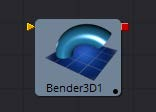 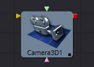

 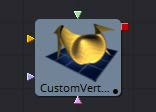 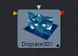 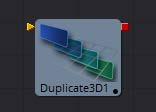

 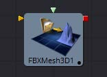 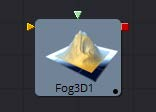 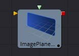

 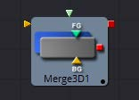 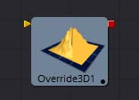 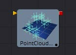

 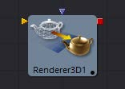 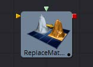 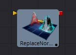

 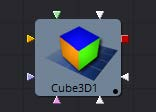 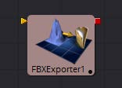 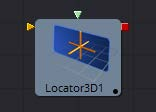

 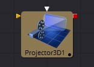  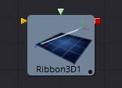

 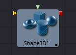  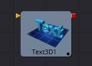

 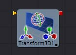 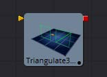 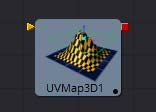 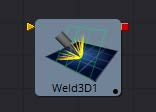