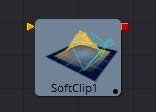

## 第一章 3D Tools 三维工具

- [Alembic Mesh 3D [ABc]](./Alembic%20Mesh%203D%20[ABc].md) 
- [Bender 3D [3Bn]](./Bender%203D%20[3Bn].md) 
- [Camera 3D [3Cm]](./Camera%203D%20[3Cm].md) 
- [Cube 3D [3Cb]](./Cube%203D%20[3Cb].md) 
- [Custom Vertex 3D [3Cv]](./Custom%20Vertex%203D%20[3Cv].md) 
- [Displace 3D [3Di]](./Displace%203D%20[3Di].md) 
- [Duplicate 3D [3Dp]](./Duplicate%203D%20[3Dp].md) 
- [FBX Exporter 3D [FBX]](./FBX%20Exporter%203D%20[FBX].md) 
- [FBX Mesh 3D [FBX]](./FBX%20Mesh%203D%20[FBX].md) 
- [Fog 3D [3Fo]](./Fog%203D%20[3Fo].md) 
- [Image Plane 3D [3Im]](./Image%20Plane%203D%20[3Im].md) 
- [Locator 3D [3Lo]](./Locator%203D%20[3Lo].md) 
- [Merge 3D [3Mg]](./Merge%203D%20[3Mg].md) 
- [Override 3D [3Ov]](./Override%203D%20[3Ov].md) 
- [Point Cloud 3D [3PC]](./Point%20Cloud%203D%20[3PC].md) 
- [Projector 3D [3Pj]](./Projector%203D%20[3Pj].md) 
- [Renderer 3D [3Rn]](./Renderer%203D%20[3Rn].md) 
- [Replace Material 3D [3Rpl]](./Replace%20Material%203D%20[3Rpl].md) 
- [Replace Normals 3D [3Rn]](./Replace%20Normals%203D%20[3Rn].md) 
- [Replicate 3D [3Rep]](./Replicate%203D%20[3Rep].md) 
- [Ribbon 3D [3Ri]](./Ribbon%203D%20[3Ri].md) 
- [Shape 3D [3Sh]](./Shape%203D%20[3Sh].md) 
- [Softclip [3Sc]](./Softclip%20[3Sc].md) 
- [Text 3D [3Txt]](./Text%203D%20[3Txt].md) 
- [Transform 3D [3Xf]](./Transform%203D%20[3Xf].md) 
- [Triangulate 3D [3Tri]](./Triangulate%203D%20[3Tri].md) 
- [UV Map 3D [3UV]](./UV%20Map%203D%20[3UV].md) 
- [Weld 3D [3We]](./Weld%203D%20[3We].md) 
- [Modifier](./Modifier.md) 
  - [Coordinate Transform 3D](./Modifier.md#Coordinate-Transform-3D)

<table id="img">
  <tr>
    <td rowspan="10"></td>
    <td></td>
    <td></td>
    <td></td>
  </tr>
  <tr>
    <td></td>
    <td></td>
    <td></td>
  </tr>
  <tr>
    <td></td>
    <td></td>
    <td></td>
  </tr>
  <tr>
    <td></td>
    <td></td>
    <td></td>
  </tr>
  <tr>
    <td></td>
    <td></td>
    <td></td>
  </tr>
  <tr>
    <td></td>
    <td></td>
    <td></td>
  </tr>
  <tr>
    <td></td>
    <td></td>
    <td></td>
  </tr>
  <tr>
    <td></td>
    <td></td>
    <td></td>
  </tr>
  <tr>
    <td></td>
    <td></td>
    <td></td>
  </tr>
  <tr>
    <td></td>
  </tr>
</table>