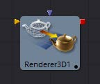
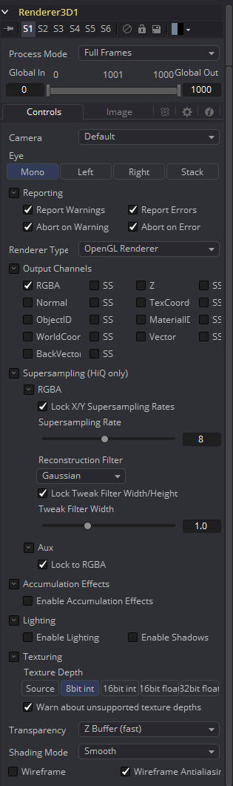
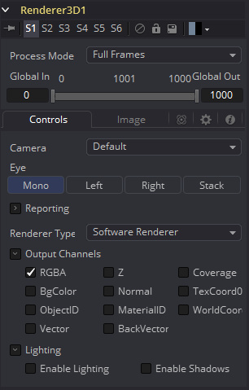
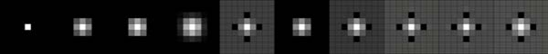
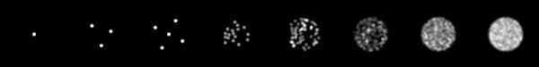
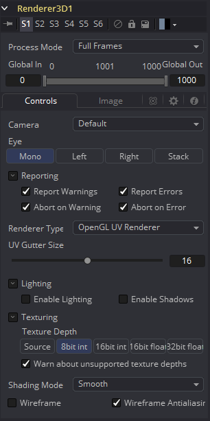

### Renderer 3D [3Rn]

Renderer 3D工具使用默认透视摄像机或场景中找到的摄像机将3D环境转换为2D图像。合成中的每个3D场景都应该以至少一个 Renderer 3D工具结束。渲染工具可以使用Softeware或者OpenGL渲染引擎来生成结果图像。也可以通过第三方插件提供额外的渲染引擎。

Softeware渲染引擎只使用系统的CPU来生成渲染的图像。它通常比OpenGL渲染引擎慢得多，但是会在所有的机器上产生一致的结果，这使得它对于涉及联机渲染的渲染是必不可少的。Software模式需要产生软阴影，并且通常支持所有可用的照明、纹理和材质特征。

OpenGL渲染引擎使用显卡上的GPU处理器来加速2D图像的渲染。根据所安装的显卡的不同，系统之间的输出可能略有不同。显卡驱动程序也会影响OpenGL渲染器的结果。OpenGL渲染引擎的速度使它能够提供超级采样和真实的3D景深选项。OpenGL渲染器不能生成软阴影。对于软阴影，建议使用Softeware渲染器。

像大多数工具一样，渲染器的动态模糊设置可以在Common Control选项卡下找到。请注意，包含一个或多个粒子系统的场景将要求pRender工具上的运动模糊设置与Renderer 3D工具上的设置完全匹配。否则，子帧渲染将阻止产生意外(和不正确)的结果。

> **注意：** GL渲染器尊重Renderer3D工具的Image选项卡中的颜色深度选项。这可能导致在一些显卡上渲染成int16或float32时速度变慢。

#### External Inputs 外部输入

 

**Renderer3D.SceneInput场景输入**

[橙色，必需的]这个输入需要一个3D场景。

**Renderer3D.EffectMask 效果遮罩**

[紫色，可选的]这个输入需要一个但通道或四通道的2D图像用于对输出蒙版。

#### Controls 控件

##### Camera 摄像机

Camera下拉列表用于在渲染时从场景中选择要使用的摄像机。默认选项是Default，它将使用场景中找到的第一个摄像机。如果没有摄像机，则使用默认的透视图来代替。

##### Eye 眼睛

Eye控制告诉工具如何在立体项目中渲染图像。Mono选项将忽略摄像机中的立体设置。Left and Right选项将使用摄像机中定义的立体分离和收敛选项来转换摄像机，以生成左眼或右眼输出。

##### Reporting 报告

此显示框中的前两个复选框可用于确定该工具是否将在渲染到控制台时打印警告和错误。第二行复选框告诉工具在遇到警告或错误时是否应该中止渲染。此工具的默认设置将启用所有四个复选框。

##### Renderer Type 渲染类型

此下拉菜单列出了可用的渲染引擎。Fusion提供了两种：软件和OpenGL渲染引擎(如上所述)，另外还可以通过第三方插件添加其他渲染器。

在这个下拉菜单下找到的所有控件都是由渲染引擎添加的。它们可能会根据每个渲染器可用的选项而改变。所以，每个渲染将在器将在下面的部分中单独描述。

#### Software Controls Software控件

##### Output Channels 输出通道

除了通常的Red、Green、Blue和Alpha通道，Software渲染器还可以将以下通道嵌入到图像中。启用其他通道将消耗额外的内存和处理时间，因此仅在需要时才应该使用这些通道。

- **RGBA：**这个选项告诉渲染器生成图像的Red、Green、Blue和Alpha颜色通道。
- **Z：**此选项支持渲染Z通道。Z通道中的像素包含一个值，该值表示每个像素到摄像机的距离。注意Z通道的值不能包含抗锯齿。在多个深度重叠的像素中，此像素使用最前面的深度值。
- **Coverage：**此选项启用Coverage通道的渲染。Coverage通道包含关于Z缓冲区中哪些像素提供覆盖(与其他对象重叠)的信息。这有助于使用Z缓冲区的工具提供少量抗锯齿。这个通道中像素的值通过百分比表示有多少像素由前景对象组成。
- **BgColor：**此选项启用BgColor通道的渲染。此通道包含来自Coverage通道中所述像素后方对象的颜色值。
- **Normal：**此选项支持渲染X、Y和Z的Normals通道。这三个通道包含表示三维空间中每个像素的方向的像素。包含[-1,1]范围内值的颜色通道表示每个轴。
- **TexCoord：**此选项允许渲染U和V映射的坐标通道。这些通道中的像素包含像素的纹理坐标。虽然纹理坐标在三维系统内部作为3分量的UVW进行处理，但是Fusion图像只存储UV分量。这些组件被映射到Red和Green通道中。
- **ObjectID：**此选项允许渲染ObjectID通道。3D环境中的每个对象在创建时都可以分配一个数字标识符。这个浮点图像通道中的像素包含分配给产生该像素的对象的值。空像素的ID为0，通道支持高达65534的值。多个对象可以共享一个Object ID。这个缓冲区对于根据场景中对象的形状提取遮罩非常有用。
- **MaterialID：**此选项允许渲染MaterialID通道。3D环境中的每个材质在创建时都可以分配一个数字标识符。这个浮点图像通道中的像素包含分配给产生该像素的材质的值。空像素的ID为0，通道支持高达65534的值。多个材质可以共享一个 Material ID。这个缓冲区对于根据材质提取遮罩非常有用；例如，一个包含所有由砖块纹理构成的所有像素的遮罩。

#### Lighting 光照

##### Enable lighting 启用光照

选中Enable Lighting复选框后，场景中的任何灯光都将照亮对象。如果没有灯光，所有的物体都是黑色的。

##### Enable Shadows 启用阴影

当启用阴影复选框被选中时，渲染器将产生阴影，这会有一定的速度代价。

#### OpenGL Controls OpenGL控件

##### Output channels 输出通道

除了通常的Red、Green、Blue和Alpha通道，OpenGL渲染引擎还可以将以下通道嵌入到图像中。启用其他通道将消耗额外的内存和处理时间，因此仅在需要时才应该使用这些通道。

- **RGBA：**这个选项告诉渲染器生成图像的Red、Green、Blue和Alpha颜色通道。
- **Z：**此选项支持渲染Z通道。Z通道中的像素包含一个值，该值表示每个像素到摄像机的距离。注意Z通道的值不能包含抗锯齿。在多个深度重叠的像素中，此像素使用最前面的深度值。
- **Normal：**此选项支持渲染X、Y和Z的Normals通道。这三个通道包含表示三维空间中每个像素的方向的像素。包含[-1,1]范围内值的颜色通道表示每个轴。
- **TexCoord：**此选项允许渲染U和V映射的坐标通道。这些通道中的像素包含像素的纹理坐标。虽然纹理坐标在三维系统内部作为3分量的UVW进行处理，但是Fusion图像只存储UV分量。这些组件被映射到Red和Green通道中。
- **ObjectID：**此选项允许渲染ObjectID通道。3D环境中的每个对象在创建时都可以分配一个数字标识符。这个浮点图像通道中的像素包含分配给产生该像素的对象的值。空像素的ID为0，通道支持高达65534的值。多个对象可以共享一个Object ID。这个缓冲区对于根据场景中对象的形状提取遮罩非常有用。
- **MaterialID;**此选项允许渲染MaterialID通道。3D环境中的每个材质在创建时都可以分配一个数字标识符。这个浮点图像通道中的像素包含分配给产生该像素的材质的值。空像素的ID为0，通道支持高达65534的值。多个材质可以共享一个 Material ID。这个缓冲区对于根据材质提取遮罩非常有用；例如，一个包含所有由砖块纹理构成的所有像素的遮罩。

#### Supersampling 超级采样

可以通过SS勾选框为每个通道启用超级采样。它产生一个拥有更高质量抗锯齿的输出图像通过暴力渲染一个更大的图像，然后缩放到目标分辨率。通过渲染一张较大的图像，然后使用Resize工具将图像调整到所需的分辨率，也可以达到完全相同的效果。与此方法相比，使用内置在渲染器中的超级采样提供了两个明显的优势。

渲染不受内存或图像大小限制。例如，考虑以下步骤来创建一个float16的1920 x 1080图像，其中包含16x超级采样。使用传统的Resize工具，首先需要渲染分辨率为30720 x 17280的图像，然后使用Resize将图像缩小到1920 x 1080。仅仅生成图像就需要将近4 GB的内存。而在GPU上执行超级采样时，OpenGL渲染器可以使用平铺渲染来显著减少内存使用。

GL渲染器可以直接在GPU上执行图像的缩放，其速度远远快于CPU的处理速度。一般来说，显卡的显存越多，该操作速度越快。

交互上，除非在时间标尺(Time Ruler)中选择HiQ按钮，否则Fusion将以跳过超级采样阶段。只要启用了它，最终的质量渲染总是包括超级采样。

由于硬件的限制，点物体(粒子)和线(定位器)总是按其原始大小渲染，独立于超级采样。这意味着这些元素将按比例缩小到原来的大小，并且看起来可能比预期的要薄得多。

##### Supersampling of Aux Channels in the OpenGL Renderer OpenGL渲染器中辅助通道的超级采样

我们为颜色和辅助通道提供单独的SS选项的原因是，颜色通道的超级采样比辅助通道慢得多。您可能会发现4×4 SS对于颜色已经足够，但是对于世界坐标或Z，您可能需要64×64才能得到足够的结果。颜色SS较慢的原因是RGBA的着色器可以是10x甚至100x或1000x更复杂，颜色会启用排序来被渲染，而辅助通道渲染使用更快的Z缓冲方法。

> **注意：** RGBA超级采样不再在超级采样内部中启用，而是在OutputChannels内部中启用。对于某些情况，有时使用SS Z缓冲区会提高质量，但是对于其他情况，比如使用Merge的PerformDepthMerge选项，可能会使情况变得更糟。
>
> 不要把超级采样误认为就是改进质量。通过辅助通道的超级采样并不意味着它的质量更好。事实上，在许多情况下，使用辅助通道会使结果变得更糟。我们只建议您在WorldCoord和Z通道启用SS。

> **提示：** 我们强烈建议禁用MaterialID和ObjectID通道上的超级采样。我们建议禁用TexCoord、Normal、BackVector和Vector通道上的超级采样。当一个像素中有多个具有完全不同TexCoord值的3D表面时，就会出现问题。超级采样不局限于对主表面进行采样，而是对两个表面进行采样。例如，如果一个表面的TexCoords在该像素范围内约为(u,v)=(0,0)，而另一个表面的TexCoords为 (0.5, 0.5) ，你会得到这两种颜色的混合。纹理的混合区域可以有(0,0)或 (0.5, 0.5)这样的颜色。导致2D Texture工具输出颜色奇怪的像素伪影。同样的问题也会发生在法线上。

##### Enable (HiQ Only) 启用（仅HiQ）

此复选框可用于启用已渲染图像的超级采样。本显示框中的其余控件仅在选中时才会显示。

##### Lock X/Y Supersampling Rates 锁定X超级采样率

禁用此复选框时，将显示单独的滑块来控制X轴和y轴上的超级采样。

##### Supersampling Rate X 超级采样率X

超级采样率告诉OpenGL渲染多大的图像来缩放。例如，如果将超级采样率设置为4，OpenGL渲染器设置为输出1920 x 1080的图像，那么在内部将渲染7680 x 4320的图像，然后缩小比例以生成目标图像。设置更高的倍数，获得更好的边缘抗锯齿的代价是渲染时间。通常，8x8的超级采样率(每像素64个样本)足以减少大多数混叠伪影。

超级采样率并不能准确定义每个目标像素的采样数量；所使用的重构滤镜的宽度也可能产生影响。

##### Reconstruction Filter 重建滤镜

当对超大尺寸图像进行下采样时，通常使用给定像素周围的像素来获得更真实的结果。有多种滤镜可用于组合这些像素。更复杂的滤镜可以提供更好的结果，但通常计算速度较慢。此工作的最佳滤镜通常取决于缩放量和图像本身的内容。

这些滤镜的功能如上图所示。

从左至右分别是：

| 滤镜                 | 效果                                                         |
| -------------------- | ------------------------------------------------------------ |
| Box                  | 这是一个简单的插值比例的图像。                               |
| Bi-Linear (Triangle) | 这使用了一个简单的滤镜，它产生相对干净和快速的结果。         |
| Bi-Cubic (Quadratic) | 这个滤镜产生一个标称的结果。它在速度和质量之间提供了一个很好的折中方案。 |
| Bi-Spline (Cubic)    | 这在连续色调图像中产生了更好的效果，但比Quadratic慢。如果图像中有精细的细节，结果可能比预期的更模糊。 |
| Catmul-Rom           | 这产生了良好的结果与连续色调图像缩小，产生了清晰的结果与精细的图像。 |
| Gaussian             | 这在速度和质量上与Quadratic非常相似。                        |
| Mitchell             | 这类似于Catmull-Rom，但使用精细的图像可以产生更好的效果。它比Catmull-Rom慢。 |
| Lanczos              | 这与Mitchell和Catmull-Rom非常相似，但是更清晰，也更慢。      |
| Sinc                 | 这是一个先进的滤镜，可以产生非常清晰，详细的结果，然而，它可能会在某些情况下产生可见的振铃。 |
| Bessel               | 这类似于Sinc滤镜，但可能更快一些。                           |

##### Window Method 窗口方法

Window Method菜单只在重构滤镜设置为Sinc或Bessel时显示。

| 名称     | 描述                                   |
| -------- | -------------------------------------- |
| Hanning  | 这是一个简单的锥形窗口。               |
| Hamming  | Hamming是Hanning的一个稍作改动的版本。 |
| Blackman | 一个下降幅度更大的窗口。               |

##### Lock Tweak Filter Width/Height 锁定调整滤镜宽度/高度

禁用此复选框时，可以在设置滤镜宽度时为X轴和Y轴设置不同的值。

##### Tweak Filter Width 调整滤镜宽度

此滑块可用于调整滤镜内核的大小。内核描述了对当前像素周围的多少像素进行采样以产生缩放后的结果。减小滤镜的宽度会使产生的图像中的抗锯齿效果看起来更清晰，而增大滤镜的宽度会使图像看起来更模糊。

每种类型的滤镜都有一个默认的宽度设置。例如，Box滤镜默认使用1x1的内核，Triangle滤镜为2x2，Bi-cubic滤镜为3x3，B-spline和Catmull-Rom使用4x4，Gaussian滤镜为3.34x3.34。滤镜的内核宽度本质上是乘以该控件中的值集。

这可以用作模糊结果图像的机制，但不推荐使用，因为对于较大的微调倍增器来说，它的效率越来越低，并且会消耗大量资源。较大的值通常会导致显卡完全失败。对于大于4的值，在输出图像上使用模糊工具几乎肯定会更有效。

#### Accumulation Effects 累积效果

渲染多个子帧以生成最终图像会产生累积效果。

##### Enable Accumulation Effects 启用累积效果

此复选框允许计算累积效果。

##### Depth of Field 景深

此复选框启用景深渲染。渲染子帧，然后将它们组合成一个单独的帧，创建景深。在每个子帧中，摄像机围绕一个虚拟目标点旋转。到目标点的距离由Camera 3D工具中的对焦控制平面设定。焦点平面上的像素将被聚焦。

如果启用了超级采样，那么将使用超像素化的大小生成每个子帧。

出于效率的考虑，为DoF效果创建的子帧也用于Common Controls选项卡中的运动模糊。实际上，这两个特性共享子帧。

##### Depth of Field Quality 景深质量

此控件设置用于创建DoF计算的子帧数。与运动模糊一样，该控件的值在内部加倍，因此将该控件设置为2实际上会生成5个子帧(4 + 1原始帧)。如果同时启用运动模糊和DoF，则生成的子帧数由更高的质量值决定。这就阻止了生成的子帧的数量呈指数增长。

下图显示了DoF质量对小圆的影响：

控件的值是从左到右：0、1、2、8、32、128、1024、4096。

##### Amount of DoF Blur 景深模糊量

定义每个子帧从其原始位置移动摄像机多少。数值越高，图像越模糊即DoF效果越强。

#### Lighting 光照

##### Enable Lighting 启用光照

选中Enable Lighting复选框后，场景中的任何灯光都将照亮对象。如果没有灯光，所有的物体都是黑色的。

##### Enable Shadows 启用阴影

当启用阴影复选框被选中时，渲染器将产生阴影，这会有一定的速度代价。

##### Lighting Mode 光照模式

逐顶点光照模型计算场景几何物体中每个顶点的光照。这产生了一个快速的场景光照的近似，但往往会在不完全嵌合对象上产生块状的照明。逐像素方法使用了一种不同的方法，它不依赖于场景几何物体中光照的细节量，因此通常会产生更好的结果。

虽然在OpenGL渲染器中使用逐像素光照产生的结果更接近于更精确的Software渲染器产生的结果，但它仍然有一些缺点。即使使用逐像素光照，OpenGL渲染器也不能正确处理半透明、软阴影和彩色阴影。渲染的颜色深度会受到系统中显卡功能的限制。

##### Transparency 透明

OpenGL渲染器会显示在计算透明度时选择使用哪种排序方法的控件。

- **Z Buffer (fast) Z缓存（快速）：**该模式非常快，对于只包含不透明对象的场景来说已经足够了。这种模式的速度是以精确排序为代价的；只有最靠近摄像机的物体才能确定其排序顺序。因此，半透明的对象可能不能正确显示，这取决于它们在场景中的顺序。
- **Sorted (accurate) 已排序（准确）：**该模式会在渲染前对场景中的所有对象进行排序(以速度为代价)，从而提供正确的透明度。
- **Quick Mode 快速模式：**该实验性的模式最适合几乎只包含粒子的场景。

##### Shading Model 着色模型

使用这个菜单选择一个用于场景中的材质的阴影模型。平滑（Smooth）是视图中使用的阴影模型，而平坦（Flat）可以生成更简单、更快的阴影模型。

##### Wireframe 线框

将整个场景渲染为线框。这将显示对象的边缘和多边形。边缘仍然被物体的材质所着色。

##### Wireframe Antialiasing 线框抗锯齿

为线框渲染启用抗锯齿。

##### OpenGL UV Unwrap Renderer OpenGL UV 展开渲染器

获取一个具有现有纹理的模型，并通过Renderergluv3D将其渲染出来，从而生成一个展开的扁平2D模型版本。光照可以选择性地烘焙。然后你可以在纹理上绘制并重新应用它。

> ##### 小心
>
> 当你把灯光烘焙成模型纹理后，你需要小心地在以后用已烘焙的纹理渲染物体时关闭灯光。
>
> - **问题：** 注意纹理图的单个区域被用于模型的多个区域的情况。这通常是为了节省纹理内存和减少建模时间。这方面的一个例子是一个人的纹理，建模师镜像复制左侧mesh/uv/纹理来产生右侧。在这种情况下，试图在灯光下烘焙是行不通的。
> - 一次打开多个mesh会导致问题。原因是大多数模型都是在[0,1]x[0,1]中最大限度地使用(u,v)，所以一般模型在UV空间中会相互重叠。
> - **接缝：** 当UV的槽尺寸为0时，当模型用未包装的纹理重新纹理时会产生接缝。
> - **UV槽尺寸：** 增加此值以隐藏面之间的接缝。