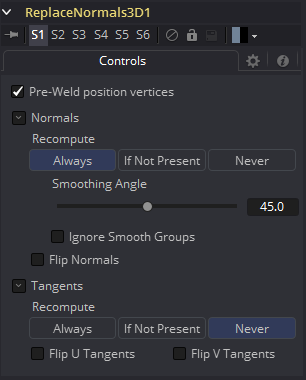

### Replace Normals 3D [3Rn] 替换法线3D

ReplaceNormals用于替换传入几何物体的法线/切线。输入场景中的所有几何物体都会受到影响。Lights/Cameras/PointClouds/Locators/Materials和其他非mesh工具不受影响。受此工具影响的法线/切线是每个顶点的法线/切线，而不是每个面的法线/切线。为了计算切线，输入的几何物体必须有纹理坐标。有时几何物体没有纹理坐标，或者纹理坐标被FBX导入设置为All，因为它们不在FBX上。

 

#### Controls 控件

##### Pre-Weld Position Vertices 预焊位置顶点

预焊位置顶点。有时位置顶点在几何物体中重复出现，即使它们的位置相同，也会导致法线/切线计算错误。预焊结果被丢弃；它们不影响输出几何物体的位置顶点。

##### Recompute 重计算

控制何时重新计算法线/切线。

- **Always 总是：** mesh上的法线总是会被重新计算。
- **If Not Present 如果不存在：** mesh上的法线只有在不存在时才会重新计算。
- **Never 从不：** 法线永远不会被计算出来。这个选项在动画制作时很有用。

##### Smoothing Angle 平滑角度

角小于这个角的相邻面，其邻接边将被平滑。平滑角的一个典型值可能在20到60度之间。对于0.0f和360.0f有特殊的情况代码。当设置为0.0f时，将生成分面法线；这对艺术效果很有用。

##### Ignore Smooth Groups 忽略平滑组

如果设置为False，具有不同光滑组的两个面将不会被平滑(例如，立方体的面或圆柱的顶部表面具有不同的光滑组)。如果你检查这个，并设置足够大的平滑角，立方体的表面将被平滑。目前还没有办法在Fusion中可视化平滑的组。

##### Flip Normals 翻转法线

翻转切线有时会令人困惑。如果mesh有切向量，翻转将产生效果。然而，大多数Fusion的mesh在到达Renderer3D之前都没有切向量。另外，在查看器中查看切向量时，如果切向量不存在，就会创建切向量。令人困惑的是，如果你查看一个没有切向量的Cube3D，然后按下FlipU/FlipV按钮，什么都不会发生。这是因为没有要创建的切向量，但是后来GL渲染器创建了一些(未翻转的)切向量。

> **已知问题：**如果法线不存在，FBX导入器将重新计算法线，但是您可以从这个工具获得更高质量的结果。凹凸贴图有时依赖于模型的法线。特别是，当您将一个复杂的高多边形模型简化为低多边形模型+ 凹凸贴图时，法线和凹凸贴图可以成为“链接的”。在这种情况下，重新计算法线会让模型看起来很有趣。凹凸贴图打算与这些法线一起使用。
>
> Fusion中的大多数原型物体不是用切线生成的；当需要时，它们由Renderer3D动态生成并缓存。
>
> 切线目前只用于凹凸贴图。如果材质需要凹凸贴图，那么就创建切线。这些切线是用一些默认设置创建的(例如，平滑角，等等)，如果你不想要Fusion自动创建切线，你应该手动使用ReplaceNormals创建它们。
>
> 所有的计算都在几何物体的局部坐标中完成，而不是在ReplaceNormals3D工具的坐标系中完成。当在应用ReplaceNormals3D之前对几何物体应用了一个不均匀的比例时，这可能会导致问题。