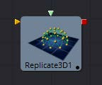
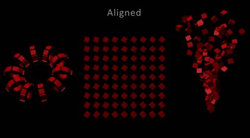
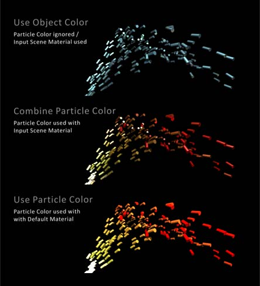

### Replicate 3D [3Rep] 复制3D

Replicate 3D工具在目标顶点的位置复制输入几何物体。这包括mesh顶点和粒子位置。对于复制的输入几何物体的每个副本，可以应用各种转换。Jitter选项卡中的选项允许非均匀转换，例如随机定位或大小。

#### External Inputs 外部输入

 

**Replicate3d.Destination 目标物体** 

[橙色，必需的]这个输入需要一个有顶点位置的3D场景，无论是mesh还是3D粒子动画。

**Replicate3d.Input[#] 输入[多个]** 

[任意，必需的]这个输入需要一个将被复制的3D场景。一旦连接，一个为了交替三维场景的新的输入将创建。

#### Controls 控件

##### Step 步长

定义跳过多少个位置。例如，Step为3表示只使用目标mesh的每3个顶点位置，而步骤1表示使用所有位置。

Step有助于为大目标mesh保持合理的性能。在参数几何物体如圆环面，它可以用来隔离mesh的某些部分。

一旦设置了Make Renderable选项，点云在内部由6个点表示。为了获得单个点，使用步长6，并在Replicate3D中设置X偏移量-0.5，以到达点云的中心。对Locator3D使用-0.125。一旦这些被缩放，偏移量可能会不同。

##### Input Mode 输入模式

它的参数定义了在目的地复制多个输入场景的顺序。如果只提供一个输入场景，这两个参数都不会有可见的效果。

使用Loop，输入被依次使用。第一个输入在第一个位置，第二个在第二个位置，以此类推。如果目标中出现的位置多于输入，则序列将被循环。

Random将根据Jitter选项卡中的种子为每个位置使用一个确定但随机的输入。这种输入模式可用于模拟各种输入场景较少的情况。

粒子的死亡会导致它们的id发生变化，因此它们的复制顺序可能发生变化。

##### Time Offset 时间偏移

使用Time Offset滑块按每次复制的设置量偏移应用于源几何物体的任何动画。例如，将值设置为-1。并使用一个立方体集在y轴上旋转作为源。第一个拷贝将显示先前帧的动画。第二个拷贝将显示之前帧的动画，以此类推。

这可以在纹理平面上使用，例如，可以显示一个剪辑的连续帧。

##### Alignment 对齐

Alignment指定如何根据目标mesh的法线或粒子旋转对副本进行对齐。

- **Not Aligned 不对齐：**不对齐副本。它保持在与输入mesh相同的方向上旋转。

  

- **Aligned 对齐：**这种模式使用点的法线，并试图重建一个上矢量。它最适合有非焊接顶点的有机mesh，比如导入的FBX mesh，因为它对相同位置的顶点具有相同的旋转。在平面几何mesh上，旋转方向的逐渐变化是显而易见的。为了获得最佳结果，建议在任何转换之前在原点使用此方法。

  

- **Aligned TBN 对齐TBN:**结果在目标点的切线、副法线和法线的基础上得到更精确、更稳定的对齐。适用于粒子和几何物体。在非焊接mesh上，同一位置的多个非焊接点的两个副本由于各自的法线可能导致不同的对齐。

  

##### Color 颜色

根据输入的粒子颜色影响每个副本的漫反射颜色或着色器。

- **Use Object Color 使用物体颜色：**不使用目标粒子的颜色。
- **Combine Particle Color 结合粒子颜色：**使用任何输入mesh的着色器，并修改漫反射颜色以匹配目标粒子的颜色。
- **Use Particle Color 使用粒子颜色：**用默认着色器替换所有输入mesh的完整着色器。它的漫反射颜色取自目标粒子。

##### Translation 位移

这三个滑块告诉工具要对每个副本应用多少偏移量。X偏移量为1时，每个复制单元偏移1；沿x轴从最后一个副本偏移1个单位。

##### Rotation Order 旋转顺序

这些按钮可用于设置旋转应用于几何物体的顺序。将旋转顺序设置为XYZ将首先应用X轴上的旋转，然后是Y轴旋转，然后是Z轴旋转。

##### XYZ Rotation XYZ旋转

这三个旋转滑块告诉工具要对每个副本应用多少旋转。

##### XYZ Pivot XYZ旋转中心

枢轴控件确定旋转每个副本时使用的枢轴点的位置。当Lock XYZ复选框被选中时，对缩放的任何调整都将同时应用于所有三个轴。

如果禁用此复选框，则将用X、Y和Z缩放的单个滑块替换缩放滑块。

##### Scale 缩放

缩放控件设置应用于每个副本的缩放程度。

#### Jitter 抖动

##### Random Seed/Randomize 随机种子/随机化

随机种子用于设置应用于复制对象的抖动量的种子。两个具有相同设置但不同随机种子的复制工具将产生两个完全不同的结果。单击Randomize按钮来分配随机种子值。

##### Time Offset 时间偏移

使用Time Offset滑块按每次复制的设置量偏移应用于源几何物体的任何动画。例如，将值设置为-1.0，并使用一个立方体集在y轴上旋转作为源。第一个拷贝将显示先前帧的动画。第二个拷贝将显示之前帧的动画，以此类推。这可以在纹理平面上使用，例如，可以显示一个剪辑的连续帧。

##### Translation XYZ Jitter 位移XYZ抖动

使用这三个控件来调整复制对象变换中的变化量。

##### Rotation XYZ Jitter 旋转XYZ抖动

使用这三个控件来调整复制对象旋转中的变化量。

##### Pivot XYZ Jitter 旋转中心XYZ抖动

使用这三个控件来调整复制对象旋转枢轴中心的变化量。这只影响附加的抖动旋转，而不影响Controls选项卡中的旋转设置所产生的旋转。

##### Scale XYZ Jitter 缩放XYZ抖动

使用此控件可调整复制对象缩放中的变化量。取消勾选Lock XYZ复选框，以在所有三个轴上独立调整比例变化。

