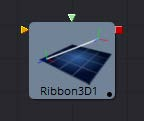
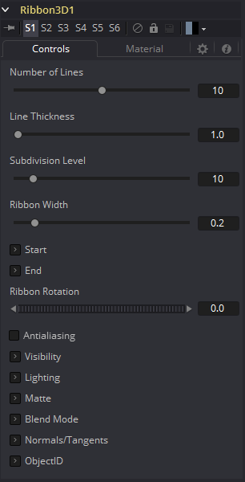

### Ribbon 3D [3Ri] 条带3D

Ribbon 3D生成一组细分线段或两点之间的单线。它对于MG动画非常有用，特别是在Replicate 3D时，可以将其他几何物体附加到线条上，在创建类闪电螺栓状结构时使用Displace 3D时更是如此。默认情况下，线的数组由纹理坐标赋值，因此它们可以与2D纹理一起使用。通常，UVMap 3D可以用来改变纹理坐标。这个工具严重依赖于OpenGL的某些特性，不会在软件渲染器中产生任何可见的结果。此外，绘制线条的方式完全取决于显卡供应商，因此任何工件都可能因显卡而异。

 

#### Controls 控件

##### Number of Lines 线数量

在起点和终点之间画的平行线的数目。

##### Line Thickness 线粗细

Line Thickness在用户界面中允许采用浮点值，但有些显卡只允许整数值。有些显卡可能只允许线条等于或大于1，或者在某个值上最大。

##### Subdivision Level 细分等级

起始点和端点之间每一行上的顶点数。数值越大，一切三维置换都可以应用得越精确。

##### Ribbon Width 条带宽度

确定线之间的距离。

##### Start 起始

XYZ控件设置带状的起始点。

##### End 结束

控件来设置功能区的结束点。

##### Ribbon Rotation 条带旋转

允许条带绕由起始点和终结点定义的虚拟轴旋转。

##### Antialiasing 抗锯齿

允许您对渲染的行应用抗锯齿。不建议使用抗锯齿。当激活时，线段之间会有间隙。这在线厚度值较高时尤其明显。同样，画线的方式完全取决于显卡供应商，这意味着这些工件可能因显卡而异。

