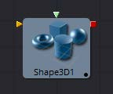
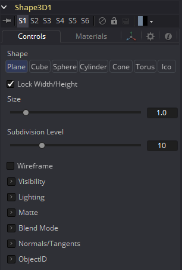
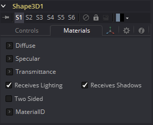
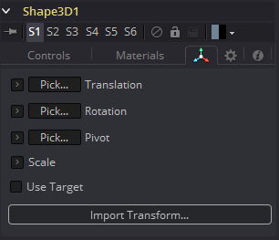

### Shape 3D [3Sh]

Shape 3D工具用于生成几种基本的基础三维物体，包括平面、立方体、球体和圆柱体。

#### 外部输入

 

*Shape3d.SceneInput* 

[橙色，必需的]这个输入需要一个3D场景。

*Shape3d.MaterialInput* 

[绿色，可选的]此输入将接受2D图像或3D材质。如果提供2D图像，它将作为一个漫反射(diffuse)纹理映射，用于工具内建的基本材质。如果连接了3D材质，则基本材质将被禁用。

#### Controls

##### Shape

选择这些选项之一，以确定形状3D工具将生成哪些几何基础物体。下面的控件将更改为匹配所选形状。

- *Lock Width/Height/Depth:*  [plane, cube]如果选中此复选框，宽度、高度和深度控件将作为一个单一大小的滑块锁定在一起。否则，将提供沿每个轴对形状大小的单独控制。
- *Size Width/Height/Depth:*  [plane, cube]用于控制形状的大小。

##### Cube Mapping

[Cube]使用立方体映射来应用Shape工具的纹理(连接到纹理输入的2D图像)。

##### Radius

[Sphere, Cylinder, Cone, Torus]设置所选形状的半径。

##### Top Radius

[Cone]此控件用于定义圆锥顶部的半径，使创建截短圆锥成为可能。

##### Start/End Angle

[Sphere, Cylinder, Cone, Torus]此范围控制决定绘制形状的扫描范围。180度的起始角和360度的结束角只能画出一半的形状。

##### Start/End Latitude

[Sphere, Torus]此范围控制用于通过定义对象的纬向子部分对对象进行切片。

##### Bottom/Top Cap

[Cylinder, Cone]仅用于圆柱体和锥体形状，底盖和顶盖复选框用于确定是否创建了这些形状的端盖，或形状是否保持打开状态。

##### Section

[Torus]只用于环面，截面控制组成环面管的厚度。

##### Subdivision Level/Base/Height

[All shapes]用于所有形状，细分控件用于确定构成对象的网格的镶嵌。细分越高，每个形状的顶点就越多。

##### Wireframe

启用此复选框将导致网格只呈现对象的线框图。

#### Visibility

##### Visible

如果没有选中Visibility复选框，则该对象将不会在监视器中可见，也不会被Renderer 3D工具渲染到输出图像中。不可见的物体不会投射阴影。

##### Unseen by Cameras

如果选择了Unseen by Cameras复选框，则对象将在监视器中可见(除非关闭了Visible复选框)，除非通过相机查看。对象不会被渲染器3D工具渲染到输出图像中。当软件渲染器渲染一个不可见的对象时，它所投射的阴影仍然是可见的，尽管OpenGL渲染器没有这样做。

##### Cull Front Face/Back Face

使用这些选项来剔除(消除)几何图形中某些多边形的呈现和显示。如果选择了Cull Back Face，所有背对相机的多边形都不会被渲染，也不会产生阴影。如果选择了Cull Front Face，所有面向摄像机的多边形也将被删除。选择这两个复选框与取消选择Visible复选框的效果相同。

##### Ignore Transparent Pixels in Aux Channels

在以前的Fusion版本中，Software/OpenGL渲染器拒绝透明像素。具体来说，软件渲染器拒绝R=G=B=A=0的像素，GL渲染器拒绝A=0的像素。现在这是可选的。这样做的原因可能是为了获得透明区域的辅助通道(例如，法线、Z、UV)。例如，假设做后期时，您想用在不同区域透明的纹理替换在特定区域透明的3D元素上的纹理，那么设置透明区域的辅助通道(特别是UV)将非常有用。再举一个例子，假设您正在做后期景深。您可能不希望将Z通道设置为透明区域，因为这会给您一个错误的深度。还要记住，这种拒绝是基于最终的像素颜色，包括灯光，如果它是开着的。所以如果你有一个镜面高光的透明玻璃材质，这个复选框不会影响它。

#### Lighting

##### Affected by Lights

如果不选中此复选框，场景中的灯光将不会影响到对象，它不会接收或投射阴影，并将以其颜色、纹理或材质的全亮度显示。

##### Shadow Caster

如果不启用此复选框，该对象将不会对场景中的其他对象投射阴影。

##### Shadow Receiver

如果不启用此复选框，该对象将不会接收场景中其他对象投射的阴影。

##### Matte

启用Is Matte选项将对该对象应用一个特殊的纹理，使该对象不仅对摄像机不可见，而且使直接出现在摄像机后面的所有内容也不可见。这个选项将覆盖所有纹理。有关更多信息，请参阅3D章节的matte objects部分。

##### Is Matte

当被激活时，像素在Z中的后于matte对象像素的对象不会被渲染。

##### Opaque Alpha

将matte对象的alpha值设置为1。此复选框仅在启用is Matte选项时可见。

##### Infinite Z

将Z通道中的值设置为无穷大。此复选框仅在启用is Matte选项时可见。

##### Blend Mode 

Blend Mode指定渲染器在将此对象与场景的其余部分组合时将使用的方法。混合模式基本上与2D Merge工具文档中列出的模式相同。有关每种模式的详细说明，请参阅该工具的文档。

混合模式最初是为2D图像设计的。在光照的3D环境中使用它们会产生不希望的结果。为了获得最佳效果，请在软件中渲染的非光照3D场景中使用Apply模式。

##### OpenGL Blend Mode

使用此菜单选择OpenGL呈现程序处理几何图形时将使用的混合模式。这也是在查看器中查看对象时使用的模式。目前OpenGL渲染器支持三种混合模式。

##### Software Blend Mode

使用此菜单选择Software渲染器处理几何图形时将使用的混合模式。目前，Software渲染器支持Merge工具文档中描述的所有模式，但Dissolve模式除外。

#### Material选项卡

此选项卡中出现的选项决定了此工具创建的几何物体的外观。由于这些控件在生成几何物体的所有工具上都是相同的，因此在本文档的Common 3D Controls部分中对这些控件进行了全面描述。

如果一个外部3D材质被连接到工具块的材质输入，那么这个选项卡中的控件将被替换为“Using External Material”标签。

#### Transform选项卡

此选项卡中出现的选项决定了此工具创建的几何物体的位置。由于这些控件在生成几何物体的所有工具上都是相同的，因此在本文档的Common 3D Controls部分中对这些控件进行了全面描述。

#### Sphere Map与直接将纹理连接到Sphere

您可以直接将经纬(球面投影)纹理映射连接到一个球体，而不是首先通过连线将其连接到Sphere Map工具。如果您将起始/结束角和纬度设置为小于360°/180°，则会导致不同的渲染。在第一种情况下，纹理将被压扁。当使用Sphere Map工具时，纹理将被裁剪。
比较:

> 注意：如果你直接将纹理导入球体，它也会被水平镜像。您可以首先使用Transform工具来“修复”这个问题。

